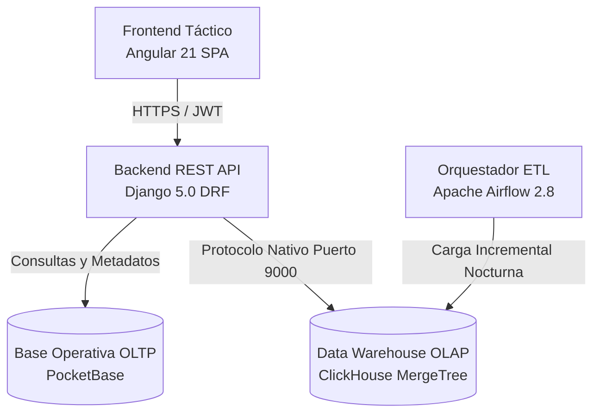

# SafeCity Intelligence & Tactical Operations Platform
### *Plataforma SaaS B2G de Misión Crítica para Inteligencia Policial, Gestión Operativa y Despacho Táctico 911*

[](https://www.djangoproject.com/)
[](https://angular.dev/)
[](https://clickhouse.com/)
[](https://pocketbase.io/)
[](https://airflow.apache.org/)
[](https://tailwindcss.com/)
[](https://www.docker.com/)
[-blueviolet?style=for-the-badge)]()

---

## Tabla de Contenidos
1. [Resumen Ejecutivo](#resumen-ejecutivo)
2. [Arquitectura del Sistema](#arquitectura-del-sistema)
3. [Módulos Funcionales del Ecosistema](#módulos-funcionales-del-ecosistema)
4. [Matriz de Roles y Control de Acceso (RBAC)](#matriz-de-roles-y-control-de-acceso-rbac)
5. [Stack Tecnológico](#stack-tecnológico)
6. [Estructura del Proyecto](#estructura-del-proyecto)
7. [Garantía de Calidad y Pruebas Automatizadas (QA)](#garantía-de-calidad-y-pruebas-automatizadas-qa)
8. [Guía de Despliegue y Puesta en Marcha](#guía-de-despliegue-y-puesta-en-marcha)
9. [Gobernanza de Datos y Seguridad](#gobernanza-de-datos-y-seguridad)
10. [Documentación Técnica y Metodología SDD](#documentación-técnica-y-metodología-sdd)

---

## Resumen Ejecutivo

**SafeCity Intelligence Ops** es una solución integral de software de misión crítica diseñada para modernizar, agilizar y securizar las operaciones de departamentos de policía, agencias de seguridad ciudadana y centros de comando y control (C4/C5/911).

El sistema consolida en una arquitectura única y de alto rendimiento:
* **Analítica Masiva Sub-Segundo (OLAP):** Consultas analíticas en milisegundos sobre más de 300,000 incidentes criminales indexados en **ClickHouse**, permitiendo la detección de patrones delictivos, series criminales y predicción de riesgo geoespacial.
* **Trazabilidad Forense y Cadena de Custodia Inmutable:** Registro riguroso de evidencias, personas desaparecidas, alertas BOLO y auditoría criptográfica campo por campo de cada interacción con los datos.
* **Centro de Mando Unificado (CAD & Triage 911):** Despacho táctico asistido, cálculo de tiempos de respuesta (ETA), gestión de recursos policiales en campo y control de detenciones (*Booking System*).
* **Gobierno y Rendición de Cuentas (Policía Comunitaria):** Portal público de transparencia, radicación de quejas ciudadanas con anonimato garantizado y control estricto de incidentes de uso de la fuerza.

---

## Arquitectura del Sistema

La arquitectura de SafeCity está fundamentada en el desacoplamiento de capas mediante una estrategia híbrida **OLTP + OLAP DW**, orquestada por microservicios y contenedores:



### Principios de Diseño Arquitectónico
1. **Desacoplamiento Operacional vs. Analítico:** Las operaciones concurrentes transaccionales de bajo volumen se procesan en la capa relacional/PocketBase, mientras que el análisis temporal masivo, agrupaciones geográficas y consultas complejas se delegan a ClickHouse con compresión columnar ZSTD/LZ4.
2. **Defensa en Profundidad (Zero Trust RBAC):** Cada endpoint valida permisos basados en roles jerárquicos policiales. Ningún usuario tiene acceso fuera de su jurisdicción funcional.
3. **Auditoría Global Inmutable:** El cliente de base de datos intercepta y audita todas las transacciones SQL con marcas de tiempo UTC, usuario ejecutor, dirección IP y tipo de operación.

---

## Módulos Funcionales del Ecosistema

SafeCity se estructura en **9 módulos operativos y estratégicos**, abarcando todo el ciclo de vida policial:

| Módulo | Descripción Funcional |
| :--- | :--- |
| **Gestión Operativa y 911** | Recepción y despacho de llamadas 911, triage de incidentes, estimación de tiempo de respuesta (ETA), libro de detenciones (*Booking System*), registro de celdas, accidentes de tránsito y solicitud de grúas. |
| **Inteligencia Criminal** | Centralización de sospechosos, expedientes delictivos, personas desaparecidas con estimación algorítmica de riesgo (Crítico/Alto/Medio), alertas tácticas BOLO (*Be On the Lookout*) y subida de evidencia multimedia inmutable. |
| **Inteligencia Geográfica** | Cartografía táctica interactiva en tiempo real construida sobre Leaflet, mapas de calor dinámicos (*Heatmaps*) basados en densidad delictiva, zonificación de cuadrantes y analítica predictiva de incidentes. |
| **Logística y Flota** | Control de parque automotor policial, estado operativo y telemetría de unidades, IA predictiva de fallas mecánicas, inspección de mantenimiento preventivo y control de equipamiento táctico (chalecos, tasers, armamento, munición). |
| **Recursos Humanos Operativos** | Kiosco digital de oficiales, gestión de relevos de turno (*Roll Call / Shift Handover*), solicitudes de licencias con documentación de respaldo y trazabilidad de certificaciones profesionales de tiro y aptitud física. |
| **Investigación Especial** | Portal exclusivo para detectives de casos mayores, asignación de expedientes confidenciales, notas de progreso, gestión de evidencias periciales y exportación de informes balísticos y judiciales en PDF. |
| **Órdenes Judiciales** | Registro y ejecución de órdenes de aprehensión y allanamiento emitidas por tribunales, control de jueces emisores, archivo de autos judiciales en PDF y estatus de ejecución en vía pública. |
| **Policía Comunitaria** | Portal público de transparencia con indicadores de gestión Balanced Scorecard (BSC), recepción de quejas ciudadanas con radicado anónimo y trazabilidad rigurosa de eventos de uso de la fuerza policial. |
| **Administración y Ciberseguridad** | Gestión de identidades y accesos policiales (RBAC), control de sesiones concurrentes activas, visor de logs de auditoría en tiempo real, generador y descargador de copias de seguridad cifradas del sistema. |

---

## Matriz de Roles y Control de Acceso (RBAC)

El acceso al sistema está blindado mediante un modelo estricto de roles jerárquicos:

```
                      [ Sheriff / Dirección General ]
                                     |
    +-----------------+--------------+---------------+----------------+
    |                 |                              |                |
[ Administrador ] [ Detectives ]            [ Oficiales ]    [ Operadores 911 ]
    |                 |                              |                |
    |                 |                              +----------------+
    |                 |                              |
[ Ciberseguridad ]  [ Forenses ]             [ Agentes Tránsito ]
```

| Rol | Código Interno | Alcance y Módulos Autorizados |
| :--- | :--- | :--- |
| **Administrador del Sistema** | `administrador_sistema` | Acceso irrestricto: Gestión de usuarios, respaldos, logs de auditoría, configuración del sistema y todos los módulos operativos. |
| **Sheriff / Comandante** | `administrador` / `sheriff` | Dashboard estratégico, mapa de calor, aprobación de personas desaparecidas, auditoría operativa y visualización general. |
| **Detective de Investigaciones** | `detective` | Mis Casos, Inteligencia Criminal, Personas Desaparecidas, BOLO Alerts, consulta de incidentes y generación de expedientes. |
| **Oficial de Patrulla** | `oficial` | Registro de incidentes en campo, libro de arrestos (*Booking*), registro de relevo de turnos, consulta de BOLO y solicitud de equipo. |
| **Operador de Emergencias 911** | `operador_emergencias` | Consola de despacho 911, triage de emergencias, historial de despacho, incidentes y alertas urgentes. |
| **Agente de Tránsito** | `agente_transito` | Control vial, gestión de accidentes de tránsito, infracciones y solicitud de grúas de remolque. |
| **Jefe de Logística** | `jefe_logistica` | Parque vehicular, equipamiento táctico, asignación de unidades e IA de mantenimiento. |
| **Recursos Humanos** | `recursos_humanos` | Tablero de personal policial, gestión de permisos, asignación de cuadrantes y certificaciones de tiro/físicas. |

---

## Stack Tecnológico

### Frontend
* **Core:** Angular 21.1.0 (Standalone Components, Signals, Control Flow Syntax)
* **Estilizado & Diseño:** Tailwind CSS v4.3, Google Material Symbols, Tipografía Inter/Roboto
* **Cartografía & Visualización:** Leaflet 1.9, Leaflet Heatmap Plugin, Chart.js 4.5, Vis-network 10.1
* **Seguridad Cliente:** `RoleGuard` por rutas, Interceptores HTTP con inyección automática de Bearer Tokens y manejo centralizado de errores 401/403

### Backend
* **Core:** Python 3.11+ / Django 5.0.6 / Django REST Framework 3.15.1
* **Conectores & Big Data:** `clickhouse-driver`, `pandas`, `numpy`, `pyarrow`, `scikit-learn`
* **Seguridad & Auth:** `PyJWT`, `django-cors-headers`, hashing seguro de contraseñas con PBKDF2/SHA256
* **Generación de Reportes:** `reportlab` 4.2.0 (Generación criptográfica de expedientes en PDF)

### Bases de Datos & Orquestación
* **ClickHouse Server:** Motor OLAP columnar, tablas optimizadas `MergeTree`, compresión por bloques
* **PocketBase:** Base de datos operativa y almacén documental ligero de alta concurrencia
* **Apache Airflow 2.8:** Orquestador de flujos de datos (DAGs) para sincronización incremental y cálculo de métricas agregadas
* **Docker & Docker Compose:** Contenedorización integral con aislamiento de redes y volúmenes persistentes

---

## Estructura del Proyecto

```
safecity_project/
├── .agents/                        # Directrices operativas y reglas para agentes de desarrollo
├── airflow/                        # Orquestación de datos y flujos ETL
│   └── dags/
│       └── dag_safecity.py        # Pipeline de ingesta y cálculo de KPIs policiales
├── datos_nuevos_pb/                # Volumen de datos operativos PocketBase
├── django_app/                     # Núcleo del Backend (Django REST Framework)
│   ├── administracion_seguridad/   # RBAC, auditoría de eventos, respaldos y sesiones
│   ├── gestion_operativa/          # Despacho 911, incidentes, booking, tránsito y grúas
│   ├── inteligencia_criminal/      # BOLO, sospechosos, personas desaparecidas y evidencias
│   ├── inteligencia_geografica/    # Mapas de calor, cartografía y predicción de delitos
│   ├── investigacion_especial/     # Portal para detectives y expedientes mayores
│   ├── logistica_patrullaje/       # Flota vehicular, IA de mantenimiento y equipamiento táctico
│   ├── operativo_rrhh/             # Kiosco policial, turnos, relevos y certificaciones
│   ├── ordenes_judiciales/         # Órdenes de captura, allanamiento y expedientes PDF
│   ├── policia_comunitaria/        # Portal de transparencia, quejas ciudadanas y uso de la fuerza
│   ├── safecity_core/              # Configuración global, URLs, middleware y custom storage
│   ├── Dockerfile                  # Empaquetado de producción para Django
│   ├── manage.py                   # CLI administrativo de Django
│   ├── setup_db.py                 # Inicialización y sembrado de esquemas en ClickHouse
│   └── requirements.txt            # Dependencias del backend
├── documentation/                  # Repositorio documental de ingeniería y especificaciones SDD
│   ├── component-diagram/          # Diagramas de componentes y arquitectura UML
│   ├── database-diagram/           # Diagrama ERD del Data Warehouse
│   ├── use-case-diagrams-by-module/# Diagramas de casos de uso por cada paquete funcional
│   ├── specs/                      # Especificaciones formales Spec-Driven Development (SDD)
│   ├── Documento_Maestro_Especificacion.md
│   └── planificacion_estrategica_safecity.md
├── frontend/                       # Aplicación SPA Angular
│   ├── src/app/                    # Módulos y componentes visuales por área táctica
│   ├── src/environments/          # Configuración de entornos (Local / Producción)
│   ├── Dockerfile                  # Empaquetado de producción con Nginx Alpine
│   ├── nginx.conf                  # Servidor web reverso de alto rendimiento
│   ├── package.json                # Dependencias NPM y scripts de compilación
│   └── tests_frontend_qa.mjs       # Suite de pruebas automatizadas del frontend
├── .gitignore                      # Reglas de exclusión para entornos corporativos
├── docker-compose.yml              # Orquestación multicontenedor de infraestructura
├── requirements.txt                # Dependencias globales de entorno Python
└── README.md                       # Documentación principal
```

---

## Garantía de Calidad y Pruebas Automatizadas (QA)

El proyecto incluye un conjunto riguroso de suites de pruebas automáticas que validan la estabilidad, consistencia de datos y rendimiento del sistema antes de cada pase a producción:

```bash
# 1. Validación de configuración e integridad de modelos Django
python django_app/manage.py check

# 2. Verificación estricta de compilación y tipado TypeScript en Angular
cd frontend && npx tsc --noEmit

# 3. Ejecución de la suite de pruebas del Backend y APIs REST
python django_app/pruebas_backend_qa.py

# 4. Auditoría de consistencia de base de datos y esquemas ClickHouse
python django_app/pruebas_base_de_datos_qa.py

# 5. Validación integral campo por campo de contratos de datos
python django_app/pruebas_campo_por_campo_total_qa.py

# 6. Pruebas de estrés y resistencia ante casos de borde
python django_app/pruebas_estres_casos_borde_qa.py

# 7. Suite automatizada de pruebas end-to-end del Frontend
node frontend/tests_frontend_qa.mjs
```

---

## Guía de Despliegue y Puesta en Marcha

### Requisitos Previos
* **Docker Engine** 24.0+ y **Docker Compose** v2+
* **Python** 3.11 o superior
* **Node.js** v20+ y **NPM** v10+

---

### Opción A: Entorno de Desarrollo Local (Recomendado para Desarrollo Activo)

Para garantizar recarga en vivo ultrarrápida (HMR) sin latencias de volumen:

#### 1. Iniciar servicios de base de datos e infraestructura en segundo plano
```bash
docker compose up -d clickhouse pocketbase airflow
```
*Los contenedores expondrán localmente los puertos `8123` (ClickHouse Web), `9000` (ClickHouse Nativo), `8091` (PocketBase) y `8080` (Airflow).*

#### 2. Configurar e inicializar el Backend (Django)
```bash
# Crear y activar entorno virtual
python -m venv .venv
.venv\Scripts\activate       # En Windows
# source .venv/bin/activate  # En Linux/macOS

# Instalar dependencias
pip install -r django_app/requirements.txt

# Inicializar esquemas y datos base en ClickHouse
python django_app/setup_db.py

# Iniciar servidor de desarrollo en puerto 8000
python django_app/manage.py runserver 0.0.0.0:8000
```

#### 3. Configurar e inicializar el Frontend (Angular)
```bash
cd frontend
npm install
npm start
```
*La aplicación estará disponible de inmediato en `http://localhost:4200`.*

---

### Opción B: Despliegue Completo en Contenedores (Producción / Staging)

Para levantar la suite completa en contenedores de producción:

```bash
docker compose up -d --build
```
* El **Frontend** servido por **Nginx** estará disponible en: `http://localhost:80`
* El **Backend** REST API estará disponible en: `http://localhost:8000/api/`
* La consola de **PocketBase** en: `http://localhost:8091/_/`
* El orquestador **Airflow** en: `http://localhost:8080`

---

## Gobernanza de Datos y Seguridad

* **Cadena de Custodia Inmutable:** Las evidencias registradas en `inteligencia_criminal` y `gestion_operativa` almacenan metadatos inmutables de autor, placa policial, fecha/hora atómica e integridad de archivos.
* **Trazabilidad de Auditoría:** Toda consulta de lectura sensible o modificación queda asentada en la tabla `registro_auditoria` con detalles de la sentencia SQL ejecutada, IP origen y usuario autenticado.
* **Políticas de Privacidad y Anonimato:** En el módulo de Policía Comunitaria, el registro de quejas ciudadanas disocia completamente los datos de contacto del denunciante frente a los oficiales investigados, garantizando protección de denunciantes.
* **Respaldos Automatizados:** El módulo de Administración cuenta con un generador de respaldos en caliente que empaqueta las bases de datos de forma comprimida y cifrada con verificación de integridad.

---

## Documentación Técnica y Metodología SDD

El proyecto ha sido concebido bajo la metodología **Spec-Driven Development (SDD)**, asegurando que cada línea de código responda a un requerimiento funcional formalizado:

* [**Planificación Estratégica Completa**](./documentation/planificacion_estrategica_safecity.md): Jerarquía 5 OE -> 10 OT -> 44 OP y Balanced Scorecard.
* [**Especificación Detallada de Funcionalidades**](./documentation/Documento_Maestro_Especificacion.md): Especificación formal de casos de uso y contratos de datos.
* [**Diagrama Entidad-Relación (DW ERD)**](./documentation/database-diagram/database-diagram.md): Arquitectura Fact/Dim del data warehouse.
* [**Diagrama de Componentes**](./documentation/component-diagram/component-diagram.puml): Interacción estructural de servicios.
* [**Catálogo de Casos de Uso por Módulo**](./documentation/use-case-diagrams-by-module/README.md): Especificaciones en formato PlantUML por cada rol.

---

## Licencia y Propiedad

(C) 2026 **SafeCity Solutions Inc.** Todos los derechos reservados.  
Plataforma desarrollada para entidades gubernamentales y departamentos de seguridad pública. Queda prohibida la reproducción total o parcial sin autorización expresa de la organización.
