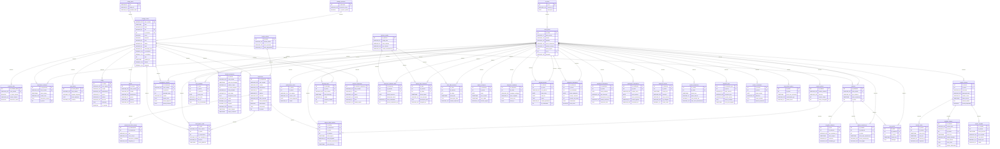

```mermaid
erDiagram
    codigo_penal {
        VARCHAR_50 iucr PK
        VARCHAR_50 codigo_fbi
        VARCHAR_100 gravedad_delito
    }
    catalogo_ubicacion {
        INT id_ubicacion PK
        VARCHAR_255 descripcion_lugar
        BOOLEAN es_espacio_publico
    }
    rol_oficial {
        INT id_rol PK
        VARCHAR_100 nombre_rol
        TEXT descripcion
    }
    oficial_policia {
        INT id_oficial PK
        VARCHAR_50 placa_policial
        VARCHAR_100 nombre
        VARCHAR_100 apellidos
        VARCHAR_100 correo_electronico
        VARCHAR_50 telefono_contacto
        DATE fecha_ingreso
        INT id_rol FK
        VARCHAR_255 fotografia
    }
    chicago_crimes {
        VARCHAR_255 case_number PK
        TIMESTAMP date
        VARCHAR_255 block
        VARCHAR_50 iucr FK
        INT id_ubicacion FK
        BOOLEAN arrest
        BOOLEAN domestic
        VARCHAR_50 beat
        VARCHAR_50 district
        VARCHAR_50 ward
        VARCHAR_50 community_area
        DECIMAL_15_2 x_coordinate
        DECIMAL_15_2 y_coordinate
        INT year
        TIMESTAMP updated_on
        DECIMAL_10_6 latitude
        DECIMAL_10_6 longitude
    }
    incidente_delito {
        INT id_incidente_delito PK
        VARCHAR_255 case_number FK
        BOOLEAN es_delito_primario
        VARCHAR_100 estado_climatico
        BOOLEAN detonacion_armas
    }
    seguimiento_incidente {
        INT id_seguimiento PK
        VARCHAR_255 case_number FK
        TIMESTAMP fecha_registro
        VARCHAR_100 estado_caso
        TEXT descripcion_avance
        INT id_oficial FK
    }
    caso_judicial {
        INT id_caso_judicial PK
        VARCHAR_255 case_number FK
        VARCHAR_255 juzgado_asignado
        DATE fecha_audiencia
        VARCHAR_255 veredicto
    }
    testigo {
        INT id_testigo PK
        VARCHAR_255 case_number FK
        VARCHAR_255 nombre
        VARCHAR_100 identificacion
        VARCHAR_50 genero
        VARCHAR_50 telefono
        VARCHAR_255 direccion
        TEXT testimonio
        BOOLEAN es_anonimo
    }
    victima {
        INT id_victima PK
        VARCHAR_255 case_number FK
        VARCHAR_255 nombre
        VARCHAR_100 identificacion
        VARCHAR_50 genero
        VARCHAR_50 telefono
        VARCHAR_255 direccion
    }
    banda_criminal {
        INT id_banda PK
        VARCHAR_255 nombre_banda
        VARCHAR_255 zona_operacion
        VARCHAR_50 nivel_peligrosidad
    }
    sospechoso {
        INT id_sospechoso PK
        VARCHAR_255 case_number FK
        VARCHAR_255 nombre
        VARCHAR_100 identificacion
        VARCHAR_50 genero
        VARCHAR_50 telefono
        VARCHAR_255 direccion
        VARCHAR_255 alias_conocido
        DATE fecha_nacimiento
        BOOLEAN antecedentes
        TEXT observacion
        INT id_banda FK
    }
    investigacion_especial {
        INT id_investigacion PK
        VARCHAR_255 case_number FK
        INT id_detective FK
        INT prioridad_mayor
        VARCHAR_100 estado
        TEXT reporte_final
        DATE fecha_asignacion
        DATE fecha_resolucion
    }
    evidencia {
        INT id_evidencia PK
        VARCHAR_255 case_number FK
        VARCHAR_100 tipo_evidencia
        TIMESTAMP fecha_recoleccion
        INT id_oficial FK
    }
    vehiculo_patrulla {
        INT id_vehiculo PK
        VARCHAR_50 codigo_flota
        VARCHAR_50 placa_vehiculo
        VARCHAR_100 tipo_vehiculo
        VARCHAR_100 estado_mantenimiento
    }
    turno_patrullaje {
        INT id_turno PK
        INT id_oficial FK
        INT id_vehiculo FK
        DATE fecha_turno
        VARCHAR_50 hora_inicio
        VARCHAR_50 hora_fin
        TEXT ruta_coordenadas
    }
    llamada_emergencia {
        INT id_llamada PK
        VARCHAR_255 case_number FK
        TIMESTAMP fecha_hora_llamado
        VARCHAR_50 telefono_origen
        INT id_oficial_despacho FK
        VARCHAR_50 nivel_prioridad
        VARCHAR_50 nivel_triage
        TEXT descripcion_inicial
        VARCHAR_100 estado
        DECIMAL_10_6 latitud
        DECIMAL_10_6 longitud
        VARCHAR_255 direccion
        TIMESTAMP tiempo_llegada
        TIMESTAMP tiempo_resolucion
    }
    usuario_sistema {
        INT id_usuario PK
        INT id_oficial FK
        VARCHAR_100 username
        VARCHAR_255 password_hash
        VARCHAR_50 estado_cuenta
        TIMESTAMP ultimo_acceso
        INT intentos_fallidos
        BOOLEAN cuenta_bloqueada
    }
    historial_sesion {
        INT id_sesion PK
        INT id_usuario FK
        TIMESTAMP fecha_inicio
        TIMESTAMP fecha_fin
        VARCHAR_50 direccion_ip
        VARCHAR_100 dispositivo
    }
    auditoria_sistema {
        INT id_auditoria PK
        VARCHAR_100 nombre_tabla
        VARCHAR_50 operacion
        INT id_usuario FK
        TIMESTAMP fecha_hora
        VARCHAR_255 registro_afectado
        TEXT valor_anterior
        TEXT valor_nuevo
        TEXT detalles_adicionales
    }
    registro_respaldo {
        INT id_respaldo PK
        INT id_usuario FK
        TIMESTAMP fecha_ejecucion
        VARCHAR_100 tipo_respaldo
        VARCHAR_255 ruta_archivo
        DECIMAL_10_2 tamano_mb
        VARCHAR_50 estado
    }
    equipamiento_oficial {
        INT id_equipo PK
        INT id_oficial FK
        VARCHAR_100 tipo_equipo
        VARCHAR_100 numero_serie
        DATE fecha_asignacion
        VARCHAR_50 estado
    }
    estacion_policial {
        INT id_estacion PK
        VARCHAR_255 nombre_estacion
        VARCHAR_255 direccion
        INT numero_celdas
        INT oficial_encargado FK
    }
    descarga_taser {
        INT id_descarga PK
        INT id_oficial FK
        VARCHAR_255 case_number FK
        TIMESTAMP fecha_descarga
        VARCHAR_50 voltaje
        INT cartuchos_usados
        TEXT motivo
    }
    fotografia_evidencia {
        INT id_foto PK
        INT id_evidencia FK
        VARCHAR_255 ruta_supabase_url
        TIMESTAMP fecha_captura
        VARCHAR_50 resolucion
        VARCHAR_255 metadata_gps
    }
    caracteristica_fisica_tatuaje {
        INT id_caracteristica PK
        INT id_sospechoso FK
        VARCHAR_100 tipo
        VARCHAR_100 zona_cuerpo
        TEXT descripcion_detallada
        VARCHAR_255 fotografia_url
    }
    vehiculo_sospechoso {
        INT id_vehiculo_sospechoso PK
        VARCHAR_255 case_number FK
        VARCHAR_50 placa
        VARCHAR_100 marca
        VARCHAR_100 modelo
        VARCHAR_50 color
        VARCHAR_100 estado_reporte
    }
    interrogatorio_audio {
        INT id_audio PK
        VARCHAR_255 case_number FK
        INT id_oficial FK
        INT id_sospechoso FK
        VARCHAR_255 ruta_supabase_url
        VARCHAR_50 duracion
        TIMESTAMP fecha_grabacion
    }
    cadena_custodia_log {
        INT id_custodia PK
        INT id_evidencia FK
        INT id_oficial FK
        TIMESTAMP fecha_hora_transferencia
        VARCHAR_255 motivo_transferencia
        VARCHAR_255 firma_digital
    }
    nota_pericial {
        INT id_nota PK
        INT id_evidencia FK
        INT id_oficial FK
        TIMESTAMP fecha_nota
        TEXT hallazgos
    }
    registro_celdas_booking {
        INT id_booking PK
        INT id_sospechoso FK
        INT id_oficial FK
        INT id_estacion FK
        TIMESTAMP fecha_ingreso
        VARCHAR_50 celda_asignada
        TEXT inventario_pertenencias
        TIMESTAMP fecha_liberacion
    }
    inspeccion_vehicular_diaria {
        INT id_inspeccion PK
        INT id_vehiculo FK
        INT id_oficial FK
        DATE fecha_inspeccion
        INT kilometraje_actual
        VARCHAR_50 nivel_combustible
        INT presion_neumaticos_psi
    }
    reporte_dano_carroceria {
        INT id_dano PK
        INT id_vehiculo FK
        INT id_oficial FK
        TIMESTAMP fecha_reporte
        VARCHAR_100 zona_afectada
        TEXT descripcion_dano
        VARCHAR_255 fotografia_url
    }
    ticket_falla_mecanica {
        INT id_ticket PK
        INT id_vehiculo FK
        INT id_oficial FK
        TIMESTAMP fecha_falla
        TEXT descripcion_falla
        VARCHAR_100 estado_reparacion
    }
    registro_asistencia {
        INT id_asistencia PK
        INT id_oficial FK
        DATE fecha
        TIMESTAMP hora_entrada
        TIMESTAMP hora_salida
        VARCHAR_100 metodo_registro
    }
    asignacion_cuadrante {
        INT id_asignacion PK
        INT id_oficial FK
        VARCHAR_255 cuadrante_poligono
        VARCHAR_50 turno_asignado
        DATE fecha_inicio
        DATE fecha_fin
    }
    solicitud_permiso {
        INT id_solicitud PK
        INT id_oficial FK
        VARCHAR_100 tipo_permiso
        DATE fecha_inicio
        DATE fecha_fin
        TEXT motivo
        VARCHAR_50 estado_aprobacion
        INT id_comandante FK
    }
    evaluacion_desempeno {
        INT id_evaluacion PK
        INT id_oficial FK
        INT id_comandante FK
        DATE fecha_evaluacion
        INT puntaje_respuesta
        INT puntaje_uso_fuerza
        TEXT comentarios
        BOOLEAN firma_oficial
    }
    expediente_disciplinario {
        INT id_expediente PK
        INT id_oficial FK
        DATE fecha_incidente
        VARCHAR_100 tipo_infraccion
        TEXT descripcion_hechos
        VARCHAR_100 estado_resolucion
        TEXT resolucion_final
    }
    certificacion_capacitacion {
        INT id_certificacion PK
        INT id_oficial FK
        VARCHAR_255 nombre_curso
        DATE fecha_emision
        DATE fecha_vencimiento
        VARCHAR_50 estado_vigencia
        VARCHAR_255 documento_url
    }
    infraccion_transito {
        INT id_infraccion PK
        INT id_oficial FK
        TIMESTAMP fecha_hora
        VARCHAR_255 ubicacion
        VARCHAR_50 placa_vehiculo
        VARCHAR_255 ley_infringida
        DECIMAL_10_2 monto_multa
    }
    prueba_alcoholemia {
        INT id_prueba PK
        INT id_oficial FK
        TIMESTAMP fecha_hora
        VARCHAR_50 placa_vehiculo
        DECIMAL_5_2 nivel_alcohol_bac
        VARCHAR_100 num_serie_alcoholimetro
    }
    despacho_grua {
        INT id_despacho_grua PK
        INT id_oficial FK
        VARCHAR_50 placa_vehiculo
        VARCHAR_255 compania_grua
        VARCHAR_255 corralon_destino
        TEXT motivo_remolque
        TIMESTAMP fecha_hora_llegada
    }
    reunion_comunitaria {
        INT id_reunion PK
        INT id_oficial FK
        DATE fecha_reunion
        VARCHAR_255 ubicacion
        TEXT temas_tratados
        INT numero_asistentes
    }
    alerta_boton_panico {
        INT id_alerta PK
        INT id_oficial FK
        TIMESTAMP fecha_hora_activacion
        VARCHAR_255 coordenadas_gps
        VARCHAR_50 estado_alerta
    }
    rol_oficial ||--o{ oficial_policia : "relaciona"
    codigo_penal ||--o{ chicago_crimes : "relaciona"
    catalogo_ubicacion ||--o{ chicago_crimes : "relaciona"
    chicago_crimes ||--o{ incidente_delito : "relaciona"
    chicago_crimes ||--o{ seguimiento_incidente : "relaciona"
    oficial_policia ||--o{ seguimiento_incidente : "relaciona"
    chicago_crimes ||--o{ caso_judicial : "relaciona"
    chicago_crimes ||--o{ testigo : "relaciona"
    chicago_crimes ||--o{ victima : "relaciona"
    chicago_crimes ||--o{ sospechoso : "relaciona"
    banda_criminal ||--o{ sospechoso : "relaciona"
    chicago_crimes ||--o{ investigacion_especial : "relaciona"
    oficial_policia ||--o{ investigacion_especial : "relaciona"
    chicago_crimes ||--o{ evidencia : "relaciona"
    oficial_policia ||--o{ evidencia : "relaciona"
    oficial_policia ||--o{ turno_patrullaje : "relaciona"
    vehiculo_patrulla ||--o{ turno_patrullaje : "relaciona"
    chicago_crimes ||--o{ llamada_emergencia : "relaciona"
    oficial_policia ||--o{ llamada_emergencia : "relaciona"
    oficial_policia ||--o{ usuario_sistema : "relaciona"
    usuario_sistema ||--o{ historial_sesion : "relaciona"
    usuario_sistema ||--o{ auditoria_sistema : "relaciona"
    usuario_sistema ||--o{ registro_respaldo : "relaciona"
    oficial_policia ||--o{ equipamiento_oficial : "relaciona"
    oficial_policia ||--o{ estacion_policial : "relaciona"
    oficial_policia ||--o{ descarga_taser : "relaciona"
    chicago_crimes ||--o{ descarga_taser : "relaciona"
    evidencia ||--o{ fotografia_evidencia : "relaciona"
    sospechoso ||--o{ caracteristica_fisica_tatuaje : "relaciona"
    chicago_crimes ||--o{ vehiculo_sospechoso : "relaciona"
    chicago_crimes ||--o{ interrogatorio_audio : "relaciona"
    oficial_policia ||--o{ interrogatorio_audio : "relaciona"
    sospechoso ||--o{ interrogatorio_audio : "relaciona"
    evidencia ||--o{ cadena_custodia_log : "relaciona"
    oficial_policia ||--o{ cadena_custodia_log : "relaciona"
    evidencia ||--o{ nota_pericial : "relaciona"
    oficial_policia ||--o{ nota_pericial : "relaciona"
    sospechoso ||--o{ registro_celdas_booking : "relaciona"
    oficial_policia ||--o{ registro_celdas_booking : "relaciona"
    estacion_policial ||--o{ registro_celdas_booking : "relaciona"
    vehiculo_patrulla ||--o{ inspeccion_vehicular_diaria : "relaciona"
    oficial_policia ||--o{ inspeccion_vehicular_diaria : "relaciona"
    vehiculo_patrulla ||--o{ reporte_dano_carroceria : "relaciona"
    oficial_policia ||--o{ reporte_dano_carroceria : "relaciona"
    vehiculo_patrulla ||--o{ ticket_falla_mecanica : "relaciona"
    oficial_policia ||--o{ ticket_falla_mecanica : "relaciona"
    oficial_policia ||--o{ registro_asistencia : "relaciona"
    oficial_policia ||--o{ asignacion_cuadrante : "relaciona"
    oficial_policia ||--o{ solicitud_permiso : "relaciona"
    oficial_policia ||--o{ solicitud_permiso : "relaciona"
    oficial_policia ||--o{ evaluacion_desempeno : "relaciona"
    oficial_policia ||--o{ evaluacion_desempeno : "relaciona"
    oficial_policia ||--o{ expediente_disciplinario : "relaciona"
    oficial_policia ||--o{ certificacion_capacitacion : "relaciona"
    oficial_policia ||--o{ infraccion_transito : "relaciona"
    oficial_policia ||--o{ prueba_alcoholemia : "relaciona"
    oficial_policia ||--o{ despacho_grua : "relaciona"
    oficial_policia ||--o{ reunion_comunitaria : "relaciona"
    oficial_policia ||--o{ alerta_boton_panico : "relaciona"
```
