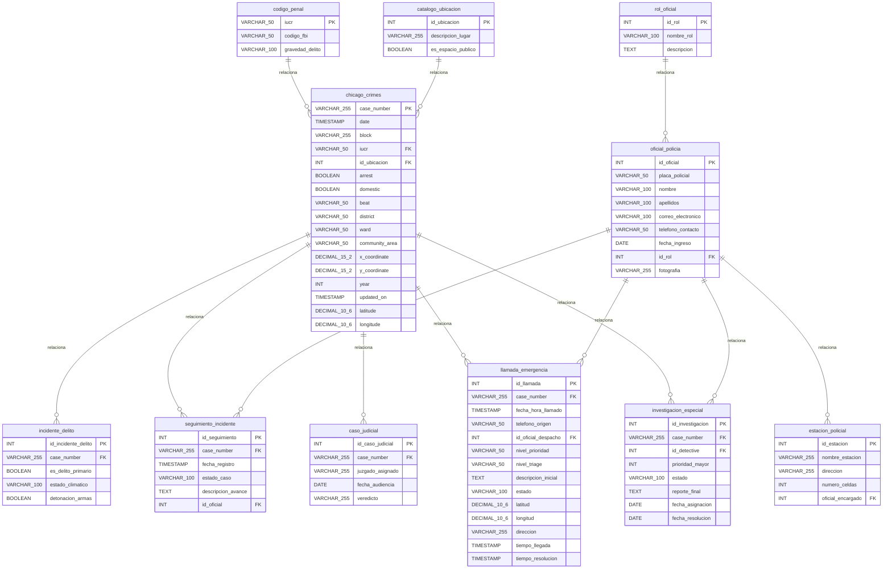

```mermaid
erDiagram
    chicago_crimes {
        VARCHAR_255 case_number PK
        TIMESTAMP date
        VARCHAR_255 block
        VARCHAR_50 iucr FK
        INT id_ubicacion FK
        BOOLEAN arrest
        BOOLEAN domestic
        VARCHAR_50 beat
        VARCHAR_50 district
        VARCHAR_50 ward
        VARCHAR_50 community_area
        DECIMAL_15_2 x_coordinate
        DECIMAL_15_2 y_coordinate
        INT year
        TIMESTAMP updated_on
        DECIMAL_10_6 latitude
        DECIMAL_10_6 longitude
    }
    codigo_penal {
        VARCHAR_50 iucr PK
        VARCHAR_50 codigo_fbi
        VARCHAR_100 gravedad_delito
    }
    catalogo_ubicacion {
        INT id_ubicacion PK
        VARCHAR_255 descripcion_lugar
        BOOLEAN es_espacio_publico
    }
    incidente_delito {
        INT id_incidente_delito PK
        VARCHAR_255 case_number FK
        BOOLEAN es_delito_primario
        VARCHAR_100 estado_climatico
        BOOLEAN detonacion_armas
    }
    seguimiento_incidente {
        INT id_seguimiento PK
        VARCHAR_255 case_number FK
        TIMESTAMP fecha_registro
        VARCHAR_100 estado_caso
        TEXT descripcion_avance
        INT id_oficial FK
    }
    caso_judicial {
        INT id_caso_judicial PK
        VARCHAR_255 case_number FK
        VARCHAR_255 juzgado_asignado
        DATE fecha_audiencia
        VARCHAR_255 veredicto
    }
    llamada_emergencia {
        INT id_llamada PK
        VARCHAR_255 case_number FK
        TIMESTAMP fecha_hora_llamado
        VARCHAR_50 telefono_origen
        INT id_oficial_despacho FK
        VARCHAR_50 nivel_prioridad
        VARCHAR_50 nivel_triage
        TEXT descripcion_inicial
        VARCHAR_100 estado
        DECIMAL_10_6 latitud
        DECIMAL_10_6 longitud
        VARCHAR_255 direccion
        TIMESTAMP tiempo_llegada
        TIMESTAMP tiempo_resolucion
    }
    investigacion_especial {
        INT id_investigacion PK
        VARCHAR_255 case_number FK
        INT id_detective FK
        INT prioridad_mayor
        VARCHAR_100 estado
        TEXT reporte_final
        DATE fecha_asignacion
        DATE fecha_resolucion
    }
    oficial_policia {
        INT id_oficial PK
        VARCHAR_50 placa_policial
        VARCHAR_100 nombre
        VARCHAR_100 apellidos
        VARCHAR_100 correo_electronico
        VARCHAR_50 telefono_contacto
        DATE fecha_ingreso
        INT id_rol FK
        VARCHAR_255 fotografia
    }
    rol_oficial {
        INT id_rol PK
        VARCHAR_100 nombre_rol
        TEXT descripcion
    }
    estacion_policial {
        INT id_estacion PK
        VARCHAR_255 nombre_estacion
        VARCHAR_255 direccion
        INT numero_celdas
        INT oficial_encargado FK
    }
    codigo_penal ||--o{ chicago_crimes : "relaciona"
    catalogo_ubicacion ||--o{ chicago_crimes : "relaciona"
    chicago_crimes ||--o{ incidente_delito : "relaciona"
    chicago_crimes ||--o{ seguimiento_incidente : "relaciona"
    oficial_policia ||--o{ seguimiento_incidente : "relaciona"
    chicago_crimes ||--o{ caso_judicial : "relaciona"
    chicago_crimes ||--o{ llamada_emergencia : "relaciona"
    oficial_policia ||--o{ llamada_emergencia : "relaciona"
    chicago_crimes ||--o{ investigacion_especial : "relaciona"
    oficial_policia ||--o{ investigacion_especial : "relaciona"
    rol_oficial ||--o{ oficial_policia : "relaciona"
    oficial_policia ||--o{ estacion_policial : "relaciona"
```
