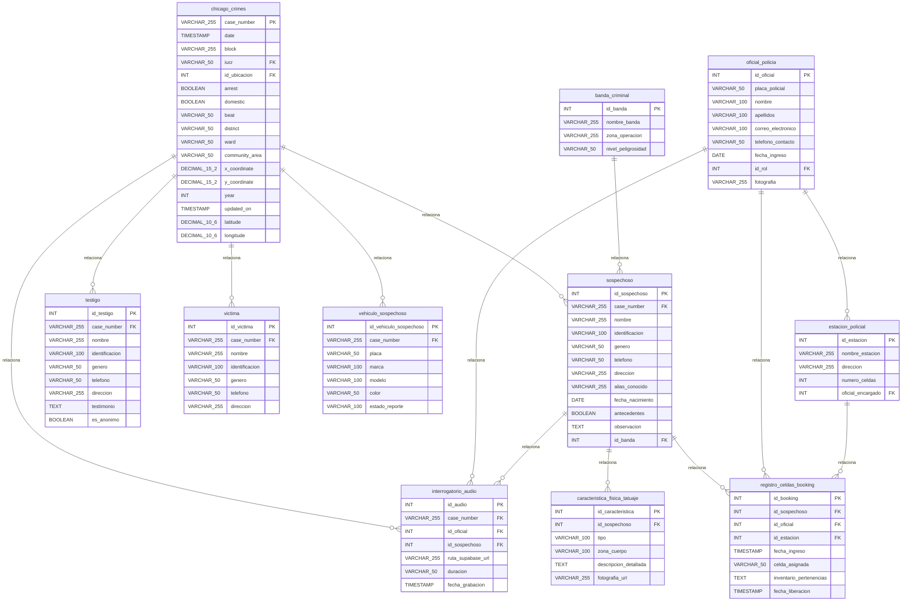

```mermaid
erDiagram
    chicago_crimes {
        VARCHAR_255 case_number PK
        TIMESTAMP date
        VARCHAR_255 block
        VARCHAR_50 iucr FK
        INT id_ubicacion FK
        BOOLEAN arrest
        BOOLEAN domestic
        VARCHAR_50 beat
        VARCHAR_50 district
        VARCHAR_50 ward
        VARCHAR_50 community_area
        DECIMAL_15_2 x_coordinate
        DECIMAL_15_2 y_coordinate
        INT year
        TIMESTAMP updated_on
        DECIMAL_10_6 latitude
        DECIMAL_10_6 longitude
    }
    sospechoso {
        INT id_sospechoso PK
        VARCHAR_255 case_number FK
        VARCHAR_255 nombre
        VARCHAR_100 identificacion
        VARCHAR_50 genero
        VARCHAR_50 telefono
        VARCHAR_255 direccion
        VARCHAR_255 alias_conocido
        DATE fecha_nacimiento
        BOOLEAN antecedentes
        TEXT observacion
        INT id_banda FK
    }
    banda_criminal {
        INT id_banda PK
        VARCHAR_255 nombre_banda
        VARCHAR_255 zona_operacion
        VARCHAR_50 nivel_peligrosidad
    }
    testigo {
        INT id_testigo PK
        VARCHAR_255 case_number FK
        VARCHAR_255 nombre
        VARCHAR_100 identificacion
        VARCHAR_50 genero
        VARCHAR_50 telefono
        VARCHAR_255 direccion
        TEXT testimonio
        BOOLEAN es_anonimo
    }
    victima {
        INT id_victima PK
        VARCHAR_255 case_number FK
        VARCHAR_255 nombre
        VARCHAR_100 identificacion
        VARCHAR_50 genero
        VARCHAR_50 telefono
        VARCHAR_255 direccion
    }
    caracteristica_fisica_tatuaje {
        INT id_caracteristica PK
        INT id_sospechoso FK
        VARCHAR_100 tipo
        VARCHAR_100 zona_cuerpo
        TEXT descripcion_detallada
        VARCHAR_255 fotografia_url
    }
    vehiculo_sospechoso {
        INT id_vehiculo_sospechoso PK
        VARCHAR_255 case_number FK
        VARCHAR_50 placa
        VARCHAR_100 marca
        VARCHAR_100 modelo
        VARCHAR_50 color
        VARCHAR_100 estado_reporte
    }
    registro_celdas_booking {
        INT id_booking PK
        INT id_sospechoso FK
        INT id_oficial FK
        INT id_estacion FK
        TIMESTAMP fecha_ingreso
        VARCHAR_50 celda_asignada
        TEXT inventario_pertenencias
        TIMESTAMP fecha_liberacion
    }
    interrogatorio_audio {
        INT id_audio PK
        VARCHAR_255 case_number FK
        INT id_oficial FK
        INT id_sospechoso FK
        VARCHAR_255 ruta_supabase_url
        VARCHAR_50 duracion
        TIMESTAMP fecha_grabacion
    }
    oficial_policia {
        INT id_oficial PK
        VARCHAR_50 placa_policial
        VARCHAR_100 nombre
        VARCHAR_100 apellidos
        VARCHAR_100 correo_electronico
        VARCHAR_50 telefono_contacto
        DATE fecha_ingreso
        INT id_rol FK
        VARCHAR_255 fotografia
    }
    estacion_policial {
        INT id_estacion PK
        VARCHAR_255 nombre_estacion
        VARCHAR_255 direccion
        INT numero_celdas
        INT oficial_encargado FK
    }
    chicago_crimes ||--o{ sospechoso : "relaciona"
    banda_criminal ||--o{ sospechoso : "relaciona"
    chicago_crimes ||--o{ testigo : "relaciona"
    chicago_crimes ||--o{ victima : "relaciona"
    sospechoso ||--o{ caracteristica_fisica_tatuaje : "relaciona"
    chicago_crimes ||--o{ vehiculo_sospechoso : "relaciona"
    sospechoso ||--o{ registro_celdas_booking : "relaciona"
    oficial_policia ||--o{ registro_celdas_booking : "relaciona"
    estacion_policial ||--o{ registro_celdas_booking : "relaciona"
    chicago_crimes ||--o{ interrogatorio_audio : "relaciona"
    oficial_policia ||--o{ interrogatorio_audio : "relaciona"
    sospechoso ||--o{ interrogatorio_audio : "relaciona"
    oficial_policia ||--o{ estacion_policial : "relaciona"
```
