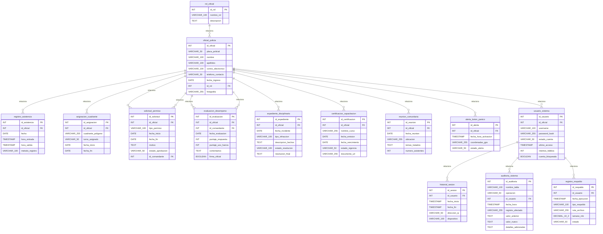

```mermaid
erDiagram
    oficial_policia {
        INT id_oficial PK
        VARCHAR_50 placa_policial
        VARCHAR_100 nombre
        VARCHAR_100 apellidos
        VARCHAR_100 correo_electronico
        VARCHAR_50 telefono_contacto
        DATE fecha_ingreso
        INT id_rol FK
        VARCHAR_255 fotografia
    }
    rol_oficial {
        INT id_rol PK
        VARCHAR_100 nombre_rol
        TEXT descripcion
    }
    registro_asistencia {
        INT id_asistencia PK
        INT id_oficial FK
        DATE fecha
        TIMESTAMP hora_entrada
        TIMESTAMP hora_salida
        VARCHAR_100 metodo_registro
    }
    asignacion_cuadrante {
        INT id_asignacion PK
        INT id_oficial FK
        VARCHAR_255 cuadrante_poligono
        VARCHAR_50 turno_asignado
        DATE fecha_inicio
        DATE fecha_fin
    }
    solicitud_permiso {
        INT id_solicitud PK
        INT id_oficial FK
        VARCHAR_100 tipo_permiso
        DATE fecha_inicio
        DATE fecha_fin
        TEXT motivo
        VARCHAR_50 estado_aprobacion
        INT id_comandante FK
    }
    evaluacion_desempeno {
        INT id_evaluacion PK
        INT id_oficial FK
        INT id_comandante FK
        DATE fecha_evaluacion
        INT puntaje_respuesta
        INT puntaje_uso_fuerza
        TEXT comentarios
        BOOLEAN firma_oficial
    }
    expediente_disciplinario {
        INT id_expediente PK
        INT id_oficial FK
        DATE fecha_incidente
        VARCHAR_100 tipo_infraccion
        TEXT descripcion_hechos
        VARCHAR_100 estado_resolucion
        TEXT resolucion_final
    }
    certificacion_capacitacion {
        INT id_certificacion PK
        INT id_oficial FK
        VARCHAR_255 nombre_curso
        DATE fecha_emision
        DATE fecha_vencimiento
        VARCHAR_50 estado_vigencia
        VARCHAR_255 documento_url
    }
    reunion_comunitaria {
        INT id_reunion PK
        INT id_oficial FK
        DATE fecha_reunion
        VARCHAR_255 ubicacion
        TEXT temas_tratados
        INT numero_asistentes
    }
    alerta_boton_panico {
        INT id_alerta PK
        INT id_oficial FK
        TIMESTAMP fecha_hora_activacion
        VARCHAR_255 coordenadas_gps
        VARCHAR_50 estado_alerta
    }
    usuario_sistema {
        INT id_usuario PK
        INT id_oficial FK
        VARCHAR_100 username
        VARCHAR_255 password_hash
        VARCHAR_50 estado_cuenta
        TIMESTAMP ultimo_acceso
        INT intentos_fallidos
        BOOLEAN cuenta_bloqueada
    }
    historial_sesion {
        INT id_sesion PK
        INT id_usuario FK
        TIMESTAMP fecha_inicio
        TIMESTAMP fecha_fin
        VARCHAR_50 direccion_ip
        VARCHAR_100 dispositivo
    }
    auditoria_sistema {
        INT id_auditoria PK
        VARCHAR_100 nombre_tabla
        VARCHAR_50 operacion
        INT id_usuario FK
        TIMESTAMP fecha_hora
        VARCHAR_255 registro_afectado
        TEXT valor_anterior
        TEXT valor_nuevo
        TEXT detalles_adicionales
    }
    registro_respaldo {
        INT id_respaldo PK
        INT id_usuario FK
        TIMESTAMP fecha_ejecucion
        VARCHAR_100 tipo_respaldo
        VARCHAR_255 ruta_archivo
        DECIMAL_10_2 tamano_mb
        VARCHAR_50 estado
    }
    rol_oficial ||--o{ oficial_policia : "relaciona"
    oficial_policia ||--o{ registro_asistencia : "relaciona"
    oficial_policia ||--o{ asignacion_cuadrante : "relaciona"
    oficial_policia ||--o{ solicitud_permiso : "relaciona"
    oficial_policia ||--o{ solicitud_permiso : "relaciona"
    oficial_policia ||--o{ evaluacion_desempeno : "relaciona"
    oficial_policia ||--o{ evaluacion_desempeno : "relaciona"
    oficial_policia ||--o{ expediente_disciplinario : "relaciona"
    oficial_policia ||--o{ certificacion_capacitacion : "relaciona"
    oficial_policia ||--o{ reunion_comunitaria : "relaciona"
    oficial_policia ||--o{ alerta_boton_panico : "relaciona"
    oficial_policia ||--o{ usuario_sistema : "relaciona"
    usuario_sistema ||--o{ historial_sesion : "relaciona"
    usuario_sistema ||--o{ auditoria_sistema : "relaciona"
    usuario_sistema ||--o{ registro_respaldo : "relaciona"
```
