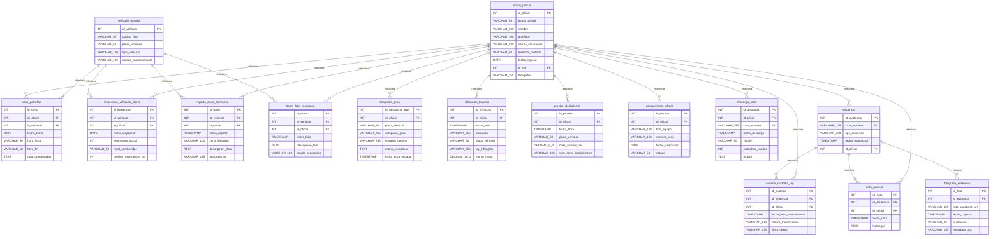

```mermaid
erDiagram
    oficial_policia {
        INT id_oficial PK
        VARCHAR_50 placa_policial
        VARCHAR_100 nombre
        VARCHAR_100 apellidos
        VARCHAR_100 correo_electronico
        VARCHAR_50 telefono_contacto
        DATE fecha_ingreso
        INT id_rol FK
        VARCHAR_255 fotografia
    }
    vehiculo_patrulla {
        INT id_vehiculo PK
        VARCHAR_50 codigo_flota
        VARCHAR_50 placa_vehiculo
        VARCHAR_100 tipo_vehiculo
        VARCHAR_100 estado_mantenimiento
    }
    turno_patrullaje {
        INT id_turno PK
        INT id_oficial FK
        INT id_vehiculo FK
        DATE fecha_turno
        VARCHAR_50 hora_inicio
        VARCHAR_50 hora_fin
        TEXT ruta_coordenadas
    }
    inspeccion_vehicular_diaria {
        INT id_inspeccion PK
        INT id_vehiculo FK
        INT id_oficial FK
        DATE fecha_inspeccion
        INT kilometraje_actual
        VARCHAR_50 nivel_combustible
        INT presion_neumaticos_psi
    }
    reporte_dano_carroceria {
        INT id_dano PK
        INT id_vehiculo FK
        INT id_oficial FK
        TIMESTAMP fecha_reporte
        VARCHAR_100 zona_afectada
        TEXT descripcion_dano
        VARCHAR_255 fotografia_url
    }
    ticket_falla_mecanica {
        INT id_ticket PK
        INT id_vehiculo FK
        INT id_oficial FK
        TIMESTAMP fecha_falla
        TEXT descripcion_falla
        VARCHAR_100 estado_reparacion
    }
    despacho_grua {
        INT id_despacho_grua PK
        INT id_oficial FK
        VARCHAR_50 placa_vehiculo
        VARCHAR_255 compania_grua
        VARCHAR_255 corralon_destino
        TEXT motivo_remolque
        TIMESTAMP fecha_hora_llegada
    }
    infraccion_transito {
        INT id_infraccion PK
        INT id_oficial FK
        TIMESTAMP fecha_hora
        VARCHAR_255 ubicacion
        VARCHAR_50 placa_vehiculo
        VARCHAR_255 ley_infringida
        DECIMAL_10_2 monto_multa
    }
    prueba_alcoholemia {
        INT id_prueba PK
        INT id_oficial FK
        TIMESTAMP fecha_hora
        VARCHAR_50 placa_vehiculo
        DECIMAL_5_2 nivel_alcohol_bac
        VARCHAR_100 num_serie_alcoholimetro
    }
    equipamiento_oficial {
        INT id_equipo PK
        INT id_oficial FK
        VARCHAR_100 tipo_equipo
        VARCHAR_100 numero_serie
        DATE fecha_asignacion
        VARCHAR_50 estado
    }
    descarga_taser {
        INT id_descarga PK
        INT id_oficial FK
        VARCHAR_255 case_number FK
        TIMESTAMP fecha_descarga
        VARCHAR_50 voltaje
        INT cartuchos_usados
        TEXT motivo
    }
    evidencia {
        INT id_evidencia PK
        VARCHAR_255 case_number FK
        VARCHAR_100 tipo_evidencia
        TIMESTAMP fecha_recoleccion
        INT id_oficial FK
    }
    cadena_custodia_log {
        INT id_custodia PK
        INT id_evidencia FK
        INT id_oficial FK
        TIMESTAMP fecha_hora_transferencia
        VARCHAR_255 motivo_transferencia
        VARCHAR_255 firma_digital
    }
    nota_pericial {
        INT id_nota PK
        INT id_evidencia FK
        INT id_oficial FK
        TIMESTAMP fecha_nota
        TEXT hallazgos
    }
    fotografia_evidencia {
        INT id_foto PK
        INT id_evidencia FK
        VARCHAR_255 ruta_supabase_url
        TIMESTAMP fecha_captura
        VARCHAR_50 resolucion
        VARCHAR_255 metadata_gps
    }
    oficial_policia ||--o{ turno_patrullaje : "relaciona"
    vehiculo_patrulla ||--o{ turno_patrullaje : "relaciona"
    vehiculo_patrulla ||--o{ inspeccion_vehicular_diaria : "relaciona"
    oficial_policia ||--o{ inspeccion_vehicular_diaria : "relaciona"
    vehiculo_patrulla ||--o{ reporte_dano_carroceria : "relaciona"
    oficial_policia ||--o{ reporte_dano_carroceria : "relaciona"
    vehiculo_patrulla ||--o{ ticket_falla_mecanica : "relaciona"
    oficial_policia ||--o{ ticket_falla_mecanica : "relaciona"
    oficial_policia ||--o{ despacho_grua : "relaciona"
    oficial_policia ||--o{ infraccion_transito : "relaciona"
    oficial_policia ||--o{ prueba_alcoholemia : "relaciona"
    oficial_policia ||--o{ equipamiento_oficial : "relaciona"
    oficial_policia ||--o{ descarga_taser : "relaciona"
    oficial_policia ||--o{ evidencia : "relaciona"
    evidencia ||--o{ cadena_custodia_log : "relaciona"
    oficial_policia ||--o{ cadena_custodia_log : "relaciona"
    evidencia ||--o{ nota_pericial : "relaciona"
    oficial_policia ||--o{ nota_pericial : "relaciona"
    evidencia ||--o{ fotografia_evidencia : "relaciona"
```
