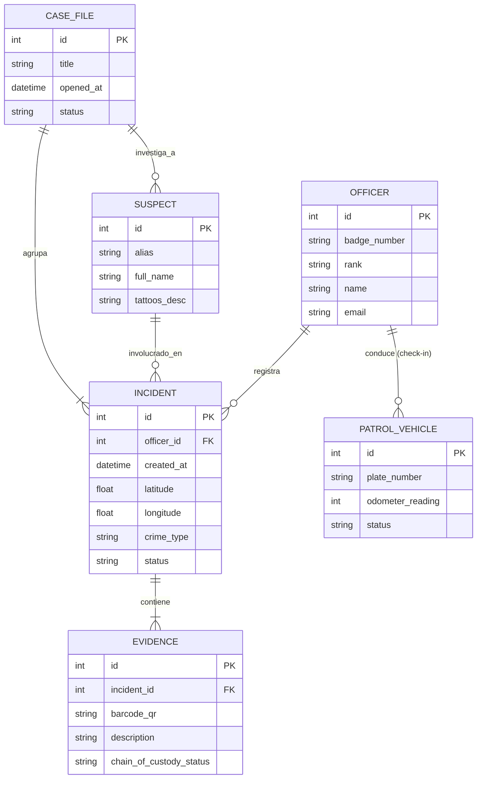
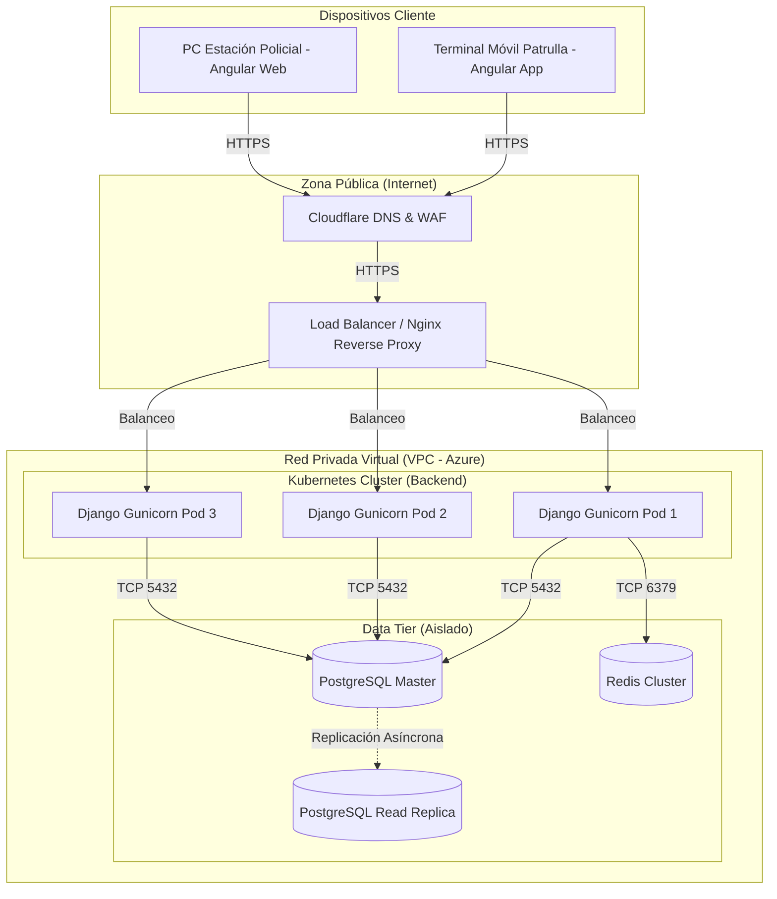

# Documento del Sistema en UML: SafeCity Intelligence Ops

Este documento contiene los modelos visuales en UML (Unified Modeling Language) generados para la arquitectura, base de datos, módulos y despliegue del sistema. Se utiliza la sintaxis **Mermaid** para su renderizado nativo.

---

## 1. Diagrama de Casos de Uso por Paquete

```mermaid
usecaseDiagram
  %% Actores del Sistema (Jerarquía)
  actor "Usuario (Base)" as USR
  actor "Oficial de Patrulla" as OP
  actor "Sheriff" as CMD
  
  %% Generalización (Herencia)
  OP --|> USR
  CMD --|> USR

  %% Otros Actores
  actor "Operador 911" as O911
  actor "Detective" as DET
  actor "Jefe de Logística" as LOG
  actor "Oficial de RRHH" as HR
  actor "Agente de Tránsito" as TRA
  actor "Administrador del Sistema" as ADM
  actor "Analista de Inteligencia" as ANA
  actor "Sistema" as SYS

  rectangle "Paquete 1: Gestión de Incidentes" {
    usecase "CU-01: Gestionar Incidentes" as UC1
    usecase "CU-02: Consultar / Filtrar Incidentes" as UC2
    usecase "CU-03: Registrar Tiempo Llegada Emergencias" as UC3
  }
  
  rectangle "Paquete 2: Inteligencia Geográfica" {
    usecase "CU-04: Visualizar Heatmap" as UC4
    usecase "CU-05: Filtrar por Calle/Zona" as UC5
    usecase "CU-06: Alternar Capas" as UC6
  }

  rectangle "Paquete 3: Investigacion Especial" {
    usecase "CU-07: Abrir Expediente y Asignar Detective" as UC7
    usecase "CU-08: Consultar 'Mis Casos'" as UC8
    usecase "CU-09: Registrar Arresto Relacionado" as UC9
    usecase "CU-10: Generar Reporte Conclusivo" as UC10
    usecase "CU-11: Reabrir Caso Cerrado" as UC11
    usecase "CU-12: Gestionar Personas Desaparecidas" as UC12
  }

  rectangle "Paquete 4: Hub de Inteligencia Criminal" {
    usecase "CU-13: Gestionar Catálogo de Bandas" as UC13
    usecase "CU-14: Gestionar y Vincular Sospechoso" as UC14
    usecase "CU-15: Registrar Declaración de Testigo" as UC15
    usecase "CU-16: Gestionar Custodia e Inventario" as UC16
    usecase "CU-17: Gestionar Alertas BOLO" as UC17
  }

  rectangle "Paquete 5: Logística y Patrullas" {
    usecase "CU-18: Gestionar Check-in y Check-out" as UC18
    usecase "CU-19: Gestionar Equipo Táctico" as UC19
    usecase "CU-20: Consultar Inventario de Flota" as UC20
    usecase "CU-21: Gestionar Tickets de Fallas" as UC21
    usecase "CU-22: Registrar Uso de Fuerza" as UC22
    usecase "CU-23: Dar de Baja Activo" as UC23
    usecase "CU-24: Registrar Persecución Vehicular" as UC24
    usecase "CU-25: Trazar Ruta Táctico-Logística" as UC25
  }

  rectangle "Paquete 6: Despacho de Emergencias" {
    usecase "CU-26: Registrar Llamada 911" as UC26
    usecase "CU-27: Geolocalizar y Despachar" as UC27
    usecase "CU-28: Monitorear Tiempos Respuesta" as UC28
    usecase "CU-29: Clasificar Triage 911" as UC29
  }

  rectangle "Paquete 7: Recursos Humanos" {
    usecase "CU-30: Gestionar Asistencia de Personal" as UC30
    usecase "CU-31: Asignar Cuadrantes de Patrulla" as UC31
    usecase "CU-32: Gestionar Solicitudes de Permisos" as UC32
    usecase "CU-33: Registrar Briefing (Roll Call)" as UC33
    usecase "CU-34: Registrar Traspaso de Turno" as UC34
    usecase "CU-35: Gestionar Capacitaciones y Certificados" as UC35
    usecase "CU-36: Registrar Queja contra Oficial" as UC36
    usecase "CU-37: Consultar Hoja de Vida" as UC37
  }

  rectangle "Paquete 8: Tránsito y Comunidad" {
    usecase "CU-38: Gestionar Infracciones Tránsito" as UC38
    usecase "CU-39: Registrar Prueba BAC (Alcoholemia)" as UC39
    usecase "CU-40: Coordinar Despacho Grúa" as UC40
    usecase "CU-41: Registrar Reunión Comunitaria" as UC41
    usecase "CU-42: Gestionar Celdas y Detenidos" as UC42
  }

  rectangle "Paquete 9: Órdenes Judiciales" {
    usecase "CU-43: Gestionar Órdenes Judiciales (Warrants)" as UC43
  }

  rectangle "Paquete 10: Accidentes" {
    usecase "CU-44: Registrar Informe de Accidente" as UC44
  }

  rectangle "Paquete 11: Admin y Seguridad" {
    usecase "CU-45: Iniciar/Cerrar Sesión" as UC45
    usecase "CU-46: Gestionar Usuarios y Roles" as UC46
    usecase "CU-47: Consultar Bitácora Auditoría" as UC47
    usecase "CU-48: Ejecutar Respaldo de BD" as UC48
    usecase "CU-49: Recuperar Contraseña" as UC49
  }

  rectangle "Paquete 12: Analítica y Dashboard" {
    usecase "CU-50: Generar Reportes Estadísticos" as UC50
    usecase "CU-51: Análisis Predictivo Hotspots" as UC51
    usecase "CU-52: Análisis de Vínculos en Red" as UC52
    usecase "CU-53: Exportar Reportes" as UC53
  }

  %% Relaciones de Incidentes
  OP --> UC1
  OP --> UC2
  OP --> UC3
  CMD --> UC1
  CMD --> UC2

  %% Relaciones de Inteligencia Geográfica
  CMD --> UC4
  DET --> UC4
  ANA --> UC4
  DET --> UC5
  ANA --> UC5
  ANA --> UC6

  %% Relaciones de Investigación Especial
  CMD --> UC7
  DET --> UC7
  DET --> UC8
  DET --> UC9
  DET --> UC10
  CMD --> UC10
  DET --> UC11
  CMD --> UC11
  OP --> UC12
  DET --> UC12

  %% Relaciones de Hub de Inteligencia (Alineado a Diagrama)
  CMD --> UC13
  USR --> UC14
  USR --> UC15
  USR --> UC16
  USR --> UC17
  DET --> UC14
  DET --> UC15
  DET --> UC16
  DET --> UC17

  %% Relaciones de Logística
  OP --> UC18
  OP --> UC19
  LOG --> UC19
  LOG --> UC20
  OP --> UC21
  LOG --> UC21
  OP --> UC22
  LOG --> UC23
  OP --> UC24
  OP --> UC25
  LOG --> UC25

  %% Relaciones de Despacho
  O911 --> UC26
  O911 --> UC27
  SYS --> UC27
  O911 --> UC28
  O911 --> UC29

  %% Relaciones de RRHH
  HR --> UC30
  OP --> UC30
  HR --> UC31
  OP --> UC32
  CMD --> UC32
  OP --> UC33
  OP --> UC34
  HR --> UC35
  HR --> UC36
  HR --> UC37

  %% Relaciones de Tránsito
  TRA --> UC38
  TRA --> UC39
  TRA --> UC40
  TRA --> UC41
  OP --> UC42
  TRA --> UC42

  %% Relaciones de Órdenes y Accidentes
  OP --> UC43
  DET --> UC43
  CMD --> UC43
  OP --> UC44
  TRA --> UC44

  %% Relaciones de Admin y Seguridad
  ADM --> UC45
  ADM --> UC46
  ADM --> UC47
  ADM --> UC48
  SYS --> UC48
  ADM --> UC49

  %% Relaciones de Analítica
  ANA --> UC50
  ANA --> UC51
  SYS --> UC51
  ANA --> UC52
  ANA --> UC53
```

*Este diagrama consolidado agrupa los procesos CRUD en casos de uso de gestión ('Gestionar') organizados en 12 paquetes lógicos, separando la consulta/filtro de incidentes por su alta relevancia operativa, y alineando el Paquete 4 y Paquete 5 a las definiciones exactas del usuario, con un total de 53 Casos de Uso globales.*

---

## 2. Diagrama de Base de Datos (Entidad-Relación)
Modelo lógico relacional core para el sistema (simplificado para los módulos principales).



---

## 3. Diagrama de Componentes
Arquitectura de software desacoplada utilizando Angular para el Frontend y Django para el Backend.

```mermaid
componentDiagram
    package "Frontend (Angular 17+)" {
        [Dashboard UI]
        [Map Component (Leaflet)]
        [Auth Guard]
        [HTTP Interceptor]
    }

    package "Backend (Django REST Framework)" {
        [API Gateway / Router]
        [Auth Service (JWT)]
        [Incident App]
        [Intelligence App]
        [Logistics App]
    }

    database "PostgreSQL Database" {
        [Relational Data]
    }

    database "Redis Cache" {
        [Session Data & Rate Limiting]
    }

    cloud "Azure Blob Storage" {
        [Evidences & Photos]
    }

    [Dashboard UI] --> [API Gateway / Router] : HTTPS / JSON
    [Map Component (Leaflet)] --> [API Gateway / Router] : HTTPS / JSON
    
    [API Gateway / Router] --> [Auth Service (JWT)]
    [API Gateway / Router] --> [Incident App]
    [API Gateway / Router] --> [Intelligence App]
    [API Gateway / Router] --> [Logistics App]

    [Incident App] --> [Relational Data]
    [Intelligence App] --> [Relational Data]
    
    [Auth Service (JWT)] --> [Session Data & Rate Limiting]
    [Incident App] --> [Evidences & Photos] : S3 Protocol
```

---

## 4. Diagrama de Despliegue (Deployment)
Arquitectura de infraestructura cloud para alta disponibilidad.


