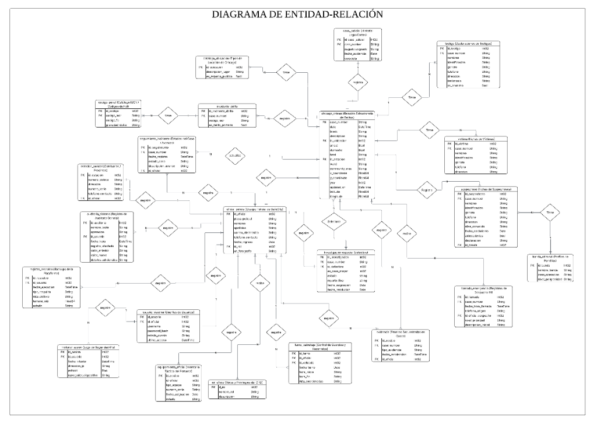

# Database Entity-Relationship Diagram (ERD)

This document describes the schema of the ClickHouse database for SafeCity, detailing tables, fields, and logical relationships as represented in the system architecture.

---

## 📊 Database Entity-Relationship Diagram (ERD)

---

## 🗂️ Database Table Catalog

### 1. Core Crimes & Classifications
* **`chicago_crimes` (Central Incident Table):** Stores primary geolocalized historical incident records.
  * Fields: `case_number` (PK), `date`, `block`, `id_ubicacion`, `arrest`, `domestic`, `beat`, `id_estacion`, `ward`, `community_area`, `x_coordinate`, `y_coordinate`, `year`, `updated_on`, `latitude`, `longitude`.
* **`incidente_delito` (Crime Link Table):** Links specific incidents to Illinois Uniform Crime Reporting (IUCR) codes.
  * Fields: `id_incidente_delito` (PK), `case_number` (FK), `codigo_iucr` (FK), `es_delito_primario`.
* **`codigo_penal` (Penal Code / Severity Directory):** Maps state-level IUCR codes to federal FBI classifications and severity names.
  * Fields: `id_codigo` (PK), `codigo_iucr`, `codigo_fbi`, `gravedad_delito` (Crime Type).
* **`catalogo_ubicacion` (Location Catalog):** Standardizes locations where crimes occurred.
  * Fields: `id_ubicacion` (PK), `descripcion_lugar` (Location Description), `es_espacio_publico` (Is Public Space).

---

### 2. Criminal Intelligence Módules
* **`sospechoso` (Suspects Dossier):** Detailed profiles of suspects identified in investigations.
  * Fields: `id_sospechoso` (PK), `case_number` (FK), `nombres` (First Name), `identificacion` (Gov ID), `genero`, `telefono`, `direccion`, `alias_conocido`, `fecha_nacimiento`, `antecedentes` (Prior Records), `declaracion` (Statement), `id_banda` (FK).
* **`banda_criminal` (Criminal Gangs):** Information on criminal structures.
  * Fields: `id_banda` (PK), `nombre_banda`, `zona_operacion` (Operational Area), `nivel_peligrosidad` (Threat Level).
* **`evidencia` (Physical Evidence Inventory):** Objects and materials collected from crime scenes.
  * Fields: `id_evidencia` (PK), `case_number` (FK), `tipo_evidencia`, `fecha_recoleccion`, `id_oficial` (FK).
* **`testigo` (Witnesses):** Witness information and testimonials.
  * Fields: `id_testigo` (PK), `case_number` (FK), `nombres`, `identificacion`, `genero`, `telefono`, `direccion`, `testimonio`, `es_anonimo` (Is Anonymous).
* **`victima` (Victims Directory):** Registry of victims associated with case files.
  * Fields: `id_victima` (PK), `case_number` (FK), `nombres`, `identificacion`, `genero`, `telefono`, `direccion`.

---

### 3. Special Investigations & Auditing
* **`investigacion_especial` (Detective Case Assignments):** Cases flagged for special investigation and assigned to detectives.
  * Fields: `id_investigacion` (PK), `case_number` (FK), `id_detective` (FK), `es_caso_mayor` (Is Major Case), `estado` (Status), `reporte_final` (Final Report), `fecha_asignacion`, `fecha_resolucion`.
* **`seguimiento_incidente` (Case Timeline Logs):** Progress logs, timeline details, and investigative actions on case files.
  * Fields: `id_seguimiento` (PK), `case_number` (FK), `fecha_registro`, `estado_caso`, `accion`, `descripcion_avance`, `id_oficial` (FK), `oficial` (Officer Name).
* **`auditoria_sistema` (System Audits):** Records metadata modifications (inserts, updates, deletes) for accountability.
  * Fields: `id_auditoria` (PK), `id_usuario` (FK), `fecha_hora`, `registro_afectado`, `valor_anterior`, `valor_nuevo`, `detalles_adicionales`.

---

### 4. Police Logistics & Operations
* **`oficial_policia` (Officer Directory):** Police personnel directory.
  * Fields: `id_oficial` (PK), `placa_policial` (Badge Number), `nombres`, `apellidos`, `correo_electronico`, `telefono_contacto`, `fecha_ingreso`, `id_rol` (FK), `url_fotografia`.
* **`rol_oficial` (Roles):** Defines access and navigation levels.
  * Fields: `id_rol` (PK), `nombre_rol` (e.g., *oficial, detective, administrador, administrador_sistema*), `descripcion`.
* **`usuario_sistema` (User Credentials):** Secure credentials linking accounts to officers.
  * Fields: `id_usuario` (PK), `id_oficial` (FK), `username`, `password_hash`, `estado_cuenta` (Account Status), `ultimo_acceso`.
* **`vehiculo_patrulla` (Patrol Fleet):** Roster of squad cars and operational vehicles.
  * Fields: `id_vehiculo` (PK), `codigo_beat` (Assigned Beat), `placa_vehiculo` (License Plate), `tipo_vehiculo`, `estado_mantenimiento`.
* **`turno_patrullaje` (Patrol Shifts):** Links officers, vehicles, and schedules.
  * Fields: `id_turno` (PK), `id_oficial` (FK), `id_vehiculo` (FK), `fecha_turno`, `hora_inicio`, `hora_fin`, `ruta_coordenadas`.
* **`estacion_policial` (Police Stations / Districts):** Information on Chicago police district headquarters.
  * Fields: `id_estacion` (PK), `numero_distrito`, `direccion`, `telefono_contacto`, `id_oficial` (FK - Station Commander).
* **`equipamiento_oficial` (Gear Inventory):** Gear allocated to officers (radios, tasers, body cams).
  * Fields: `id_equipo` (PK), `id_oficial` (FK), `tipo_equipo`, `numero_serie`, `fecha_asignacion`, `estado`.
* **`llamada_emergencia` (Emergency Calls):** Roster of 911 emergency calls.
  * Fields: `id_llamada` (PK), `case_number` (FK), `fecha_hora_llamada`, `telefono_origen`, `oficial_despacho` (FK), `nivel_prioridad`, `descripcion_inicial`.
* **`historial_acceso` (Access History):** Tracks active and past sessions for security reviews.
  * Fields: `id_sesion` (PK), `id_usuario` (FK), `fecha_inicio`, `fecha_fin`, `ip_acceso`, `navegador_dispositivo`.
