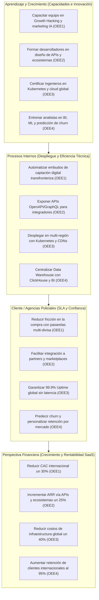

# Planificación Estratégica y Diseño del Sistema: SafeCity Intelligence Ops

Este documento detalla la planificación estratégica, el Balanced Scorecard, la arquitectura de datos híbrida, y las técnicas analíticas y de Inteligencia Artificial aplicadas al software **SafeCity Intelligence Ops** (desarrollado por **SafeCity Solutions**).

---

## 1. Identidad Organizacional (SafeCity Solutions)

*   **Nombre de la Empresa:** SafeCity Solutions.
*   **Actividad Comercial:** Desarrollo y comercialización B2G (Business-to-Government) de plataformas SaaS de misión crítica para el sector de la seguridad pública. Especializados en digitalizar y automatizar operaciones policiales para reducir costos logísticos, optimizar la gestión de flotas y agilizar el procesamiento de inteligencia criminal mediante análisis de datos.
*   **Misión:** Maximizar la eficiencia operativa de las instituciones de seguridad pública a nivel global mediante tecnología de alto rendimiento que garantice rapidez en la respuesta a emergencias y una optimización absoluta de los recursos estatales asignados. Transformar la gestión policial en un proceso medible, ágil y altamente rentable para la administración pública.
*   **Visión:** Posicionarnos como la empresa GovTech más competitiva y rentable a nivel global en el desarrollo de software para Smart Cities, siendo reconocidos por entregar un alto retorno de inversión (ROI) a los gobiernos de Chicago, Nueva York, Los Ángeles y ciudades de Latinoamérica, a través de plataformas escalables que aseguran operaciones rápidas, transparentes y sostenibles.
*   **Objetivo Estratégico General:** Expandir la presencia comercial internacional de SafeCity Solutions mediante la captación digital automatizada de clientes gubernamentales, la escalabilidad exponencial a través de ecosistemas de APIs y marketplaces, una infraestructura en la nube de alta disponibilidad global, y una inteligencia de negocio centralizada que garantice ventaja competitiva en cada mercado.

---

## 2. Objetivos Estratégicos Empresariales (OEE)

| Código | Objetivo Estratégico (Enfoque) | Descripción (Meta de Negocio) | Apoyo en TIC (Tecnología) | Indicador de Éxito (KPI) |
| :--- | :--- | :--- | :--- | :--- |
| **OEE1** | **Penetración de Mercado Digital y Adquisición Automatizada de Clientes (Growth Hacking GovTech)** | Capturar rápidamente una masa crítica de contratos gubernamentales (departamentos de policía y alcaldías) a nivel internacional mediante flujos digitales de licitación y captación B2G, reduciendo al mínimo la necesidad de despliegues comerciales presenciales o equipos de ventas tradicionales en cada país. | Implementación de plataformas de automatización de marketing (HubSpot) con Inteligencia Artificial para segmentar campañas dirigidas a autoridades públicas y tomadores de decisiones. Uso de analítica predictiva (Google Analytics 4) para identificar jurisdicciones con altos presupuestos de seguridad y portales de onboarding digital institucional sin fricción. | Costo de Adquisición Gubernamental (CAC) optimizado digitalmente y tasa de conversión de demostraciones piloto (POC) a contratos cerrados en nuevas regiones. |
| **OEE2** | **Escalabilidad Comercial Exponencial a través de Ecosistemas (Marketplaces y APIs Policiales)** | Multiplicar el alcance y los ingresos de SafeCity integrando nuestros módulos de análisis criminal directamente en la infraestructura de hardware y software que ya utilizan las agencias de seguridad en los países destino (sistemas CAD del 911, redes de cámaras urbanas, bases de datos federales). | Adopción de un enfoque Specification-Driven Development (SDD) para diseñar y exponer APIs públicas estables y estandarizadas (OpenAPI/GraphQL). Esto permite que fabricantes de cámaras corporales (ej. Axon) o proveedores de sistemas de emergencia conecten e incorporen nuestra inteligencia analítica bajo cumplimiento CJIS. | Porcentaje de ingresos recurrentes (ARR) generados a través de integraciones por API y número de alianzas activas con fabricantes externos de hardware táctico o software policial. |
| **OEE3** | **Expansión Continua Basada en Infraestructura en la Nube de Alta Disponibilidad** | Garantizar que los módulos de despacho de patrullas y análisis de crímenes mantengan un rendimiento ultrarrápido y tolerancia a fallos en cualquier ciudad, permitiendo que la operación escale automáticamente ante crisis de seguridad pública sin restricciones geográficas. | Arquitectura SaaS Multi-Tenant nativa en nubes públicas globales (Azure, GCP) mediante clústeres de contenedores (Azure AKS), asegurando el aislamiento total de datos probatorios confidenciales. Implementación de CDNs globales y pipelines DevOps/CI-CD para lanzamientos mundiales sin interrumpir la operatividad del 911. | Tiempo de disponibilidad global del sistema de emergencias (Uptime) superior al 99.99% y reducción del tiempo de despliegue (Time-to-Market) de nuevos módulos tácticos en regiones internacionales. |
| **OEE4** | **Inteligencia de Negocio Centralizada para la Ventaja Competitiva Global** | Recolectar y procesar datos masivos sobre la adopción y el rendimiento de la plataforma en distintas ciudades para optimizar nuestros algoritmos y mejorar continuamente el retorno de inversión (ROI en reducción de crímenes) que ofrecemos a los gobiernos locales. | Despliegue de un Data Warehouse unificado (ClickHouse) y herramientas BI (PowerBI) para analizar internamente la usabilidad del software en las comisarías. Uso de modelos de Machine Learning para predecir qué ciudades están subutilizando el sistema (riesgo de cancelación o *churn*) y adaptar proactivamente el soporte. | Tasa de retención anual de contratos gubernamentales internacionales y tiempo de respuesta para la toma de decisiones estratégicas de producto (basadas en datos de uso global). |

---

## 3. Jerarquía de Objetivos del Sistema (Estratégicos, Tácticos y Operativos)

De acuerdo a la arquitectura tecnológica de SafeCity Intelligence Ops, se han desglosado **27 Objetivos Tácticos (OT)** y **54 Objetivos Operativos (OP)** que alimentan el sistema.

<table border="1" style="width:100%; border-collapse: collapse; text-align: left;">
<thead>
    <tr style="background-color: #333; color: white;">
      <th style="padding: 8px;">Objetivo Estratégico (OE)</th>
      <th style="padding: 8px;">Objetivo Táctico (OT)</th>
      <th style="padding: 8px;">Objetivo Operativo (OP)</th>
      <th style="padding: 8px;">Departamento / Área</th>
    </tr>
  </thead>
<tbody>
<tr>
      <td rowspan="9" style="padding: 8px; vertical-align: middle;">OE1 : Predecir tendencias de criminalidad a largo plazo mediante modelos de Machine Learning.</td>
      <td rowspan="2" style="padding: 8px; vertical-align: middle;"><b>OT1:</b> Analizar reportes mensuales de inteligencia y mapas de calor.</td>
      <td style="padding: 8px;"><b>OP1:</b> Registrar información de nuevas emergencias policiales.</td>
      <td rowspan="9" style="padding: 8px; vertical-align: middle; text-align: center;"><b>Despacho y Operaciones</b></td>
    </tr>
    <tr>
      <td style="padding: 8px;"><b>OP2:</b> Consultar el historial de incidentes activos y pasados.</td>
    </tr>
    <tr>
      <td rowspan="2" style="padding: 8px; vertical-align: middle;"><b>OT11:</b> Generar reportes comparativos de criminalidad por tipo de delito.</td>
      <td style="padding: 8px;"><b>OP3:</b> Actualizar datos y estado de los incidentes en curso.</td>
    </tr>
    <tr>
      <td style="padding: 8px;"><b>OP4:</b> Anular incidentes inválidos o falsos positivos.</td>
    </tr>
    <tr>
      <td rowspan="1" style="padding: 8px; vertical-align: middle;"><b>OT12:</b> Consultar el listado de incidentes activos asignados a una patrulla.</td>
      <td style="padding: 8px;"><b>OP5:</b> Asignar unidades de patrulla a escenas de crimen.</td>
    </tr>
    <tr>
      <td rowspan="1" style="padding: 8px; vertical-align: middle;"><b>OT6:</b> Monitorear indicadores de tiempos de respuesta de emergencias (SLA).</td>
      <td style="padding: 8px;"><b>OP6:</b> Registrar automáticamente los tiempos de respuesta policial.</td>
    </tr>
    <tr>
      <td rowspan="1" style="padding: 8px; vertical-align: middle;"><b>OT22:</b> Consultar el historial de llamadas de emergencia recibidas.</td>
      <td style="padding: 8px;"><b>OP44:</b> Emitir y actualizar infracciones de tránsito e-Citation.</td>
    </tr>
    <tr>
      <td rowspan="2" style="padding: 8px; vertical-align: middle;"><b>OT26:</b> Gestionar el registro de infracciones de tránsito y accidentes.</td>
      <td style="padding: 8px;"><b>OP45:</b> Registrar pruebas de alcoholemia BAC en intervenciones.</td>
    </tr>
    <tr>
      <td style="padding: 8px;"><b>OP54:</b> Registrar informe de accidente de tránsito.</td>
    </tr>
    </tbody>
</table>
 

**Descripción de la Implementación:** El sistema integra analítica de Machine Learning utilizando algoritmos de regresión lineal (vía `scikit-learn` en **Python/Django DRF**). Al pulsar "Predicción ML (IA)" en el **Tactical Map (Leaflet.js)**, el backend extrae series temporales (Big Data) desde **ClickHouse** e interpola tendencias futuras. El frontend en **Angular** renderiza la proyección instantáneamente, permitiendo distribuir recursos policiales proactivamente.

**Imagen o evidencia de la implementación:**
*(Espacio para colocar la imagen de la evidencia - Puedes pegar aquí la captura que me acabas de mostrar)*

 
<table border="1" style="width:100%; border-collapse: collapse; text-align: left;">
<thead>
    <tr style="background-color: #333; color: white;">
      <th style="padding: 8px;">Objetivo Estratégico (OE)</th>
      <th style="padding: 8px;">Objetivo Táctico (OT)</th>
      <th style="padding: 8px;">Objetivo Operativo (OP)</th>
      <th style="padding: 8px;">Departamento / Área</th>
    </tr>
  </thead>
<tbody>
<tr>
      <td rowspan="17" style="padding: 8px; vertical-align: middle;">OE2 : Desmantelar organizaciones criminales utilizando algoritmos de grafos y detección de anomalías.</td>
      <td rowspan="2" style="padding: 8px; vertical-align: middle;"><b>OT2:</b> Visualizar tableros de estadísticas de reincidencia.</td>
      <td style="padding: 8px;"><b>OP7:</b> Registrar perfiles iniciales de individuos sospechosos.</td>
      <td rowspan="17" style="padding: 8px; vertical-align: middle; text-align: center;"><b>Inteligencia Criminal</b></td>
    </tr>
    <tr>
      <td style="padding: 8px;"><b>OP8:</b> Consultar antecedentes y cruce de datos criminales.</td>
    </tr>
    <tr>
      <td rowspan="1" style="padding: 8px; vertical-align: middle;"><b>OT13:</b> Consultar el directorio actualizado de sospechosos y vehículos.</td>
      <td style="padding: 8px;"><b>OP9:</b> Actualizar expedientes con nuevos indicios y vehículos.</td>
    </tr>
    <tr>
      <td rowspan="1" style="padding: 8px; vertical-align: middle;"><b>OT18:</b> Gestionar el registro de bandas criminales y víctimas.</td>
      <td style="padding: 8px;"><b>OP10:</b> Vincular arrestos operativos a investigaciones formales.</td>
    </tr>
    <tr>
      <td rowspan="4" style="padding: 8px; vertical-align: middle;"><b>OT7:</b> Consultar reportes con listados de testimonios e incautaciones.</td>
      <td style="padding: 8px;"><b>OP11:</b> Registrar evidencia física y su cadena de custodia.</td>
    </tr>
    <tr>
      <td style="padding: 8px;"><b>OP12:</b> Ejecutar transferencias de custodia de evidencia.</td>
    </tr>
    <tr>
      <td style="padding: 8px;"><b>OP13:</b> Registrar testimonios protegidos y notas periciales.</td>
    </tr>
    <tr>
      <td style="padding: 8px;"><b>OP14:</b> Emitir reportes conclusivos de cierre de investigación.</td>
    </tr>
    <tr>
      <td rowspan="3" style="padding: 8px; vertical-align: middle;"><b>OT19:</b> Gestionar el registro de arrestos y estado de celdas (Booking).</td>
      <td style="padding: 8px;"><b>OP48:</b> Registrar inventario de pertenencias de detenidos en separos.</td>
    </tr>
    <tr>
      <td style="padding: 8px;"><b>OP49:</b> Registrar bitácora de rondas y visitas médicas en celdas.</td>
    </tr>
    <tr>
      <td style="padding: 8px;"><b>OP50:</b> Procesar liberación, fianza o traslado de detenido.</td>
    </tr>
    <tr>
      <td rowspan="6" style="padding: 8px; vertical-align: middle;"><b>OT23:</b> Gestionar los casos asignados al detective e investigación especial.</td>
      <td style="padding: 8px;"><b>OP15:</b> Abrir expediente de investigación y asignar detective.</td>
    </tr>
    <tr>
      <td style="padding: 8px;"><b>OP16:</b> Reabrir caso cerrado por nueva evidencia.</td>
    </tr>
    <tr>
      <td style="padding: 8px;"><b>OP17:</b> Crear alerta BOLO (Be On The Lookout).</td>
    </tr>
    <tr>
      <td style="padding: 8px;"><b>OP18:</b> Consultar alertas BOLO activas.</td>
    </tr>
    <tr>
      <td style="padding: 8px;"><b>OP19:</b> Registrar reporte de persona desaparecida.</td>
    </tr>
    <tr>
      <td style="padding: 8px;"><b>OP20:</b> Actualizar estado de persona desaparecida.</td>
    </tr>
    </tbody>
</table>
 

**Descripción de la Implementación:** El sistema emplea teoría de grafos y detección de anomalías. **Django DRF** procesa y deduplica entidades desde la base de datos. En el frontend, **Angular** integra la librería **vis-network** para renderizar la topología con físicas interactivas (`barnesHut`). La interfaz utiliza un diseño *Glassmorphism* oscuro premium, permitiendo a los detectives realizar búsquedas reactivas en memoria y localizar nodos anómalos al instante.

**Imagen o evidencia de la implementación:**
*(Espacio para colocar la imagen de la evidencia)*

 
<table border="1" style="width:100%; border-collapse: collapse; text-align: left;">
<thead>
    <tr style="background-color: #333; color: white;">
      <th style="padding: 8px;">Objetivo Estratégico (OE)</th>
      <th style="padding: 8px;">Objetivo Táctico (OT)</th>
      <th style="padding: 8px;">Objetivo Operativo (OP)</th>
      <th style="padding: 8px;">Departamento / Área</th>
    </tr>
  </thead>
<tbody>
<tr>
      <td rowspan="8" style="padding: 8px; vertical-align: middle;">OE3 : Minimizar el gasto público mediante el mantenimiento predictivo (IA) sobre la flota vehicular.</td>
      <td rowspan="1" style="padding: 8px; vertical-align: middle;"><b>OT3:</b> Generar reportes del porcentaje de disponibilidad de la flota.</td>
      <td style="padding: 8px;"><b>OP23:</b> Consultar inventario global de la flota vehicular.</td>
      <td rowspan="8" style="padding: 8px; vertical-align: middle; text-align: center;"><b>Logística y Flota</b></td>
    </tr>
    <tr>
      <td rowspan="3" style="padding: 8px; vertical-align: middle;"><b>OT8:</b> Planificar el mantenimiento preventivo rotativo de la flota.</td>
      <td style="padding: 8px;"><b>OP21:</b> Registrar la salida y retorno (Check-in/Out) de patrullas.</td>
    </tr>
    <tr>
      <td style="padding: 8px;"><b>OP24:</b> Registrar tickets de reparaciones mecánicas de patrullas.</td>
    </tr>
    <tr>
      <td style="padding: 8px;"><b>OP46:</b> Coordinar despacho de grúas y custodia de vehículos.</td>
    </tr>
    <tr>
      <td rowspan="1" style="padding: 8px; vertical-align: middle;"><b>OT14:</b> Analizar el promedio de kilometraje recorrido por unidades.</td>
      <td style="padding: 8px;"><b>OP27:</b> Dar de baja vehículos o equipos del inventario.</td>
    </tr>
    <tr>
      <td rowspan="3" style="padding: 8px; vertical-align: middle;"><b>OT21:</b> Gestionar inventario de equipo táctico, armas y combustible.</td>
      <td style="padding: 8px;"><b>OP22:</b> Asignar equipo táctico y radios a los oficiales.</td>
    </tr>
    <tr>
      <td style="padding: 8px;"><b>OP26:</b> Registrar devolución de equipo táctico al final de turno.</td>
    </tr>
    <tr>
      <td style="padding: 8px;"><b>OP28:</b> Registrar persecución vehicular y revisión post-evento.</td>
    </tr>
    </tbody>
</table>
 

**Descripción de la Implementación:** Se integró un modelo de Machine Learning (Random Forest) en el backend (**Django**) para inferir fallas mecánicas usando telemetría. En el frontend (**Angular**), el módulo de Logística consume esta API REST para desplegar un "Análisis Predictivo IA", que incluye un Health Score, semáforos de riesgo y modales de diagnóstico interactivos con diseño *Glassmorphism* responsivo.

**Imagen o evidencia de la implementación:**
*(Espacio para colocar la imagen de la evidencia de Logística - Mantenimiento Predictivo)*

 
<table border="1" style="width:100%; border-collapse: collapse; text-align: left;">
<thead>
    <tr style="background-color: #333; color: white;">
      <th style="padding: 8px;">Objetivo Estratégico (OE)</th>
      <th style="padding: 8px;">Objetivo Táctico (OT)</th>
      <th style="padding: 8px;">Objetivo Operativo (OP)</th>
      <th style="padding: 8px;">Departamento / Área</th>
    </tr>
  </thead>
<tbody>
<tr>
      <td rowspan="10" style="padding: 8px; vertical-align: middle;">OE4 : Optimizar la fuerza laboral policial y predecir el desgaste del personal (burnout) mediante IA.</td>
      <td rowspan="2" style="padding: 8px; vertical-align: middle;"><b>OT4:</b> Visualizar reportes de ausentismo y cobertura de cuadrantes.</td>
      <td style="padding: 8px;"><b>OP29:</b> Registrar asistencia y turnos del personal en estación.</td>
      <td rowspan="10" style="padding: 8px; vertical-align: middle; text-align: center;"><b>Recursos Humanos (RRHH)</b></td>
    </tr>
    <tr>
      <td style="padding: 8px;"><b>OP31:</b> Asignar cobertura de cuadrantes de patrullaje en el mapa.</td>
    </tr>
    <tr>
      <td rowspan="1" style="padding: 8px; vertical-align: middle;"><b>OT16:</b> Generar reportes de rendimiento por oficial.</td>
      <td style="padding: 8px;"><b>OP30:</b> Generar reportes de horas trabajadas y overtime.</td>
    </tr>
    <tr>
      <td rowspan="4" style="padding: 8px; vertical-align: middle;"><b>OT9:</b> Gestionar reportes de permisos, capacitación y disciplina.</td>
      <td style="padding: 8px;"><b>OP32:</b> Procesar solicitudes y aprobaciones de permisos del personal.</td>
    </tr>
    <tr>
      <td style="padding: 8px;"><b>OP35:</b> Registrar capacitación y certificación de oficial.</td>
    </tr>
    <tr>
      <td style="padding: 8px;"><b>OP36:</b> Consultar vencimiento de certificaciones.</td>
    </tr>
    <tr>
      <td style="padding: 8px;"><b>OP38:</b> Consultar perfil y hoja de vida del oficial.</td>
    </tr>
    <tr>
      <td rowspan="2" style="padding: 8px; vertical-align: middle;"><b>OT24:</b> Gestionar control de asistencia, briefings y entregas de turno.</td>
      <td style="padding: 8px;"><b>OP33:</b> Registrar briefing de turno (Roll Call).</td>
    </tr>
    <tr>
      <td style="padding: 8px;"><b>OP34:</b> Registrar traspaso de turno entre oficiales.</td>
    </tr>
    <tr>
      <td rowspan="1" style="padding: 8px; vertical-align: middle;"><b>OT17:</b> Consolidar KPIs operativos del departamento para el Sheriff.</td>
      <td style="padding: 8px;"><b>OP55:</b> Generar automaticamente el tablero ejecutivo consolidado de KPIs para el Sheriff.</td>
    </tr>
    </tbody>
</table>
 

**Descripción de la Implementación:** Módulo de RRHH desarrollado con componentes standalone de **Angular** y formularios reactivos. Consume endpoints de **Django DRF** para orquestar asignaciones de turnos, horas extra y capacitaciones. Genera reportes ejecutivos consolidados consultando directamente modelos relacionales, lo que permite a la gerencia anticipar el desgaste del personal (burnout) mediante filtros reactivos del lado del cliente.

**Imagen o evidencia de la implementación:**
*(Espacio para colocar la imagen de la evidencia)*

 
<table border="1" style="width:100%; border-collapse: collapse; text-align: left;">
<thead>
    <tr style="background-color: #333; color: white;">
      <th style="padding: 8px;">Objetivo Estratégico (OE)</th>
      <th style="padding: 8px;">Objetivo Táctico (OT)</th>
      <th style="padding: 8px;">Objetivo Operativo (OP)</th>
      <th style="padding: 8px;">Departamento / Área</th>
    </tr>
  </thead>
<tbody>
<tr>
      <td rowspan="8" style="padding: 8px; vertical-align: middle;">OE5 : Garantizar la admisibilidad legal de toda la evidencia en cortes penales.</td>
      <td rowspan="2" style="padding: 8px; vertical-align: middle;"><b>OT5:</b> Auditar los tableros de logs de accesos y detección de anomalías.</td>
      <td style="padding: 8px;"><b>OP39:</b> Registrar accesos e inicios de sesión de usuarios.</td>
      <td rowspan="8" style="padding: 8px; vertical-align: middle; text-align: center;"><b>Seguridad y Auditoría</b></td>
    </tr>
    <tr>
      <td style="padding: 8px;"><b>OP41:</b> Consultar bitácora de auditoría de seguridad del sistema.</td>
    </tr>
    <tr>
      <td rowspan="3" style="padding: 8px; vertical-align: middle;"><b>OT10:</b> Revisar listados de Cadena de Custodia y órdenes judiciales (Warrants).</td>
      <td style="padding: 8px;"><b>OP51:</b> Registrar orden judicial (warrant).</td>
    </tr>
    <tr>
      <td style="padding: 8px;"><b>OP52:</b> Consultar y verificar órdenes judiciales activas.</td>
    </tr>
    <tr>
      <td style="padding: 8px;"><b>OP53:</b> Registrar ejecución de orden judicial.</td>
    </tr>
    <tr>
      <td rowspan="2" style="padding: 8px; vertical-align: middle;"><b>OT25:</b> Gestionar el directorio de usuarios y catálogos de configuración.</td>
      <td style="padding: 8px;"><b>OP40:</b> Crear usuarios y asignar roles de acceso.</td>
    </tr>
    <tr>
      <td style="padding: 8px;"><b>OP43:</b> Recuperar o restablecer contraseña de usuario.</td>
    </tr>
    <tr>
      <td rowspan="1" style="padding: 8px; vertical-align: middle;"><b>OT15:</b> Automatizar e inspeccionar la ejecución de respaldos de la base de datos.</td>
      <td style="padding: 8px;"><b>OP42:</b> Ejecutar respaldos cifrados de la base de datos.</td>
    </tr>
    </tbody>
</table>
 

**Descripción de la Implementación:** Garantiza la admisibilidad legal mediante un módulo de Seguridad estricto. **Django Middlewares** registran logs inmutables en **ClickHouse**. El frontend (**Angular**) está protegido por **Route Guards (RBAC)**, exponiendo interfaces para auditar y exportar logs a PDF, gestionar órdenes judiciales (Warrants) mediante formularios dinámicos, y disparar respaldos automatizados de base de datos hacia la nube de **Supabase**.

**Imagen o evidencia de la implementación:**
*(Espacio para colocar la imagen de la evidencia)*

 
<table border="1" style="width:100%; border-collapse: collapse; text-align: left;">
<thead>
    <tr style="background-color: #333; color: white;">
      <th style="padding: 8px;">Objetivo Estratégico (OE)</th>
      <th style="padding: 8px;">Objetivo Táctico (OT)</th>
      <th style="padding: 8px;">Objetivo Operativo (OP)</th>
      <th style="padding: 8px;">Departamento / Área</th>
    </tr>
  </thead>
<tbody>
<tr>
      <td rowspan="3" style="padding: 8px; vertical-align: middle;">OE6 : Fortalecer la confianza y transparencia pública mediante la digitalización de la Policía Comunitaria.</td>
      <td rowspan="1" style="padding: 8px; vertical-align: middle;"><b>OT27:</b> Gestionar el portal de transparencia y participación ciudadana.</td>
      <td style="padding: 8px;"><b>OP47:</b> Registrar reuniones y actividades de policía comunitaria.</td>
      <td rowspan="3" style="padding: 8px; vertical-align: middle; text-align: center;"><b>Asuntos Internos y Comunidad</b></td>
    </tr>
    <tr>
      <td rowspan="2" style="padding: 8px; vertical-align: middle;"><b>OT28:</b> Auditar y procesar quejas ciudadanas y reportes de uso de fuerza.</td>
      <td style="padding: 8px;"><b>OP25:</b> Registrar y documentar el uso de fuerza letal o no letal.</td>
    </tr>
    <tr>
      <td style="padding: 8px;"><b>OP37:</b> Registrar queja ciudadana contra oficial.</td>
    </tr>
  </tbody>
</table>
 

**Descripción de la Implementación:** El Portal de Transparencia consume APIs de **Django DRF** para procesar de forma asíncrona Quejas Ciudadanas y Reportes de Uso de Fuerza. Construido en **Angular**, la arquitectura garantiza trazabilidad segura de los reportes, asegurando integridad en las auditorías de Asuntos Internos mediante validaciones robustas en backend e interfaces de usuario reactivas.

**Imagen o evidencia de la implementación:**
*(Espacio para colocar la imagen de la evidencia)*

 

## 4. Mapa del Balanced Scorecard (Perspectivas GovTech)

Las cuatro perspectivas del Balanced Scorecard están diseñadas para garantizar la expansión internacional y la rentabilidad del SaaS B2G que proveemos, alineadas a los 4 Objetivos Estratégicos Empresariales (OEE).

**APRENDIZAJE Y CRECIMIENTO**
* Capacitar al equipo en Growth Hacking y automatización de marketing con IA (OEE1)
* Formar desarrolladores en diseño de APIs públicas y ecosistemas digitales (OEE2)
* Certificar ingenieros en Kubernetes, Azure y despliegue multi-región (OEE3)
* Entrenar analistas en BI, Machine Learning y predicción de churn global (OEE4)

⬇️

**PROCESOS INTERNOS**
* Automatizar embudos de captación digital transfronteriza (OEE1)
* Exponer APIs estables OpenAPI/GraphQL para integradores externos (OEE2)
* Desplegar infraestructura en multi-región con Kubernetes y CDNs globales (OEE3)
* Centralizar Data Warehouse con ClickHouse y dashboards de BI unificados (OEE4)

⬇️

**CLIENTES (AGENCIAS POLICIALES)**
* Reducir fricción de compra con pasarelas multi-divisa y onboarding digital (OEE1)
* Facilitar la integración técnica a partners, distribuidores y marketplaces (OEE2)
* Garantizar 99.9% de disponibilidad global sin latencia perceptible (OEE3)
* Predecir fuga de clientes y personalizar estrategias de retención por mercado (OEE4)

⬇️

**FINANCIERA**
* Reducir el Costo de Adquisición de Clientes (CAC) internacional un 30% (OEE1)
* Incrementar ingresos recurrentes (ARR) vía APIs y ecosistemas un 25% (OEE2)
* Reducir costos de infraestructura global un 40% mediante contenedores (OEE3)
* Aumentar la tasa de retención de clientes internacionales al 95% (OEE4)

---

## 5. Matrices del Balanced Scorecard

### A. Perspectiva Financiera
| Objetivo Estratégico | Indicador (KPI) | Fórmula | Meta | Iniciativa Estratégica | Responsable |
| :--- | :--- | :--- | :--- | :--- | :--- |
| **OEE1 — Reducir CAC internacional** | Costo de Adquisición de Clientes | `Gastos de marketing digital / Nuevos contratos firmados` | -30% anual | Automatizar embudos de captación con HubSpot e IA predictiva. | Gerente General |
| **OEE2 — Incrementar ARR vía APIs** | Ingresos recurrentes por ecosistema | `ARR generado por integraciones API / ARR total * 100` | +25% anual | Publicar APIs en marketplaces GovTech y firmar partners distribuidores. | Gerente General |
| **OEE3 — Reducir costos de infraestructura** | Ahorro en servidores globales | `Costo infraestructura anterior - Costo actual / Costo anterior * 100` | -40% anual | Migrar a Kubernetes multi-región con escalado automático bajo demanda. | Administrador de Sistema |
| **OEE4 — Aumentar retención internacional** | Tasa de retención de clientes | `Clientes activos al final / Clientes al inicio del período * 100` | 95% retención | Modelos de ML para predecir churn y ejecutar campañas proactivas de retención. | Sheriff |

### B. Perspectiva del Cliente (Agencias de Seguridad Internacionales)
| Objetivo Estratégico | Indicador (KPI) | Fórmula | Meta | Iniciativa Estratégica | Responsable |
| :--- | :--- | :--- | :--- | :--- | :--- |
| **OEE1 — Experiencia de compra sin fricción** | Tasa de conversión del embudo | `Demos completadas / Leads generados * 100` | +40% conversión | Landing pages localizadas por país con pasarelas Stripe/Adyen multi-divisa. | Gerente General |
| **OEE2 — Integración fácil para partners** | Tiempo de integración por API | `Promedio de días hasta primera integración exitosa` | Máx 5 días | Documentación OpenAPI interactiva y sandbox de pruebas para integradores. | Administrador de Sistema |
| **OEE3 — Disponibilidad global garantizada** | Uptime (SLA) | `Horas de sistema activo / Horas totales del mes * 100` | 99.9% uptime | Monitoreo automatizado 24/7 con failover multi-región (Azure). | Administrador de Sistema |
| **OEE4 — Satisfacción y retención personalizada** | Índice de satisfacción (NPS) | `Agencias satisfechas / Agencias encuestadas * 100` | 90% NPS | Encuestas trimestrales automatizadas y dashboards de uso por mercado. | Sheriff |

### C. Perspectiva de Procesos Internos
| Objetivo Estratégico | Indicador (KPI) | Fórmula | Meta | Iniciativa Estratégica | Responsable |
| :--- | :--- | :--- | :--- | :--- | :--- |
| **OEE1 — Captación digital automatizada** | Leads calificados automáticos | `Leads generados por IA / Total de leads * 100` | 80% automatizado | Implementar flujos de nurturing con HubSpot, Marketo y scoring de IA. | Gerente General |
| **OEE2 — APIs públicas estables** | Cobertura de endpoints | `Endpoints documentados / Funcionalidades totales * 100` | 100% cobertura | Enfoque SDD (Specification-Driven Development) con OpenAPI 3.0. | Administrador de Sistema |
| **OEE3 — Despliegue global sin interrupciones** | Tiempo de despliegue (Time-to-Market) | `Horas desde merge hasta producción global` | Menos de 4 horas | Pipeline CI/CD con Kubernetes, Helm charts y rollback automático. | Administrador de Sistema |
| **OEE4 — Data Warehouse centralizado** | Latencia de consultas analíticas | `Milisegundos promedio por consulta OLAP` | Menos de 2 segundos | Optimización de ClickHouse con vistas materializadas y particionamiento. | Analista de Inteligencia Criminal |
| **OEE5 (Compliance) — Cumplimiento normativo** | Certificaciones vigentes | `Auditorías aprobadas / Auditorías programadas * 100` | 100% cumplimiento | Alinear la plataforma con ISO 27001 y lineamientos CJIS para datos policiales sensibles. | Administrador de Sistema |

### D. Perspectiva de Aprendizaje y Crecimiento
| Objetivo Estratégico | Indicador (KPI) | Fórmula | Meta | Iniciativa Estratégica | Responsable |
| :--- | :--- | :--- | :--- | :--- | :--- |
| **OEE1 — Capacitar en Growth Hacking** | Horas de formación en marketing digital | `Total de horas de formación en growth / Miembros del equipo` | 30 horas al año | Cursos de automatización de marketing, analítica predictiva y IA conversacional. | Gerente General |
| **OEE2 — Formar en diseño de APIs** | Certificaciones de ecosistemas | `Desarrolladores certificados en API Design / Total del equipo * 100` | 80% certificado | Formación en OpenAPI, GraphQL y arquitectura de microservicios. | Administrador de Sistema |
| **OEE3 — Certificar en cloud global** | Certificaciones cloud activas | `Ingenieros certificados Azure / Total del equipo * 100` | 70% certificado | Programa de certificación en Kubernetes (CKA), Azure Solutions Architect. | Administrador de Sistema |
| **OEE4 — Entrenar en BI y ML** | Modelos de ML en producción | `Conteo de modelos de ML activos en el Data Warehouse` | 3 modelos al año | I+D en predicción de churn, precios dinámicos y análisis de patrones de uso. | Analista de Inteligencia Criminal |

---

## 6. Cuadro Resumen del Balanced Scorecard

| Perspectiva | Objetivo Estratégico | Indicador Clave (KPI) | Meta Estratégica |
| :--- | :--- | :--- | :--- |
| **Financiera** | OEE1 — Reducir CAC internacional | Costo de Adquisición de Clientes | -30% anual |
| **Financiera** | OEE2 — Incrementar ARR vía ecosistemas | Ingresos recurrentes por API | +25% anual |
| **Financiera** | OEE3 — Reducir costos de infraestructura | Ahorro en servidores globales | -40% anual |
| **Financiera** | OEE4 — Retención de clientes internacionales | Tasa de retención | 95% retención |
| **Cliente** | OEE1 — Experiencia de compra sin fricción | Tasa de conversión del embudo | +40% conversión |
| **Cliente** | OEE2 — Integración fácil para partners | Tiempo de integración por API | Máx 5 días |
| **Cliente** | OEE3 — Disponibilidad global garantizada | Uptime (SLA) | 99.9% uptime |
| **Cliente** | OEE4 — Satisfacción personalizada | Índice NPS por mercado | 90% NPS |
| **Procesos Internos** | OEE1 — Captación digital automatizada | Leads calificados automáticos | 80% automatizado |
| **Procesos Internos** | OEE2 — APIs públicas estables | Cobertura de endpoints | 100% cobertura |
| **Procesos Internos** | OEE3 — Despliegue global sin caídas | Time-to-Market | Menos de 4 horas |
| **Procesos Internos** | OEE4 — Data Warehouse centralizado | Latencia OLAP | Menos de 2 segundos |
| **Aprendizaje** | OEE1 — Capacitar en Growth Hacking | Horas de formación marketing | 30 horas/año |
| **Aprendizaje** | OEE2 — Formar en diseño de APIs | Certificaciones ecosistemas | 80% certificado |
| **Aprendizaje** | OEE3 — Certificar en cloud global | Certificaciones Azure | 70% certificado |
| **Aprendizaje** | OEE4 — Entrenar en BI y ML | Modelos de ML en producción | 3 modelos/año |

---

## 7. Plan de Acción Estratégico

El siguiente plan de acción detalla las iniciativas operativas para la expansión internacional de SafeCity Solutions y la adopción exitosa de la plataforma por departamentos de policía en múltiples mercados.

| Acción Estratégica | OE Relacionado | Plazo | Responsable | Recurso Tecnológico Necesario | Resultado Esperado |
| :--- | :--- | :--- | :--- | :--- | :--- |
| **Lanzamiento de embudos de captación digital automatizados por país** | OEE1 | 2 Meses | Gerente General | HubSpot / Marketo con IA predictiva, Google Analytics 4, Mixpanel | Reducción del CAC internacional en un 30% y generación de leads calificados en 5+ países. |
| **Publicación de APIs públicas en marketplaces GovTech** | OEE2 | 3 Meses | Administrador de Sistema | OpenAPI 3.0, Swagger UI, sandbox de pruebas para integradores | Primeras 10 conexiones activas con partners distribuidores e integradores de software remotos. |
| **Migración a infraestructura multi-región con Kubernetes** | OEE3 | 4 Meses | Administrador de Sistema | Azure AKS, Helm charts, CDN global (CloudFront/Cloudflare) | 99.9% uptime global con despliegue de actualizaciones en menos de 4 horas sin interrupciones. |
| **Despliegue de Data Warehouse centralizado con BI y ML** | OEE4 | 3 Meses | Analista de Inteligencia Criminal | ClickHouse (OLAP), PowerBI / Tableau, modelos de predicción de churn | Toma de decisiones estratégicas en menos de 24 horas, retención del 95% en mercados internacionales. |
| **Sesiones tácticas de reasignación de patrullas basadas en Hotspots** | OEE4 | Semanal | Analista de Inteligencia Criminal | Módulo de Inteligencia Geográfica (Mapa de Calor KDE) | Reducción del 10% en el índice de criminalidad en cuadrantes de mayor riesgo. |
| **Integración de pasarelas de pago multi-divisa (Stripe / Adyen)** | OEE1 | 1 Mes | Gerente General | Stripe Connect, Adyen, facturación automática multi-moneda | Eliminación total de la fricción en la compra para clientes de Latinoamérica, EE.UU. y Europa. |
| **Programa de certificación cloud para el equipo de ingeniería** | OEE3 | Permanente | Gerente General / Administrador de Sistema | Microsoft Certified: Azure Solutions Architect, CKA (Kubernetes), Azure DevOps | 70% del equipo certificado en tecnologías de nube global en el primer año. |
| **Adopción masiva mediante diseño UX/UI móvil optimizado** | OEE1 | Permanente | Administrador de Sistema | Interfaz Angular responsive centrada en usabilidad móvil (terminales de patrulla) | Registro de incidentes en menos de 3 clics, curva de aprendizaje casi nula y adopción del 95%. |

---

> [!NOTE]
> **Nota aclaratoria:** Las secciones 1 a 6 (Balanced Scorecard y Plan de Acción) evalúan el rendimiento comercial y la estrategia de expansión internacional de la empresa proveedora del software (**SafeCity Solutions**). A partir de la siguiente sección, el enfoque cambia a los procesos operativos y gerenciales del **Departamento de Policía** (el cliente final) al usar el sistema.

---

