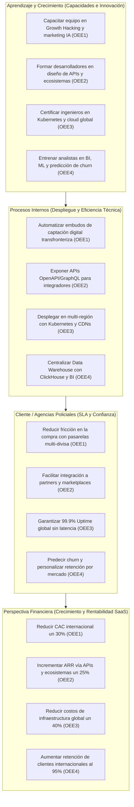
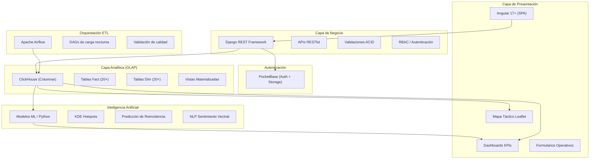

# Planificación Estratégica y Diseño del Sistema: SafeCity Intelligence Ops

Este documento detalla la planificación estratégica, el Balanced Scorecard, la arquitectura de datos híbrida, y las técnicas analíticas y de Inteligencia Artificial aplicadas al software **SafeCity Intelligence Ops** (desarrollado por **SafeCity Solutions**).

---

## 1. Identidad Organizacional (SafeCity Solutions)

*   **Nombre de la Empresa:** SafeCity Solutions.
*   **Actividad Comercial:** Desarrollo y comercialización B2G (Business-to-Government) de plataformas SaaS de misión crítica para el sector de la seguridad pública. Especializados en digitalizar y automatizar operaciones policiales para reducir costos logísticos, optimizar la gestión de flotas y agilizar el procesamiento de inteligencia criminal mediante análisis de datos.
*   **Misión:** Maximizar la eficiencia operativa de las instituciones de seguridad pública a nivel global mediante tecnología de alto rendimiento que garantice rapidez en la respuesta a emergencias y una optimización absoluta de los recursos estatales asignados. Transformar la gestión policial en un proceso medible, ágil y altamente rentable para la administración pública.
*   **Visión:** Posicionarnos como la empresa GovTech más competitiva y rentable a nivel global en el desarrollo de software para Smart Cities, siendo reconocidos por entregar un alto retorno de inversión (ROI) a los gobiernos de Chicago, Nueva York, Los Ángeles y ciudades de Latinoamérica, a través de plataformas escalables que aseguran operaciones rápidas, transparentes y sostenibles.
*   **Objetivo Estratégico General:** Expandir la presencia comercial internacional de SafeCity Solutions mediante la captación digital automatizada de clientes gubernamentales, la escalabilidad exponencial a través de ecosistemas de APIs y marketplaces, una infraestructura en la nube de alta disponibilidad global, y una inteligencia de negocio centralizada que garantice ventaja competitiva en cada mercado.

---

## 2. Objetivos Estratégicos Empresariales (OEE)

| Código | Objetivo Estratégico (Enfoque) | Descripción (Meta de Negocio) | Apoyo en TIC (Tecnología) | Indicador de Éxito (KPI) |
| :--- | :--- | :--- | :--- | :--- |
| **OEE1** | **Penetración de Mercado Digital y Adquisición Automatizada de Clientes (Growth Hacking GovTech)** | Capturar rápidamente una masa crítica de contratos gubernamentales (departamentos de policía y alcaldías) a nivel internacional mediante flujos digitales de licitación y captación B2G, reduciendo al mínimo la necesidad de despliegues comerciales presenciales o equipos de ventas tradicionales en cada país. | Implementación de plataformas de automatización de marketing (HubSpot) con Inteligencia Artificial para segmentar campañas dirigidas a autoridades públicas y tomadores de decisiones. Uso de analítica predictiva (Google Analytics 4) para identificar jurisdicciones con altos presupuestos de seguridad y portales de onboarding digital institucional sin fricción. | Costo de Adquisición Gubernamental (CAC) optimizado digitalmente y tasa de conversión de demostraciones piloto (POC) a contratos cerrados en nuevas regiones. |
| **OEE2** | **Escalabilidad Comercial Exponencial a través de Ecosistemas (Marketplaces y APIs Policiales)** | Multiplicar el alcance y los ingresos de SafeCity integrando nuestros módulos de análisis criminal directamente en la infraestructura de hardware y software que ya utilizan las agencias de seguridad en los países destino (sistemas CAD del 911, redes de cámaras urbanas, bases de datos federales). | Adopción de un enfoque Specification-Driven Development (SDD) para diseñar y exponer APIs públicas estables y estandarizadas (OpenAPI/GraphQL). Esto permite que fabricantes de cámaras corporales (ej. Axon) o proveedores de sistemas de emergencia conecten e incorporen nuestra inteligencia analítica bajo cumplimiento CJIS. | Porcentaje de ingresos recurrentes (ARR) generados a través de integraciones por API y número de alianzas activas con fabricantes externos de hardware táctico o software policial. |
| **OEE3** | **Expansión Continua Basada en Infraestructura en la Nube de Alta Disponibilidad** | Garantizar que los módulos de despacho de patrullas y análisis de crímenes mantengan un rendimiento ultrarrápido y tolerancia a fallos en cualquier ciudad, permitiendo que la operación escale automáticamente ante crisis de seguridad pública sin restricciones geográficas. | Arquitectura SaaS Multi-Tenant nativa en nubes públicas globales (Azure, GCP) mediante clústeres de contenedores (Azure AKS), asegurando el aislamiento total de datos probatorios confidenciales. Implementación de CDNs globales y pipelines DevOps/CI-CD para lanzamientos mundiales sin interrumpir la operatividad del 911. | Tiempo de disponibilidad global del sistema de emergencias (Uptime) superior al 99.99% y reducción del tiempo de despliegue (Time-to-Market) de nuevos módulos tácticos en regiones internacionales. |
| **OEE4** | **Inteligencia de Negocio Centralizada para la Ventaja Competitiva Global** | Recolectar y procesar datos masivos sobre la adopción y el rendimiento de la plataforma en distintas ciudades para optimizar nuestros algoritmos y mejorar continuamente el retorno de inversión (ROI en reducción de crímenes) que ofrecemos a los gobiernos locales. | Despliegue de un Data Warehouse unificado (ClickHouse) y herramientas BI (PowerBI) para analizar internamente la usabilidad del software en las comisarías. Uso de modelos de Machine Learning para predecir qué ciudades están subutilizando el sistema (riesgo de cancelación o *churn*) y adaptar proactivamente el soporte. | Tasa de retención anual de contratos gubernamentales internacionales y tiempo de respuesta para la toma de decisiones estratégicas de producto (basadas en datos de uso global). |

---

## 3. Mapa del Balanced Scorecard (Perspectivas GovTech)

Las cuatro perspectivas del Balanced Scorecard están diseñadas para garantizar la expansión internacional y la rentabilidad del SaaS B2G que proveemos, alineadas a los 4 Objetivos Estratégicos Empresariales (OEE).




**APRENDIZAJE Y CRECIMIENTO**
* Capacitar al equipo en Growth Hacking y automatización de marketing con IA (OEE1)
* Formar desarrolladores en diseño de APIs públicas y ecosistemas digitales (OEE2)
* Certificar ingenieros en Kubernetes, Azure y despliegue multi-región (OEE3)
* Entrenar analistas en BI, Machine Learning y predicción de churn global (OEE4)

⬇️


**PROCESOS INTERNOS**
* Automatizar embudos de captación digital transfronteriza (OEE1)
* Exponer APIs estables OpenAPI/GraphQL para integradores externos (OEE2)
* Desplegar infraestructura en multi-región con Kubernetes y CDNs globales (OEE3)
* Centralizar Data Warehouse con ClickHouse y dashboards de BI unificados (OEE4)

⬇️


**CLIENTES (AGENCIAS POLICIALES)**
* Reducir fricción de compra con pasarelas multi-divisa y onboarding digital (OEE1)
* Facilitar la integración técnica a partners, distribuidores y marketplaces (OEE2)
* Garantizar 99.9% de disponibilidad global sin latencia perceptible (OEE3)
* Predecir fuga de clientes y personalizar estrategias de retención por mercado (OEE4)

⬇️


**FINANCIERA**
* Reducir el Costo de Adquisición de Clientes (CAC) internacional un 30% (OEE1)
* Incrementar ingresos recurrentes (ARR) vía APIs y ecosistemas un 25% (OEE2)
* Reducir costos de infraestructura global un 40% mediante contenedores (OEE3)
* Aumentar la tasa de retención de clientes internacionales al 95% (OEE4)

---

## 4. Matrices del Balanced Scorecard

### A. Perspectiva Financiera
| Objetivo Estratégico | Indicador (KPI) | Fórmula | Meta | Iniciativa Estratégica | Responsable |
| :--- | :--- | :--- | :--- | :--- | :--- |
| **OEE1 — Reducir CAC internacional** | Costo de Adquisición de Clientes | `Gastos de marketing digital / Nuevos contratos firmados` | -30% anual | Automatizar embudos de captación con HubSpot e IA predictiva. | Gerente General |
| **OEE2 — Incrementar ARR vía APIs** | Ingresos recurrentes por ecosistema | `ARR generado por integraciones API / ARR total * 100` | +25% anual | Publicar APIs en marketplaces GovTech y firmar partners distribuidores. | Gerente General |
| **OEE3 — Reducir costos de infraestructura** | Ahorro en servidores globales | `Costo infraestructura anterior - Costo actual / Costo anterior * 100` | -40% anual | Migrar a Kubernetes multi-región con escalado automático bajo demanda. | Administrador de Sistema |
| **OEE4 — Aumentar retención internacional** | Tasa de retención de clientes | `Clientes activos al final / Clientes al inicio del período * 100` | 95% retención | Modelos de ML para predecir churn y ejecutar campañas proactivas de retención. | Sheriff |

### B. Perspectiva del Cliente (Agencias de Seguridad Internacionales)
| Objetivo Estratégico | Indicador (KPI) | Fórmula | Meta | Iniciativa Estratégica | Responsable |
| :--- | :--- | :--- | :--- | :--- | :--- |
| **OEE1 — Experiencia de compra sin fricción** | Tasa de conversión del embudo | `Demos completadas / Leads generados * 100` | +40% conversión | Landing pages localizadas por país con pasarelas Stripe/Adyen multi-divisa. | Gerente General |
| **OEE2 — Integración fácil para partners** | Tiempo de integración por API | `Promedio de días hasta primera integración exitosa` | Máx 5 días | Documentación OpenAPI interactiva y sandbox de pruebas para integradores. | Administrador de Sistema |
| **OEE3 — Disponibilidad global garantizada** | Uptime (SLA) | `Horas de sistema activo / Horas totales del mes * 100` | 99.9% uptime | Monitoreo automatizado 24/7 con failover multi-región (Azure). | Administrador de Sistema |
| **OEE4 — Satisfacción y retención personalizada** | Índice de satisfacción (NPS) | `Agencias satisfechas / Agencias encuestadas * 100` | 90% NPS | Encuestas trimestrales automatizadas y dashboards de uso por mercado. | Sheriff |

### C. Perspectiva de Procesos Internos
| Objetivo Estratégico | Indicador (KPI) | Fórmula | Meta | Iniciativa Estratégica | Responsable |
| :--- | :--- | :--- | :--- | :--- | :--- |
| **OEE1 — Captación digital automatizada** | Leads calificados automáticos | `Leads generados por IA / Total de leads * 100` | 80% automatizado | Implementar flujos de nurturing con HubSpot, Marketo y scoring de IA. | Gerente General |
| **OEE2 — APIs públicas estables** | Cobertura de endpoints | `Endpoints documentados / Funcionalidades totales * 100` | 100% cobertura | Enfoque SDD (Specification-Driven Development) con OpenAPI 3.0. | Administrador de Sistema |
| **OEE3 — Despliegue global sin interrupciones** | Tiempo de despliegue (Time-to-Market) | `Horas desde merge hasta producción global` | Menos de 4 horas | Pipeline CI/CD con Kubernetes, Helm charts y rollback automático. | Administrador de Sistema |
| **OEE4 — Data Warehouse centralizado** | Latencia de consultas analíticas | `Milisegundos promedio por consulta OLAP` | Menos de 2 segundos | Optimización de ClickHouse con vistas materializadas y particionamiento. | Analista de Inteligencia Criminal |
| **OEE5 (Compliance) — Cumplimiento normativo** | Certificaciones vigentes | `Auditorías aprobadas / Auditorías programadas * 100` | 100% cumplimiento | Alinear la plataforma con ISO 27001 y lineamientos CJIS para datos policiales sensibles. | Administrador de Sistema |

### D. Perspectiva de Aprendizaje y Crecimiento
| Objetivo Estratégico | Indicador (KPI) | Fórmula | Meta | Iniciativa Estratégica | Responsable |
| :--- | :--- | :--- | :--- | :--- | :--- |
| **OEE1 — Capacitar en Growth Hacking** | Horas de formación en marketing digital | `Total de horas de formación en growth / Miembros del equipo` | 30 horas al año | Cursos de automatización de marketing, analítica predictiva y IA conversacional. | Gerente General |
| **OEE2 — Formar en diseño de APIs** | Certificaciones de ecosistemas | `Desarrolladores certificados en API Design / Total del equipo * 100` | 80% certificado | Formación en OpenAPI, GraphQL y arquitectura de microservicios. | Administrador de Sistema |
| **OEE3 — Certificar en cloud global** | Certificaciones cloud activas | `Ingenieros certificados Azure / Total del equipo * 100` | 70% certificado | Programa de certificación en Kubernetes (CKA), Azure Solutions Architect. | Administrador de Sistema |
| **OEE4 — Entrenar en BI y ML** | Modelos de ML en producción | `Conteo de modelos de ML activos en el Data Warehouse` | 3 modelos al año | I+D en predicción de churn, precios dinámicos y análisis de patrones de uso. | Analista de Inteligencia Criminal |

---

## 5. Cuadro Resumen del Balanced Scorecard

| Perspectiva | Objetivo Estratégico | Indicador Clave (KPI) | Meta Estratégica |
| :--- | :--- | :--- | :--- |
| **Financiera** | OEE1 — Reducir CAC internacional | Costo de Adquisición de Clientes | -30% anual |
| **Financiera** | OEE2 — Incrementar ARR vía ecosistemas | Ingresos recurrentes por API | +25% anual |
| **Financiera** | OEE3 — Reducir costos de infraestructura | Ahorro en servidores globales | -40% anual |
| **Financiera** | OEE4 — Retención de clientes internacionales | Tasa de retención | 95% retención |
| **Cliente** | OEE1 — Experiencia de compra sin fricción | Tasa de conversión del embudo | +40% conversión |
| **Cliente** | OEE2 — Integración fácil para partners | Tiempo de integración por API | Máx 5 días |
| **Cliente** | OEE3 — Disponibilidad global garantizada | Uptime (SLA) | 99.9% uptime |
| **Cliente** | OEE4 — Satisfacción personalizada | Índice NPS por mercado | 90% NPS |
| **Procesos Internos** | OEE1 — Captación digital automatizada | Leads calificados automáticos | 80% automatizado |
| **Procesos Internos** | OEE2 — APIs públicas estables | Cobertura de endpoints | 100% cobertura |
| **Procesos Internos** | OEE3 — Despliegue global sin caídas | Time-to-Market | Menos de 4 horas |
| **Procesos Internos** | OEE4 — Data Warehouse centralizado | Latencia OLAP | Menos de 2 segundos |
| **Aprendizaje** | OEE1 — Capacitar en Growth Hacking | Horas de formación marketing | 30 horas/año |
| **Aprendizaje** | OEE2 — Formar en diseño de APIs | Certificaciones ecosistemas | 80% certificado |
| **Aprendizaje** | OEE3 — Certificar en cloud global | Certificaciones Azure | 70% certificado |
| **Aprendizaje** | OEE4 — Entrenar en BI y ML | Modelos de ML en producción | 3 modelos/año |
| **Cliente (Ciudadano)** | OE6 — Confianza y transparencia | Índice de Confianza Comunitaria (NLP) | ≥75% positivo |

---

## 6. Plan de Acción Estratégico

El siguiente plan de acción detalla las iniciativas operativas para la expansión internacional de SafeCity Solutions y la adopción exitosa de la plataforma por departamentos de policía en múltiples mercados.

| Acción Estratégica | OE Relacionado | Plazo | Responsable | Recurso Tecnológico Necesario | Resultado Esperado |
| :--- | :--- | :--- | :--- | :--- | :--- |
| **Lanzamiento de embudos de captación digital automatizados por país** | OEE1 | 2 Meses | Gerente General | HubSpot / Marketo con IA predictiva, Google Analytics 4, Mixpanel | Reducción del CAC internacional en un 30% y generación de leads calificados en 5+ países. |
| **Publicación de APIs públicas en marketplaces GovTech** | OEE2 | 3 Meses | Administrador de Sistema | OpenAPI 3.0, Swagger UI, sandbox de pruebas para integradores | Primeras 10 conexiones activas con partners distribuidores e integradores de software remotos. |
| **Migración a infraestructura multi-región con Kubernetes** | OEE3 | 4 Meses | Administrador de Sistema | Azure AKS, Helm charts, CDN global (CloudFront/Cloudflare) | 99.9% uptime global con despliegue de actualizaciones en menos de 4 horas sin interrupciones. |
| **Despliegue de Data Warehouse centralizado con BI y ML** | OEE4 | 3 Meses | Analista de Inteligencia Criminal | ClickHouse (OLAP), PowerBI / Tableau, modelos de predicción de churn | Toma de decisiones estratégicas en menos de 24 horas, retención del 95% en mercados internacionales. |
| **Sesiones tácticas de reasignación de patrullas basadas en Hotspots** | OEE4 | Semanal | Analista de Inteligencia Criminal | Módulo de Inteligencia Geográfica (Mapa de Calor KDE) | Reducción del 10% en el índice de criminalidad en cuadrantes de mayor riesgo. |
| **Integración de pasarelas de pago multi-divisa (Stripe / Adyen)** | OEE1 | 1 Mes | Gerente General | Stripe Connect, Adyen, facturación automática multi-moneda | Eliminación total de la fricción en la compra para clientes de Latinoamérica, EE.UU. y Europa. |
| **Programa de certificación cloud para el equipo de ingeniería** | OEE3 | Permanente | Gerente General / Administrador de Sistema | Microsoft Certified: Azure Solutions Architect, CKA (Kubernetes), Azure DevOps | 70% del equipo certificado en tecnologías de nube global en el primer año. |
| **Adopción masiva mediante diseño UX/UI móvil optimizado** | OEE1 | Permanente | Administrador de Sistema | Interfaz Angular responsive centrada en usabilidad móvil (terminales de patrulla) | Registro de incidentes en menos de 3 clics, curva de aprendizaje casi nula y adopción del 95%. |

---

> [!NOTE]
> **Nota aclaratoria:** Las secciones 1 a 6 (Balanced Scorecard y Plan de Acción) evalúan el rendimiento comercial y la estrategia de expansión internacional de la empresa proveedora del software (**SafeCity Solutions**). A partir de la siguiente sección, el enfoque cambia a los procesos operativos y gerenciales del **Departamento de Policía** (el cliente final) al usar el sistema.

# CASOS DE USO DEL SISTEMA

## 1. Sistema propuesto: SafeCity Intelligence Ops

*   **Sistema Propuesto:** SafeCity Intelligence Ops (Plataforma de Gestión de Operaciones e Inteligencia Policial).
*   **Propósito:** Centralizar la analítica de crímenes, la gestión de flota vehicular, el mapeo táctico en tiempo real y la investigación de expedientes, entregando a los departamentos de policía una herramienta que garantiza rapidez operativa y optimización total de sus recursos estatales asignados.

---

## 2. Actores del sistema

| Actor | Descripción de Responsabilidades en el Sistema |
| :--- | :--- |
| **Gerente General** | Máxima autoridad estratégica y comercial. Dirige la expansión internacional, aprueba presupuestos, supervisa la captación de clientes gubernamentales y define la estrategia de crecimiento de la empresa. |
| **Sheriff (Gerente Operativo)** | Toma decisiones de alto nivel basándose en tableros estratégicos (KPIs), aprueba despliegues a gran escala, evalúa la eficiencia general del departamento y fideliza la relación con la agencia cliente. |
| **Analista de Inteligencia Criminal** | Actor táctico y estratégico. Cruza datos de incidentes, realiza análisis predictivo de puntos calientes, ejecuta análisis de vínculos criminales en red y entrena modelos de BI/ML. |
| **Operador de Emergencias** | Primer contacto ciudadano. Registra y geolocaliza llamadas de emergencia al 911, asigna patrullas y monitorea tiempos de respuesta operativos. |
| **Jefe de Logística** | Responsable de mantener la disponibilidad técnica y operativa de la flota de vehículos, registrar mantenimientos y asegurar los recursos para la cobertura de cuadrantes. |
| **Administrador de Sistema** | Gestiona los accesos (RBAC), roles, configuraciones globales, auditoría de logs, respaldos, infraestructura cloud, APIs públicas, pipelines CI/CD y cumplimiento de seguridad (ISO 27001 / CJIS). |
| **Detective** | Gestiona expedientes especiales, asume la titularidad de investigaciones complejas (Casos Mayores), registra testimonios y cierra casos formales. |
| **Oficial de Patrulla** | Actor operativo en campo. Registra nuevos incidentes desde su terminal móvil, ingresa notas de seguimiento y traza sus rutas de patrullaje diarias. |
| **Oficial de Custodia** | Responsable de la custodia temporal de detenidos en celdas de retención, gestión de inventario de pertenencias, bitácoras de rondas médicas y procesamiento de liberaciones o traslados. |

---

## 3. Jerarquía de Objetivos del Sistema (Estratégicos, Tácticos y Operativos)

De acuerdo a la arquitectura tecnológica de SafeCity Intelligence Ops, se han desglosado **27 Objetivos Tácticos (OT)** y **54 Objetivos Operativos (OP)** que alimentan el sistema.

**OE1 (Estratégico): Predecir tendencias de criminalidad a largo plazo mediante modelos de Machine Learning.**
* **OT1 (Táctico):** Analizar reportes mensuales de inteligencia y mapas de calor.
    * **OP1:** Registrar información de nuevas emergencias policiales.
    * **OP2:** Consultar el historial de incidentes activos y pasados.
* **OT11 (Táctico):** Generar reportes comparativos de criminalidad por tipo de delito.
    * **OP3:** Actualizar datos y estado de los incidentes en curso.
    * **OP4:** Anular incidentes inválidos o falsos positivos.
* **OT12 (Táctico):** Consultar el listado de incidentes activos asignados a una patrulla.
    * **OP5:** Asignar unidades de patrulla a escenas de crimen.
* **OT6 (Táctico):** Monitorear indicadores de tiempos de respuesta de emergencias (SLA).
    * **OP6:** Registrar automáticamente los tiempos de respuesta policial.
* **OT22 (Táctico):** Consultar el historial de llamadas de emergencia recibidas.
    * **OP44:** Emitir y actualizar infracciones de tránsito e-Citation.
* **OT26 (Táctico):** Gestionar el registro de infracciones de tránsito y accidentes.
    * **OP45:** Registrar pruebas de alcoholemia BAC en intervenciones.
    * **OP54:** Registrar informe de accidente de tránsito.

**OE2 (Estratégico): Desmantelar organizaciones criminales utilizando algoritmos de grafos y detección de anomalías.**
* **OT2 (Táctico):** Visualizar tableros de estadísticas de reincidencia.
    * **OP7:** Registrar perfiles iniciales de individuos sospechosos.
    * **OP8:** Consultar antecedentes y cruce de datos criminales.
* **OT13 (Táctico):** Consultar el directorio actualizado de sospechosos y vehículos.
    * **OP9:** Actualizar expedientes con nuevos indicios y vehículos.
* **OT18 (Táctico):** Gestionar el registro de bandas criminales y víctimas.
    * **OP10:** Vincular arrestos operativos a investigaciones formales.
* **OT7 (Táctico):** Consultar reportes con listados de testimonios e incautaciones.
    * **OP11:** Registrar evidencia física y su cadena de custodia.
    * **OP12:** Ejecutar transferencias de custodia de evidencia.
    * **OP13:** Registrar testimonios protegidos y notas periciales.
    * **OP14:** Emitir reportes conclusivos de cierre de investigación.
* **OT19 (Táctico):** Gestionar el registro de arrestos y estado de celdas (Booking).
    * **OP48:** Registrar inventario de pertenencias de detenidos en separos.
    * **OP49:** Registrar bitácora de rondas y visitas médicas en celdas.
    * **OP50:** Procesar liberación, fianza o traslado de detenido.
* **OT23 (Táctico):** Gestionar los casos asignados al detective e investigación especial.
    * **OP15:** Abrir expediente de investigación y asignar detective.
    * **OP16:** Reabrir caso cerrado por nueva evidencia.
    * **OP17:** Crear alerta BOLO (Be On The Lookout).
    * **OP18:** Consultar alertas BOLO activas.
    * **OP19:** Registrar reporte de persona desaparecida.
    * **OP20:** Actualizar estado de persona desaparecida.

**OE3 (Estratégico): Minimizar el gasto público mediante el mantenimiento predictivo (IA) sobre la flota vehicular.**
* **OT3 (Táctico):** Generar reportes del porcentaje de disponibilidad de la flota.
    * **OP23:** Consultar inventario global de la flota vehicular.
* **OT8 (Táctico):** Planificar el mantenimiento preventivo rotativo de la flota.
    * **OP21:** Registrar la salida y retorno (Check-in/Out) de patrullas.
    * **OP24:** Registrar tickets de reparaciones mecánicas de patrullas.
    * **OP46:** Coordinar despacho de grúas y custodia de vehículos.
* **OT14 (Táctico):** Analizar el promedio de kilometraje recorrido por unidades.
    * **OP27:** Dar de baja vehículos o equipos del inventario.
* **OT21 (Táctico):** Gestionar inventario de equipo táctico, armas y combustible.
    * **OP22:** Asignar equipo táctico y radios a los oficiales.
    * **OP26:** Registrar devolución de equipo táctico al final de turno.
    * **OP28:** Registrar persecución vehicular y revisión post-evento.

**OE4 (Estratégico): Optimizar la fuerza laboral policial y predecir el desgaste del personal (burnout) mediante IA.**
* **OT4 (Táctico):** Visualizar reportes de ausentismo y cobertura de cuadrantes.
    * **OP29:** Registrar asistencia y turnos del personal en estación.
    * **OP31:** Asignar cobertura de cuadrantes de patrullaje en el mapa.
* **OT16 (Táctico):** Generar reportes de rendimiento por oficial.
    * **OP30:** Generar reportes de horas trabajadas y overtime.
* **OT9 (Táctico):** Gestionar reportes de permisos, capacitación y disciplina.
    * **OP32:** Procesar solicitudes y aprobaciones de permisos del personal.
    * **OP35:** Registrar capacitación y certificación de oficial.
    * **OP36:** Consultar vencimiento de certificaciones.
    * **OP38:** Consultar perfil y hoja de vida del oficial.
* **OT24 (Táctico):** Gestionar control de asistencia, briefings y entregas de turno.
    * **OP33:** Registrar briefing de turno (Roll Call).
    * **OP34:** Registrar traspaso de turno entre oficiales.
* **OT17 (Táctico):** Consolidar KPIs operativos del departamento para el Sheriff.
    * **OP55:** Generar automáticamente el tablero ejecutivo consolidado de KPIs para el Sheriff.

**OE5 (Estratégico): Garantizar la admisibilidad legal de toda la evidencia en cortes penales.**
* **OT5 (Táctico):** Auditar los tableros de logs de accesos y detección de anomalías.
    * **OP39:** Registrar accesos e inicios de sesión de usuarios.
    * **OP41:** Consultar bitácora de auditoría de seguridad del sistema.
* **OT10 (Táctico):** Revisar listados de Cadena de Custodia y órdenes judiciales (Warrants).
    * **OP51:** Registrar orden judicial (warrant).
    * **OP52:** Consultar y verificar órdenes judiciales activas.
    * **OP53:** Registrar ejecución de orden judicial.
* **OT25 (Táctico):** Gestionar el directorio de usuarios y catálogos de configuración.
    * **OP40:** Crear usuarios y asignar roles de acceso.
    * **OP43:** Recuperar o restablecer contraseña de usuario.
* **OT15 (Táctico):** Automatizar e inspeccionar la ejecución de respaldos de la base de datos.
    * **OP42:** Ejecutar respaldos cifrados de la base de datos.

---


**OE6 (Estratégico - Cliente/Ciudadano): Fortalecer la confianza y transparencia pública mediante la digitalización de la Policía Comunitaria.**
* **OT27 (Táctico):** Gestionar el portal de transparencia y participación ciudadana.
    * **OP47:** Registrar reuniones y actividades de policía comunitaria.
* **OT28 (Táctico):** Auditar y procesar quejas ciudadanas y reportes de uso de fuerza.
    * **OP25:** Registrar y documentar el uso de fuerza letal o no letal.
    * **OP37:** Registrar queja ciudadana contra oficial.


## 4. Módulos Principales del Sistema

| Módulo / Submódulo | Descripción y Funcionalidad Principal |
| :--- | :--- |
| **Gestión Operativa de Incidentes** | Ingreso, tipificación y bitácora pública de crímenes. |
| **Inteligencia Geográfica y Mapeo Táctico** | Mapas tácticos de calor, filtros espaciales y trazado de rutas. |
| **Inteligencia Criminal y Archivo** | Directorio de bandas, sospechosos, testigos y evidencias. |
| **Gestión de Logística y Flota Vehicular** | Inventario de flota vehicular y control de estados. |
| **Gestión de Turnos y Patrullaje** | Control de personal, cuadrantes (beats) y turnos. |
| **Gestión de Investigación Especial (Casos Mayores)** | Asignación, escalado y cierre formal de casos de alta complejidad. |
| **Gestión de Personal Policial y Accesos** | Control de roles, fichas de personal y permisos. |
| **Auditoría, Seguridad y Backups** | Logs de accesos de seguridad, revocación de sesiones e inmutabilidad. |
| **Reportes e Indicadores Balanced Scorecard** | Analítica de rendimiento operativo e indicadores clave de gestión. |
| **Policía Comunitaria y Transparencia** | Portal de participación ciudadana, procesamiento de quejas públicas, auditoría de uso de fuerza y registro de reuniones vecinales. |

---

## 5. Catálogo General de Casos de Uso

### A. Casos de uso estratégicos
| Código | Caso de uso | Actor principal | Objetivo relacionado |
| :--- | :--- | :--- | :--- |
| **CU-E01** | Consultar Dashboard de KPIs policiales | Sheriff | OE1, OE2, OE3, OE4, OE5 |
| **CU-E02** | Visualizar Mapa Táctico de Calor de delitos | Sheriff / Analista de Inteligencia | OE1, OT1 |
| **CU-E03** | Generar Reportes Estadísticos Mensuales y Anuales | Analista de Inteligencia Criminal | OE1, OE2, OE3 |

### B. Casos de uso tácticos
| Código | Caso de uso | Actor principal | Objetivo relacionado |
| :--- | :--- | :--- | :--- |
| **CU-T01** | Consultar Historial Filtrado de Delitos | Sheriff / Detective | OE2, OT2, OT13 |
| **CU-T02** | Visualizar Expediente del Incidente | Sheriff / Detective | OE2, OT2 |
| **CU-T03** | Filtrar Delitos por Calle en Mapa Táctico | Analista de Inteligencia | OE1, OT1, OT11 |
| **CU-T04** | Alternar Capas y Filtros del Mapa | Analista de Inteligencia | OE1, OT1 |
| **CU-T05** | Gestionar Catálogo de Bandas Criminales | Analista de Inteligencia | OE2, OT2, OT18 |
| **CU-T06** | Administrar Inventario de Flota Vehicular | Jefe de Logística | OE3, OT3, OT8, OT14 |
| **CU-T07** | Programar Turnos de Patrullaje | Jefe de Logística | OE4, OT4, OT24 |
| **CU-T08** | Administrar Fichas de Personal Policial | Administrador de Sistema | OE4, OT9, OT16 |
| **CU-T09** | Escalar Incidente a Investigación Especial | Detective | OE2, OT2, OT23 |
| **CU-T10** | Consultar Bandeja de Investigaciones Asignadas | Detective | OE2, OT7, OT23 |
| **CU-T11** | Realizar Análisis Predictivo de Puntos Calientes | Analista de Inteligencia Criminal | OE1, OE2, OT1, OT2 |
| **CU-T12** | Ejecutar Análisis de Vínculos Criminales en Red | Analista de Inteligencia Criminal | OE2, OT2 |
| **CU-T13** | Monitorear Estado y Tiempos de Respuesta en Emergencias | Operador de Emergencias | OE1, OT6, OT12, OT22 |

### C. Casos de uso operativos
| Código | Caso de uso | Actor principal | Objetivo relacionado |
| :--- | :--- | :--- | :--- |
| **CU-O01** | Registrar Nuevo Incidente | Oficial de Patrulla | OP1 |
| **CU-O02** | Consultar / Filtrar Incidentes | Oficial de Patrulla / Detective | OP2 |
| **CU-O03** | Modificar Datos de Incidente | Oficial de Patrulla | OP3 |
| **CU-O04** | Eliminar / Anular Incidente | Administrador de Sistema | OP4 |
| **CU-O05** | Despachar Unidad y Trazar Ruta | Operador de Emergencias | OP5 |
| **CU-O06** | Registrar Tiempos de Respuesta | Sistema (Automático) | OP6 |
| **CU-O07** | Registrar Nuevo Sospechoso | Detective | OP7 |
| **CU-O08** | Consultar Perfil de Sospechoso | Detective | OP8 |
| **CU-O09** | Modificar Perfil de Sospechoso | Detective | OP9 |
| **CU-O10** | Registrar Arresto Relacionado | Detective | OP10 |
| **CU-O11** | Registrar Evidencia y Cadena de Custodia | Detective | OP11 |
| **CU-O12** | Consultar / Transferir Evidencia | Detective | OP12 |
| **CU-O13** | Agregar Testimonio y Notas Periciales | Detective | OP13 |
| **CU-O14** | Generar Reporte Conclusivo y Cerrar Caso | Detective | OP14 |
| **CU-O15** | Registrar Check-in de Patrulla | Oficial de Patrulla | OP21 |
| **CU-O16** | Registrar Check-out de Patrulla | Oficial de Patrulla | OP21 |
| **CU-O17** | Asignar Equipo Táctico | Jefe de Logística | OP22 |
| **CU-O18** | Consultar Inventario de Flota | Jefe de Logística | OP23 |
| **CU-O19** | Registrar Ticket de Falla Mecánica | Oficial de Patrulla | OP24 |
| **CU-O20** | Registrar Uso de Fuerza | Oficial de Patrulla | OP25 |
| **CU-O21** | Registrar Asistencia | Oficial de Patrulla | OP29 |
| **CU-O22** | Consultar Reporte de Horas | Sheriff | OP30 |
| **CU-O23** | Asignar Cuadrantes de Patrullaje | Sheriff | OP31 |
| **CU-O24** | Registrar Solicitud de Permisos | Oficial de Patrulla | OP32 |
| **CU-O25** | Aprobar / Rechazar Permisos | Sheriff | OP32 |
| **CU-O26** | Iniciar / Cerrar Sesión | Todos los Usuarios | OP39 |
| **CU-O27** | Registrar Nuevo Usuario | Administrador de Sistema | OP40 |
| **CU-O28** | Modificar Rol y Permisos RBAC | Administrador de Sistema | OP40 |
| **CU-O29** | Consultar Bitácora de Auditoría | Administrador de Sistema | OP41 |
| **CU-O30** | Ejecutar Respaldo de Base de Datos | Administrador de Sistema | OP42 |
| **CU-O31** | Registrar Infracción de Tránsito | Oficial de Patrulla | OP44 |
| **CU-O32** | Modificar / Anular Infracción | Sheriff | OP44 |
| **CU-O33** | Registrar Prueba de Alcoholemia | Oficial de Patrulla | OP45 |
| **CU-O34** | Coordinar Despacho de Grúa | Operador de Emergencias | OP46 |
| **CU-O35** | Registrar Reunión Comunitaria | Oficial de Patrulla | OP47 |
| **CU-O36** | Registrar Inventario de Celda (Booking) | Oficial de Custodia | OP48 |
| **CU-O37** | Registrar Bitácora de Detenidos | Oficial de Custodia | OP49 |
| **CU-O38** | Abrir Expediente y Asignar Detective | Sheriff | OP15 |
| **CU-O39** | Reabrir Caso Cerrado | Detective / Sheriff | OP16 |
| **CU-O40** | Crear Alerta BOLO | Detective / Operador 911 | OP17 |
| **CU-O41** | Consultar Alertas BOLO Activas | Oficial de Patrulla | OP18 |
| **CU-O42** | Registrar Persona Desaparecida | Oficial de Patrulla | OP19 |
| **CU-O43** | Actualizar Estado Persona Desaparecida | Detective | OP20 |
| **CU-O44** | Registrar Devolución Equipo Táctico | Jefe de Logística | OP26 |
| **CU-O45** | Dar de Baja Vehículo o Equipo | Jefe de Logística | OP27 |
| **CU-O46** | Registrar Persecución Vehicular | Oficial de Patrulla | OP28 |
| **CU-O47** | Registrar Briefing de Turno | Sheriff | OP33 |
| **CU-O48** | Registrar Traspaso de Turno | Oficial de Patrulla | OP34 |
| **CU-O49** | Registrar Capacitación / Certificación | Sheriff | OP35 |
| **CU-O50** | Consultar Vencimiento Certificaciones | Sheriff | OP36 |
| **CU-O51** | Registrar Queja Ciudadana | Administrador de Sistema | OP37 |
| **CU-O52** | Consultar Hoja de Vida del Oficial | Sheriff | OP38 |
| **CU-O53** | Recuperar Contraseña | Todos los Usuarios | OP43 |
| **CU-O54** | Procesar Liberación de Detenido | Oficial de Custodia | OP50 |
| **CU-O55** | Registrar Orden Judicial | Detective | OP51 |
| **CU-O56** | Verificar Órdenes Judiciales Activas | Oficial de Patrulla | OP52 |
| **CU-O57** | Registrar Ejecución de Orden Judicial | Oficial de Patrulla | OP53 |
| **CU-O58** | Registrar Informe de Accidente Tránsito | Oficial de Patrulla | OP54 |


---

## 6. Diagrama Textual de Casos de Uso

```
SISTEMA DE GESTIÓN DE OPERACIONES E INTELIGENCIA POLICIAL (SAFECITY INTELLIGENCE OPS)

Oficial de Patrulla ───────────────> Registrar Nuevo Incidente (CU-O01)
Oficial de Patrulla ───────────────> Consultar / Filtrar Incidentes (CU-O02)
Oficial de Patrulla ───────────────> Modificar Datos de Incidente (CU-O03)
Oficial de Patrulla ───────────────> Registrar Check-in de Patrulla (CU-O15)
Oficial de Patrulla ───────────────> Registrar Check-out de Patrulla (CU-O16)
Oficial de Patrulla ───────────────> Registrar Ticket Falla Mecánica (CU-O19)
Oficial de Patrulla ───────────────> Registrar Uso de Fuerza (CU-O20)
Oficial de Patrulla ───────────────> Registrar Asistencia (CU-O21)
Oficial de Patrulla ───────────────> Registrar Solicitud de Permisos (CU-O24)
Oficial de Patrulla ───────────────> Registrar Infracción Tránsito (CU-O31)
Oficial de Patrulla ───────────────> Registrar Prueba Alcoholemia (CU-O33)
Oficial de Patrulla ───────────────> Registrar Reunión Comunitaria (CU-O35)
Oficial de Patrulla ───────────────> Consultar Alertas BOLO (CU-O41)
Oficial de Patrulla ───────────────> Registrar Persona Desaparecida (CU-O42)
Oficial de Patrulla ───────────────> Registrar Persecución Vehicular (CU-O46)
Oficial de Patrulla ───────────────> Registrar Traspaso de Turno (CU-O48)
Oficial de Patrulla ───────────────> Verificar Órdenes Judiciales (CU-O56)
Oficial de Patrulla ───────────────> Ejecutar Orden Judicial (CU-O57)
Oficial de Patrulla ───────────────> Registrar Accidente Tránsito (CU-O58)

Detective ─────────────────────────> Registrar Nuevo Sospechoso (CU-O07)
Detective ─────────────────────────> Consultar Perfil de Sospechoso (CU-O08)
Detective ─────────────────────────> Modificar Perfil de Sospechoso (CU-O09)
Detective ─────────────────────────> Registrar Arresto Relacionado (CU-O10)
Detective ─────────────────────────> Registrar Evidencia y Custodia (CU-O11)
Detective ─────────────────────────> Consultar / Transferir Evidencia (CU-O12)
Detective ─────────────────────────> Agregar Testimonio y Notas (CU-O13)
Detective ─────────────────────────> Generar Reporte Conclusivo (CU-O14)
Detective ─────────────────────────> Reabrir Caso Cerrado (CU-O39)
Detective ─────────────────────────> Crear Alerta BOLO (CU-O40)
Detective ─────────────────────────> Actualizar Persona Desaparecida (CU-O43)
Detective ─────────────────────────> Registrar Orden Judicial (CU-O55)

Operador de Emergencias ───────────> Despachar Unidad y Trazar Ruta (CU-O05)
Operador de Emergencias ───────────> Coordinar Despacho de Grúa (CU-O34)
Operador de Emergencias ───────────> Crear Alerta BOLO (CU-O40)

Jefe de Logística ─────────────────> Asignar Equipo Táctico (CU-O17)
Jefe de Logística ─────────────────> Consultar Inventario de Flota (CU-O18)
Jefe de Logística ─────────────────> Registrar Devolución Equipo (CU-O44)
Jefe de Logística ─────────────────> Dar de Baja Vehículo/Equipo (CU-O45)

Sheriff ────────────────────────> Consultar Reporte de Horas (CU-O22)
Sheriff ────────────────────────> Asignar Cuadrantes Patrullaje (CU-O23)
Sheriff ────────────────────────> Aprobar / Rechazar Permisos (CU-O25)
Sheriff ────────────────────────> Modificar / Anular Infracción (CU-O32)
Sheriff ────────────────────────> Abrir Expediente y Asignar Detective (CU-O38)
Sheriff ────────────────────────> Registrar Briefing de Turno (CU-O47)
Sheriff ────────────────────────> Registrar Capacitación (CU-O49)
Sheriff ────────────────────────> Consultar Vencimiento Certificaciones (CU-O50)
Sheriff ────────────────────────> Consultar Hoja de Vida Oficial (CU-O52)
Sheriff ────────────────────────> Consultar Dashboard KPIs (CU-E01)

Administrador de Sistema ──────────> Eliminar / Anular Incidente (CU-O04)
Administrador de Sistema ──────────> Registrar Nuevo Usuario (CU-O27)
Administrador de Sistema ──────────> Modificar Permisos RBAC (CU-O28)
Administrador de Sistema ──────────> Consultar Bitácora Auditoría (CU-O29)
Administrador de Sistema ──────────> Ejecutar Respaldo BD (CU-O30)
Administrador de Sistema ──────────> Registrar Queja Ciudadana (CU-O51)

Oficial de Custodia ───────────────> Registrar Inventario Celda (CU-O36)
Oficial de Custodia ───────────────> Registrar Bitácora Detenidos (CU-O37)
Oficial de Custodia ───────────────> Procesar Liberación Detenido (CU-O54)

Sistema (Automático) ─────────────> Registrar Tiempos Respuesta (CU-O06)

Todos los Usuarios ───────────────> Iniciar / Cerrar Sesión (CU-O26)
Todos los Usuarios ───────────────> Recuperar Contraseña (CU-O53)

Sheriff / Analista / Detective ─> Visualizar Mapa Calor (CU-E02)
Analista de Inteligencia Criminal ─> Generar Reportes Estadísticos (CU-E03)
```


---

# VISIÓN ARQUITECTÓNICA

A continuación, se relacionan los niveles organizacionales de la seguridad pública con los casos de uso del sistema, indicando qué técnicas analíticas o de inteligencia artificial podrían aplicarse, qué modelos Fact-Dim se usarían y qué registros o reportes alimentan cada proceso.

## 1. Enfoque general por nivel organizacional

| Nivel Organizacional | Tipo de decisión | Técnicas principales | Tipo de datos usados |
| :--- | :--- | :--- | :--- |
| **Estratégico** | Decisiones gerenciales y de largo plazo | BI, agregaciones, predicción, detección de anomalías, Machine Learning | Datos históricos consolidados |
| **Táctico** | Planeación por áreas y control mensual/semanal | Segmentación espacial, pronósticos, alertas, optimización de recursos, reportes | Datos agrupados por distrito, oficial, turno |
| **Operativo** | Ejecución diaria del servicio policial | Reglas de negocio, validaciones, alertas automáticas, reconocimiento IA, ACID | Datos en tiempo real de incidentes y evidencias |

## 2. Modelo analítico general del sistema

La plataforma **SafeCity Intelligence Ops** opera bajo una arquitectura estructurada en grandes capas:



> El diagrama anterior también puede representarse en texto plano para entornos sin soporte Mermaid:

```text
SISTEMA OPERATIVO DE CAPTURA Y TRANSACCIONAL (SafeCity Angular 17+ / Django)
Registra incidentes criminales, evidencias, turnos, oficiales y flotas en tiempo real
                                  ↓
BASE DE DATOS TRANSACCIONAL
Registros detallados del día a día (Validaciones ACID, auditoría, control estricto)
                                  ↓
DATA WAREHOUSE / MODELO FACT-DIM (ClickHouse Columnar)
Hechos y dimensiones para análisis (Consolidación vía Apache Airflow)
                                  ↓
CAPA ANALÍTICA E INTELIGENCIA TÁCTICA
Reportes, Dashboards gerenciales de KPIs, Machine Learning y Predicciones Geográficas
```

---

## 3. Tablas de Hechos Principales

Las tablas transaccionales (más de 20 en total) almacenan eventos medibles de la operativa policial y criminal.

| Tabla Fact | Qué mide | Ejemplos de métricas |
| :--- | :--- | :--- |
| **chicago_crimes** | Incidentes y delitos registrados | Número de arrestos, tiempo de respuesta 911 |
| **incidente_delito** | Asociación de incidente con su clasificación penal | Tipos de delitos cometidos |
| **llamada_emergencia** | Llamadas al 911 despachadas | Tiempo de llegada de la unidad |
| **turno_patrullaje** | Despliegue de patrullas y oficiales | Horas patrulladas, km recorridos |
| **evidencia** | Cadena de custodia de objetos físicos | Cantidad incautada, tipo de arma |
| **investigacion_especial** | Casos de alta prioridad asignados a detectives | Tiempo de resolución de expedientes |
| **seguimiento_incidente** | Novedades e historial de avances de los casos | Cantidad de testimonios e hitos logrados |
| **auditoria_sistema** | Eventos de modificación (INSERT, UPDATE, DELETE) | Registros modificados o alterados |
| **historial_sesion** | Accesos e inicios de sesión de usuarios | Intentos fallidos, direcciones IP |
| **infraccion_transito** | Emisión de multas electrónicas (e-Citations) | Monto de la multa, velocidad del infractor |
| **prueba_alcoholemia** | Resultados de controles de DUI | Nivel BAC (Blood Alcohol), intentos fallidos |
| **despacho_grua** | Acarreos y asistencias civiles tercerizadas | Tiempo llegada de grúa, costo de maniobra |
| **reunion_comunitaria** | Actividades de acercamiento y prevención | Vecinos asistentes, NLP sentimiento vecinal |
| **registro_celdas_booking (Booking)** | Estadía de detenidos en calabozos temporales | Horas de encierro, frecuencia de chequeos médicos |
| **registro_respaldo** | Historial de transacciones de respaldos técnicos | Fecha de backup y tamaño |
| **rrhh_persona_desaparecida** | Reportes de personas desaparecidas | Nivel de riesgo, edad |
| **rrhh_bolo** | Alertas activas emitidas | Expiración, prioridad |
| **orden_judicial** | Órdenes judiciales (Warrants) activas | Estado, fecha vencimiento |
| **rrhh_solicitud_permiso** | Gestión de ausentismos y licencias | Días aprobados, rechazos |
| **maintenance_tickets** | Control de fallas mecánicas | Estado de reparación, severidad |


---

## 4. Dimensiones y Tablas de Staging Principales

Las tablas maestras y de dimensiones (más de 20 en total) describen el contexto de los hechos policiales. También se utiliza 1 tabla de Staging para el flujo de carga ELT, sumando las más de 45 tablas arquitectónicas de la base de datos ClickHouse.

| Dimensión / Staging | Uso en SafeCity Intelligence Ops |
| :--- | :--- |
| **catalogo_ubicacion** | coordenadas (lat, lng), distrito policial, ward, beat (cuadrante), tipo de ubicación. |
| **codigo_penal** | código IUCR, descripción del crimen, código del FBI y nivel de gravedad. |
| **oficial_policia** | placa, nombre completo, rango, unidad asignada, fecha de ingreso. |
| **rol_oficial** | catálogo de roles (administradores, oficiales, detectives) y sus permisos. |
| **usuario_sistema** | credenciales de acceso de los oficiales habilitados en la plataforma web. |
| **equipamiento_oficial** | equipamiento asignado individualmente (radios, tasers, cámaras corporales). |
| **vehiculo_patrulla** | número de placa, marca, estado de mantenimiento, unidad GPS instalada. |
| **estacion_policial** | sedes de los distritos policiales, sheriffs y ubicaciones. |
| **sospechoso** | alias, antecedentes, características físicas, historial criminal previo. |
| **victima** | datos de identificación, género e información de contacto de las víctimas. |
| **testigo** | nombre (enmascarado para seguridad), testimonios, información de contacto. |
| **banda_criminal** | nombre de la pandilla, territorio de influencia principal, nivel de peligrosidad. |
| **caso_judicial** | información descriptiva de la resolución judicial (juzgado, veredicto). |
| **dataset_crudo** | **Tabla de Staging:** Almacena los registros en bruto desde el SaaS antes de la ETL. |
| **catalogo_sistema** | Diccionario unificado del sistema (IUCR, Distritos, Tipos Vehículos). |
| **vehicle_fleet** | Inventario oficial unificado de patrullas y estado. |
| **equipment_catalog** | Inventario base de cámaras corporales, radios y tasers. |
| **vehiculo_sospechoso** | Vehículos incautados o rastreados vinculados a criminales. |


---

## 5. Escalabilidad Multi-Tenant (Arquitectura Multicliente)

La plataforma **SafeCity Intelligence Ops** está diseñada bajo una arquitectura **SaaS Multi-Tenant**, lo que significa que una única base de código e infraestructura en la nube puede servir simultáneamente a múltiples departamentos de policía de distintas ciudades (Chicago, Nueva York, Los Ángeles, ciudades de Latinoamérica), manteniendo los datos de cada cliente **completamente aislados y seguros** mediante esquemas lógicos separados.

| Característica | Beneficio |
| :--- | :--- |
| **Código único compartido** | Reducción drástica de costos de mantenimiento y servidores (hasta 60%). |
| **Datos aislados por tenant** | Cada departamento de policía opera en su propio espacio seguro sin riesgo de filtración cruzada. |
| **Despliegue centralizado** | Una sola actualización se propaga a todos los clientes simultáneamente. |
| **Escalabilidad horizontal** | Agregar un nuevo cliente no requiere nueva infraestructura, solo configurar un nuevo tenant. |

---

## 6. Técnicas detalladas por Nivel Organizacional

### A. Nivel estratégico
En este nivel se usan técnicas para tomar decisiones gerenciales (Jefatura de Policía).

| Técnica | Uso en el Sistema (SafeCity) |
| :--- | :--- |
| **Agregaciones BI** | Medir tendencias de criminalidad mensuales, eficacia de arrestos y desempeño inter-distrital. |
| **Machine Learning predictivo**| Prever olas de criminalidad a largo plazo y estimar demanda presupuestaria anual. |
| **Detección de anomalías** | Identificar picos inusuales de homicidios o caídas repentinas sospechosas en la tasa de arrestos. |
| **Segmentación de distritos** | Clasificar distritos según niveles de riesgo estructural o criminalidad organizada. |
| **Dashboards estratégicos** | Monitoreo del Balanced Scorecard gubernamental, eficacia operativa y tiempos de respuesta al 911. |

### B. Nivel táctico
En este nivel se usan técnicas para planificar y controlar áreas específicas (Sheriffs de Distrito, Jefes de Logística).

| Técnica | Uso en el Sistema (SafeCity) |
| :--- | :--- |
| **Agregaciones por área** | Conteo de incidentes por cuadrante (beat), desempeño por oficial de patrulla, uso de vehículos. |
| **Forecasting** | Predecir aumento de robos por temporada festiva, eventos deportivos masivos o fines de semana. |
| **Clasificación Espacial** | Densidad de Kernel (KDE) para detectar cuadras y zonas "hotspots" altamente peligrosas. |
| **Alertas inteligentes** | Avisar a logística sobre déficit inminente de patrullas operativas o vencimiento de mantenimientos. |
| **Optimización de flota** | Definir cuántas patrullas desplegar a cada cuadrante basado en el nivel de riesgo en tiempo real. |

### C. Nivel operativo
En este nivel se usan técnicas para ejecutar bien el servicio diario (Oficiales de Patrulla y Detectives en terreno).

| Técnica | Uso en el Sistema (SafeCity) |
| :--- | :--- |
| **Reglas de negocio** | No permitir el cierre de un caso de investigación sin haber subido evidencias o un reporte conclusivo legal. |
| **Validaciones automáticas** | Evitar la duplicidad en números de incidentes, forzar la geocodificación inversa obligatoria del GPS. |
| **Alertas operativas** | Notificar al patrullero inmediatamente si un sospechoso ingresado tiene una orden de captura activa. |
| **Recomendaciones simples** | Sugerir rutas logísticas más rápidas para llegar a la escena del crimen evitando congestiones. |
| **Deep Learning (Opcional)** | Reconocimiento automático de placas vehiculares robadas (LPR), OCR de etiquetas de evidencia policial. |
| **Registros transaccionales** | Ingreso inmutable de denuncias criminales, cadena de custodia y bitácoras de investigación bajo principios ACID. |

---

## 7. Matriz por casos de uso estratégicos

| Caso de Uso | Técnicas usadas | Modelo Fact-Dim | Reportes generados | Registros usados |
| :--- | :--- | :--- | :--- | :--- |
| **CU-E01 Consultar Dashboard de KPIs policiales** | BI, agregaciones, ML predictivo, Detección anomalías | `chicago_crimes`, `investigacion_especial`, `catalogo_ubicacion` | Dashboard estratégico (Crime Stats) | Histórico de delitos, arrestos, casos resueltos. |
| **CU-E02 Visualizar Mapa Táctico de Calor** | Agregación geoespacial, KDE (Kernel Density) | `chicago_crimes`, `catalogo_ubicacion` | Mapa de calor interactivo de delitos | Coordenadas GPS, tipos de crimen, fechas. |
| **CU-E03 Generar Reportes Estadísticos** | Consolidación OLAP, agregaciones temporales | `chicago_crimes`, `investigacion_especial`, `codigo_penal` | Informes mensuales y anuales de criminalidad | Tendencias, tasas de arresto, cierre de casos. |

---

## 8. Matriz por casos de uso tácticos

| Caso de Uso | Técnicas usadas | Modelo Fact-Dim | Reportes generados | Registros usados |
| :--- | :--- | :--- | :--- | :--- |
| **CU-T01 Consultar Historial Filtrado** | Agregaciones, filtros multicriterio, paginación | `chicago_crimes`, `catalogo_ubicacion`, `codigo_penal` | Grid interactivo histórico policial | Códigos IUCR, fechas, estados de resolución. |
| **CU-T02 Visualizar Expediente del Incidente** | Consolidación relacional 360° | `chicago_crimes`, `evidencia`, `sospechoso` | Expediente digital unificado de caso | Evidencias, declaraciones, bitácoras. |
| **CU-T03 Filtrar Delitos por Calle** | Geocodificación inversa, SIG perimetral | `chicago_crimes`, `catalogo_ubicacion` | Mapa focalizado de cuadra/calle | Direcciones, coordenadas precisas. |
| **CU-T04 Alternar Capas del Mapa** | Superposición de capas geográficas (GIS) | `chicago_crimes`, `codigo_penal` | Mapa dinámico con topología | Tipos de escena (interior, exterior). |
| **CU-T05 Gestionar Catálogo de Bandas** | Teoría de grafos, segmentación de riesgo | `banda_criminal`, `sospechoso` | Directorio maestro de pandillas | Líderes, territorio de influencia. |
| **CU-T06 Administrar Inventario de Flota** | Análisis de disponibilidad mecánica | `vehiculo_patrulla`, `turno_patrullaje` | Reporte de flota operativa | Placa, kilometraje, mantenimientos. |
| **CU-T07 Programar Turnos de Patrullaje** | Forecasting, optimización de cuadrantes | `turno_patrullaje`, `vehiculo_patrulla`, `oficial_policia` | Panel de turnos sin solapamiento | ID oficial, horarios asignados. |
| **CU-T08 Administrar Fichas de Personal** | RBAC, gestión de jerarquías y perfiles | `oficial_policia` | Directorio activo de la fuerza policial | Nombres, rango, unidad operativa. |
| **CU-T09 Escalar a Investigación Especial** | Reglas de alerta prioritaria (Alerta Roja) | `investigacion_especial`, `chicago_crimes` | Marca de Caso Mayor en panel | Gravedad del delito, víctimas. |
| **CU-T10 Consultar Bandeja de Investigaciones** | Clasificación por estado procesal | `investigacion_especial`, `oficial_policia` | Bandeja unificada de casos activos | Casos asignados al detective en sesión. |
| **CU-T11 Análisis Predictivo de Puntos Calientes** | Machine Learning, KDE temporal | `chicago_crimes`, `catalogo_ubicacion` | Pronóstico semanal de hotspots | Datos históricos, estacionalidad, clima. |
| **CU-T12 Análisis de Vínculos Criminales en Red** | Teoría de grafos, análisis de enlaces | `sospechoso`, `banda_criminal`, `chicago_crimes` | Mapa de red criminal interactivo | Co-arrestos, relaciones, territorios. |
| **CU-T13 Monitorear Tiempos de Respuesta** | Agregaciones temporales, alertas en vivo | `llamada_emergencia`, `turno_patrullaje` | Panel de control del despacho 911 | Tiempos de alerta, llegada, resolución. |

---

## 9. Matriz por casos de uso operativos

| Caso de Uso | Técnicas usadas | Modelo Fact-Dim | Reportes generados | Registros usados |
| :--- | :--- | :--- | :--- | :--- |
| **CU-O01 Registrar Ubicación GPS de Incidente** | Geocodificación en vivo (GIS) | `chicago_crimes`, `catalogo_ubicacion` | Marcador en Mapa Táctico | Latitud, Longitud, ID Oficial |
| **CU-O02 Clasificar Tipo Penal (IUCR/FBI)** | Indexación taxonómica | `chicago_crimes`, `codigo_penal` | Estadística de Delitos | Código FBI, Nivel de crimen |
| **CU-O03 Despachar y Trazar Ruta de Llegada** | Ruteo logístico, grafos de caminos | `llamada_emergencia`, `turno_patrullaje` | Bitácora de Despacho | ID Patrulla, ETA estimado |
| **CU-O04 Registrar Tiempo de Respuesta** | Trazabilidad temporal (Timestamps) | `chicago_crimes`, `llamada_emergencia` | Métrica de Uptime Logístico | Hora despacho, Hora llegada |
| **CU-O05 Ingresar Número de Víctimas Afectadas** | Inserción transaccional atómica | `chicago_crimes`, `testigo` | Conteo de Damnificados | Total heridos, fallecidos |
| **CU-O06 Detallar Uso o Detonación de Armas** | Flags booleanos en BD | `chicago_crimes` | Alerta de Uso de Fuerza | Booleano (Arma_Fuego) |
| **CU-O07 Adjuntar Fotografías Panorámicas y Detalle** | Almacenamiento BLOB (Cloudinary/S3) | `evidencia`, `chicago_crimes` | Carpeta Visual del Incidente | Archivos .jpg/.png, metadatos |
| **CU-O08 Registrar Estado Climático y Visibilidad** | Extracción API Meteorológica | `chicago_crimes` | Factores Ambientales | Temperatura, Visibilidad |
| **CU-O09 Clasificar Nivel de Gravedad (Triage 911)** | Árboles de decisión en UI | `llamada_emergencia` | Prioridad de Despacho | Nivel 1 a 5 (Severidad) |
| **CU-O10 Ingresar Alias o Apodo de Sospechoso** | Búsqueda difusa (Fuzzy Search) | `sospechoso` | Perfil Criminal Inicial | Texto (Alias) |
| **CU-O11 Describir Tatuajes o Señas Particulares** | Procesamiento de Texto Libre (NLP básico) | `sospechoso` | Identificador Biométrico Visual | Textos descriptivos |
| **CU-O12 Registrar Placas y Modelo de Vehículos** | OCR Básico en app móvil | `sospechoso`, `chicago_crimes` | Alerta de Vehículo Sospechoso | Matrícula, Color, Marca |
| **CU-O13 Digitar Testimonio Confidencial de Testigos** | Enmascaramiento de Datos (Data Masking) | `testigo`, `investigacion_especial` | Declaración Anónima | Texto relato, ID Testigo Hash |
| **CU-O14 Subir Audios de Interrogatorios / Entrevistas** | Almacenamiento de flujos de audio (BLOB) | `evidencia` | Registro Sonoro Judicial | Archivos .mp3/.wav |
| **CU-O15 Relacionar Arresto con Expediente Abierto** | Relaciones de clave foránea múltiple | `investigacion_especial`, `chicago_crimes` | Actualización de Caso | ID Arresto, ID Expediente |
| **CU-O16 Registrar Custodia y Rotulado de Evidencia** | Cadena de bloques o Logs inmutables | `evidencia` | Cadena de Custodia Legal | Código QR Evidencia |
| **CU-O17 Ingresar Notas de Seguimiento Pericial** | Bitácoras secuenciales ACID | `seguimiento_incidente` | Novedades del Expediente | Texto, Fecha Peritaje |
| **CU-O18 Redactar Reporte Conclusivo (Cierre)** | Generación de PDF con Firma Digital | `investigacion_especial` | Dictamen Fiscal / Policial | ID Detective, Estado = Cerrado |
| **CU-O19 Registrar Kilometraje de Patrulla** | Entradas numéricas validadas | `vehiculo_patrulla`, `turno_patrullaje` | Desgaste Vehicular Diario | Odómetro Inicio/Fin |
| **CU-O20 Reportar Daños Físicos en Carrocería** | Checklists visuales en app | `vehiculo_patrulla` | Ticket de Mantenimiento | Estado visual (Bueno/Malo) |
| **CU-O21 Informar Niveles de Combustible** | Validaciones de rango (0-100%) | `vehiculo_patrulla` | Alertas de Reabastecimiento | Porcentaje Tanque |
| **CU-O22 Registrar Entrega de Radio** | Asignación 1 a 1 de hardware | `oficial_policia`, `turno_patrullaje` | Inventario de Comunicaciones | Serial Radio |
| **CU-O24 Reportar Munición Asignada** | Contadores transaccionales | `oficial_policia` | Control de Armería | Cantidad de Cartuchos |
| **CU-O25 Levantar Ticket por Falla Mecánica** | Workflows de soporte (Ticketing) | `vehiculo_patrulla` | Alerta Logística Urgente | Descripción de avería |
| **CU-O26 Registrar Descarga de Taser** | Logs críticos de uso de fuerza | `chicago_crimes`, `oficial_policia` | Auditoría de Asuntos Internos | Serial Taser, ID Oficial |
| **CU-O27 Informar Presión de Neumáticos** | Sensores manuales/IoT | `vehiculo_patrulla` | Prevención de Accidentes | PSI (Libras de presión) |
| **CU-O28 Registrar Clock-in / Clock-out** | Marcado de tiempo inmutable | `turno_patrullaje`, `oficial_policia` | Asistencia y Nómina | Timestamps, Biometría |
| **CU-O29 Asignar Oficial a Cuadrante (Beat)** | Relación espacial (SIG) | `turno_patrullaje`, `catalogo_ubicacion` | Mapa de Cobertura | ID Cuadrante |
| **CU-O30 Ingresar Solicitud de Permisos** | Flujos de aprobación jerárquicos | `oficial_policia` | Reporte de Ausentismo | Fecha Inicio, Fecha Fin |
| **CU-O33 Rastrear Inicio de Sesión Web/Móvil** | Monitoreo de seguridad de red | `historial_sesion`, `oficial_policia` | Alerta de Intrusión | IP, Dispositivo, Hora |
| **CU-O34 Modificar Permisos de Acceso (RBAC)** | Control de acceso basado en roles | `rol_oficial` | Matriz de Seguridad | Rol (Admin, Patrulla) |
| **CU-O35 Ejecutar Respaldo de Base de Datos** | Tareas programadas (Cron jobs) | `registro_respaldo`, `auditoria_sistema` | Confirmación de Backup | Estado (Éxito/Falla) |
| **CU-O36 Etiquetar Huella Digital en Acceso a Evidencia** | Logs forenses CJIS compliance | `evidencia`, `historial_sesion` | Cadena de Custodia Digital | Hash de usuario, ID Evidencia |
| **CU-O37 Bloquear Cuenta por Intentos Fallidos** | Reglas de bloqueo temporal | `oficial_policia` | Protección contra Brute Force | Intentos Fallidos (>3) |
| **CU-O38 Emitir Infracción de Tránsito** | Integración con pasarelas de pago | `infraccion_transito`, `catalogo_ubicacion` | Recaudación y Seguridad Vial | Monto Multa, Ley de Tránsito |
| **CU-O39 Registrar Prueba de Alcoholemia** | Validación de rangos permitidos | `prueba_alcoholemia`, `infraccion_transito` | Control de DUI (Driving Under Influence) | Nivel BAC (Blood Alcohol) |
| **CU-O40 Coordinar Despacho de Grúa** | Ruteo a proveedores externos | `despacho_grua`, `catalogo_sistema` | Gestión Logística Externa | ID Grúa, Ubicación |
| **CU-O41 Documentar Reunión Comunitaria** | Análisis de sentimiento NLP preliminar | `reunion_comunitaria`, `catalogo_ubicacion` | Reporte de Confianza Ciudadana | Comentarios Vecinales |
| **CU-O42 Validar Alerta de Botón de Pánico** | Webhooks en tiempo real | `llamada_emergencia`, `catalogo_sistema` | Alerta Crítica Prioritaria | ID Local Comercial |
| **CU-O43 Registrar Inventario de Celda** | Listas de comprobación (Checklists) | `registro_celdas_booking`, `registro_celdas_booking` | Prevención de Robos Internos | Items Personales Retenidos |
| **CU-O44 Registrar Bitácora de Detenidos** | Auditoría ACID temporal | `registro_celdas_booking`, `registro_celdas_booking` | Derechos Humanos (Compliance) | Horarios de Comida/Visita |
---

## 10. Agregaciones usadas en el sistema

Las agregaciones son cálculos robustos que ClickHouse ejecuta en tiempo real para resumir los millones de registros operativos.

| Agregación Estratégica | Fórmula o Cálculo SQL Base | Uso en la Plataforma |
| :--- | :--- | :--- |
| **Volumen de Delitos** | `count(id_incidente)` | Medir la producción delictiva total mensual/diaria. |
| **Tasa de Arrestos** | `sum(arrestos) / count(incidentes) * 100` | Evaluar la eficacia operativa directa de la policía. |
| **Tiempo de Respuesta al 911** | `avg(tiempo_llegada_patrulla - tiempo_llamada)` | Cuantificar la eficiencia en el despliegue logístico. |
| **Delitos por Distrito** | `count(incidentes) group by distrito` | Decidir la asignación táctica de presupuesto y personal. |
| **Tasa de Cierre de Casos** | `count(casos_resueltos) / count(casos_abiertos) * 100` | Rendimiento investigativo del cuerpo de detectives. |
| **Disponibilidad de Flota** | `sum(patrullas_operativas) / count(patrullas_totales) * 100` | Control de la salud logística del departamento. |
| **Tasa de Criminalidad Violenta** | `count(incidentes) where delito_violento = true` | Evaluación del índice de riesgo para los ciudadanos. |
| **Tasa de Infracciones de Tránsito** | `count(infracciones) group by cuadrante` | Identificar las zonas con mayor indisciplina vial y priorizar operativos de tránsito. |
| **Promedio BAC en Controles** | `avg(nivel_bac) where bac > 0.08` | Medir la severidad del consumo de alcohol en conductores detenidos. |
| **Tiempo Promedio de Detención Temporal** | `avg(hora_salida - hora_ingreso) from registro_celdas_booking` | Garantizar que los detenidos no excedan el tiempo legal máximo en calabozos. |
| **Índice de Confianza Comunitaria** | `avg(sentimiento_nlp) from reunion_comunitaria` | Evaluar la percepción ciudadana sobre la policía por cuadrante. |

---

## 11. Técnicas de IA y Machine Learning aplicables

### A. Segmentación Geoespacial de Riesgo (Hotspots)
**Objetivo:** Identificar cuadrantes altamente peligrosos independientemente de los límites políticos.
| Técnica | Uso |
| :--- | :--- |
| **Clustering Espacial** | Agrupar crímenes cercanos para reasignar patrullas y recursos |
| **KDE (Densidad de Kernel)** | Generar mapas de calor visuales sobre la densidad del crimen real |

### B. Predicción de Olas Delictivas (Forecasting)
**Objetivo:** Prever el aumento o disminución de asaltos, robos o crímenes urbanos.
| Entrada del modelo | Salida |
| :--- | :--- |
| **Datos históricos ClickHouse** | Tendencia base de criminalidad y estacionalidad |
| **Fechas festivas y clima** | Probabilidad de picos anómalos de asaltos |
| **Eventos deportivos** | Cantidad esperada de delitos en el distrito |
**Casos de uso relacionados:** CU-E01 Consultar Dashboard de KPIs, CU-T07 Programar Turnos de Patrullaje.

### C. Análisis de Redes Criminales (Pandillas)
**Objetivo:** Identificar la estructura jerárquica y el liderazgo de las bandas locales.
| Técnica | Uso |
| :--- | :--- |
| **Teoría de grafos** | Mapear conexiones entre sospechosos basándose en co-arrestos |
| **Análisis de Enlaces** | Detectar los nodos críticos (líderes) y territorios compartidos |
**Caso de uso relacionado:** CU-T05 Gestionar Catálogo de Bandas, CU-T12 Análisis de Vínculos Criminales en Red.

### D. Detección de Anomalías Operativas
**Objetivo:** Identificar comportamientos atípicos en la eficacia policial que requieran auditoría.
| Anomalía | Posible causa |
| :--- | :--- |
| **Caída repentina en arrestos** | Déficit no reportado de patrullas, corrupción o negligencia |
| **Pico inusual de homicidios** | Guerra territorial entre bandas criminales o ineficiencia táctica |
**Casos de uso relacionados:** CU-E01 Consultar Dashboard de KPIs, CU-E02 Visualizar Mapa Táctico de Calor.

---

## 12. Técnicas de Deep Learning aplicables

El Deep Learning otorga ventajas operativas de misión crítica, especialmente si se integra al hardware vehicular de los patrulleros o a las cámaras de seguridad (IoT).

| Técnica Deep Learning | Uso Posible en la Operativa de SafeCity | Caso de Uso Relacionado |
| :--- | :--- | :--- |
| **Reconocimiento de Placas (ALPR - CNNs)** | Detectar automáticamente vehículos reportados como robados mediante las cámaras integradas (dashcams) de las patrullas circulando. | CU-O12 (Registrar Placas y Modelo de Vehículos) |
| **Visión por Computadora / OCR** | Escanear y extraer automáticamente los números de serie de armas o identificaciones confiscadas desde fotografías de los oficiales. | CU-O16 (Registrar Custodia y Rotulado de Evidencia) |
| **Procesamiento de Lenguaje Natural (NLP)** | Transcribir grabaciones de voz del 911 a texto estructurado, o extraer automáticamente entidades clave (Ej: "hombre de chaqueta roja") de notas escritas. | CU-O13 (Digitar Testimonio Confidencial de Testigos), CU-O14 (Subir Audios de Interrogatorios) |
| **Clasificación de Imágenes** | Clasificar y etiquetar automáticamente fotografías forenses de las escenas del crimen subidas a la plataforma. | CU-O07 (Adjuntar Fotografías), CU-O17 (Ingresar Notas de Seguimiento Pericial) |

---

## 13. Relación entre registros operativos y reportes gerenciales

Este diagrama ilustra el flujo del dato a través de la arquitectura GovTech híbrida, desde la calle hasta la pantalla del Sheriff.

```text
Registro Operativo Transaccional (Sistema SafeCity en Terminales / Django)
[Ej: Un Oficial patrullero registra el robo de un vehículo a mano armada, añade fotos de evidencia]
                                 ↓
Proceso ETL / Data Pipeline (Apache Airflow / Apache Kafka)
[Extracción nocturna o en streaming hacia el Data Warehouse columnar]
                                 ↓
Modelo Analítico Fact-Dim (ClickHouse OLAP)
[La data se consolida en 'chicago_crimes' ligada a 'catalogo_ubicacion']
                                 ↓
Reporte Táctico o Estratégico (SafeCity Dashboard Angular)
[El nuevo asalto altera el Mapa KDE de calor y reduce la métrica de seguridad general del distrito]
                                 ↓
Decisión Gerencial y Respuesta Táctica
[El Sheriff visualiza el incremento, ordena reasignar 3 patrullas adicionales y lanza un operativo]
```

---

## 14. Ejemplo completo de trazabilidad

| Objetivo estratégico | Objetivo táctico | Objetivo operativo |
| :--- | :--- | :--- |
| OE1: Predecir tendencias de criminalidad a largo plazo mediante IA/ML para optimizar el presupuesto. | OT1: Analizar reportes mensuales y mapas de calor geoespaciales para reasignar dinámicamente las patrullas. | OP1: Registrar la ubicación y los detalles exactos de cada incidente delictivo desde la escena en tiempo real. |

### Casos de uso relacionados
| Nivel | Caso de uso |
| :--- | :--- |
| Estratégico | CU-E02 Visualizar Mapa Táctico de Calor de delitos |
| Táctico | CU-T11 Análisis Predictivo de Puntos Calientes |
| Operativo | CU-O01 Registrar Ubicación GPS de Incidente |

### Modelo Fact-Dim usado
| Tipo | Tabla |
| :--- | :--- |
| Fact | chicago_crimes |
| Fact | turno_patrullaje |
| Dim | catalogo_ubicacion |
| Dim | vehiculo_patrulla |

### Agregaciones
| Indicador | Cálculo |
| :--- | :--- |
| Nivel de riesgo por zona | total de incidentes violentos / población del cuadrante |
| Tasa de cobertura | patrullas activas / total de zonas de alto riesgo |

### Técnicas de IA o ML
| Técnica | Aplicación |
| :--- | :--- |
| Segmentación geoespacial | Identificar las cuadras exactas con mayor concentración de delitos |
| Predicción temporal | Anticipar los horarios y días con mayor probabilidad de asaltos |

### Ejemplo 2: Flujo del Detective (Cadena de Custodia)

| Objetivo estratégico | Objetivo táctico | Objetivo operativo |
| :--- | :--- | :--- |
| OE2: Desmantelar organizaciones criminales utilizando algoritmos de grafos y detección de anomalías. | OT7: Generar reportes de inteligencia procesando testimonios e incautaciones para estructurar casos penales sólidos. | OP16: Registrar el ingreso, rotulado y custodia en bodega de evidencias físicas incautadas (Cadena de Custodia). |

#### Casos de uso relacionados
| Nivel | Caso de uso |
| :--- | :--- |
| Estratégico | CU-E01 Consultar Dashboard de KPIs policiales |
| Táctico | CU-T10 Consultar Bandeja de Investigaciones Asignadas |
| Operativo | CU-O16 Registrar Custodia y Rotulado de Evidencia |

#### Modelo Fact-Dim usado
| Tipo | Tabla |
| :--- | :--- |
| Fact | evidencia |
| Fact | investigacion_especial |
| Dim | sospechoso |
| Dim | banda_criminal |

#### Agregaciones
| Indicador | Cálculo |
| :--- | :--- |
| Tasa de cierre de casos | `count(casos_resueltos) / count(casos_abiertos) * 100` |
| Evidencias por expediente | `count(evidencias) group by id_expediente` |

#### Técnicas de IA o ML
| Técnica | Aplicación |
| :--- | :--- |
| Teoría de grafos | Mapear conexiones entre sospechosos basándose en co-arrestos y relaciones familiares |
| Detección de anomalías | Detectar alteraciones sospechosas en la cadena de custodia digital de un expediente |

---

### Ejemplo 3: Flujo del Ciudadano (Transparencia y Policía Comunitaria)

| Objetivo estratégico | Objetivo táctico | Objetivo operativo |
| :--- | :--- | :--- |
| OE6: Fortalecer la confianza y transparencia pública mediante la digitalización de la Policía Comunitaria. | OT28: Auditar y procesar quejas ciudadanas y reportes de uso de fuerza. | OP37: Registrar queja ciudadana contra oficial de patrulla. |

#### Casos de uso relacionados
| Nivel | Caso de uso |
| :--- | :--- |
| Estratégico | CU-E01 Consultar Dashboard de KPIs policiales |
| Táctico | CU-T08 Administrar Fichas de Personal Policial |
| Operativo | CU-O51 Registrar Queja Ciudadana |

#### Modelo Fact-Dim usado
| Tipo | Tabla |
| :--- | :--- |
| Fact | reunion_comunitaria |
| Fact | auditoria_sistema |
| Dim | oficial_policia |
| Dim | catalogo_ubicacion |

#### Agregaciones
| Indicador | Cálculo |
| :--- | :--- |
| Índice de Confianza Comunitaria | `avg(sentimiento_nlp) from reunion_comunitaria` |
| Tasa de quejas resueltas | `count(quejas_cerradas) / count(quejas_totales) * 100` |

#### Técnicas de IA o ML
| Técnica | Aplicación |
| :--- | :--- |
| NLP (Análisis de Sentimiento) | Evaluar la percepción ciudadana a partir de comentarios recopilados en reuniones vecinales |
| Detección de anomalías | Identificar oficiales con patrones de quejas excesivos respecto a sus pares |

---

## 15. Resumen final por nivel

| Nivel Organizacional | Casos de uso principales | Técnicas tecnológicas recomendadas | Resultado esperado (ROI para el Gobierno) |
| :--- | :--- | :--- | :--- |
| **Estratégico (Alta Gerencia)** | CU-E01 a CU-E03 | Business Intelligence, ML Predictivo, Detección de Anomalías, Agregaciones | Toma de decisiones de inversión y seguridad basadas en datos reales, optimización de presupuesto. |
| **Táctico (Mandos Medios)** | CU-T01 a CU-T13 | Forecasting Espacial (SIG), Optimización Logística, Segmentación, Grafos | Mejora drástica en el despliegue de recursos, prevención inteligente y resolución rápida de expedientes. |
| **Operativo (Personal en Terreno)**| CU-O01 a CU-O58 | Inmutabilidad de Bases ACID, Validaciones Automáticas, Deep Learning, NLP | Recolección de evidencias perfecta, registro 100% digital, sin fallas y legalmente sólido para cortes. |

---

## 16. Glosario de Siglas y Acrónimos

| Sigla | Significado |
| :--- | :--- |
| **ACID** | Atomicidad, Consistencia, Aislamiento, Durabilidad (propiedades de transacciones de BD) |
| **ALPR** | Automated License Plate Recognition (Reconocimiento Automático de Placas) |
| **ARR** | Annual Recurring Revenue (Ingreso Recurrente Anual) |
| **B2G** | Business-to-Government (Empresa a Gobierno) |
| **BAC** | Blood Alcohol Content (Nivel de Alcohol en Sangre) |
| **BI** | Business Intelligence (Inteligencia de Negocios) |
| **BOLO** | Be On The Lookout (Alerta de Búsqueda Activa) |
| **BSC** | Balanced Scorecard (Cuadro de Mando Integral) |
| **CAC** | Customer Acquisition Cost (Costo de Adquisición de Clientes) |
| **CAD** | Computer-Aided Dispatch (Despacho Asistido por Computadora) |
| **CDN** | Content Delivery Network (Red de Distribución de Contenidos) |
| **CI/CD** | Continuous Integration / Continuous Deployment |
| **CJIS** | Criminal Justice Information Services (Servicios de Información de Justicia Criminal del FBI) |
| **CNN** | Convolutional Neural Network (Red Neuronal Convolucional) |
| **DUI** | Driving Under the Influence (Conducir Bajo la Influencia del Alcohol) |
| **ETL** | Extract, Transform, Load (Extraer, Transformar, Cargar) |
| **GIS/SIG** | Geographic Information System (Sistema de Información Geográfica) |
| **GPS** | Global Positioning System (Sistema de Posicionamiento Global) |
| **IUCR** | Illinois Uniform Crime Reporting (Código Penal Unificado de Illinois) |
| **KDE** | Kernel Density Estimation (Estimación de Densidad por Kernel) |
| **KPI** | Key Performance Indicator (Indicador Clave de Rendimiento) |
| **ML** | Machine Learning (Aprendizaje Automático) |
| **NLP** | Natural Language Processing (Procesamiento de Lenguaje Natural) |
| **NPS** | Net Promoter Score (Índice de Promotor Neto) |
| **OCR** | Optical Character Recognition (Reconocimiento Óptico de Caracteres) |
| **OE** | Objetivo Estratégico (del Sistema Policial) |
| **OEE** | Objetivo Estratégico Empresarial (de SafeCity Solutions) |
| **OLAP** | Online Analytical Processing (Procesamiento Analítico en Línea) |
| **OP** | Objetivo Operativo |
| **OT** | Objetivo Táctico |
| **RBAC** | Role-Based Access Control (Control de Acceso Basado en Roles) |
| **ROI** | Return on Investment (Retorno de Inversión) |
| **SaaS** | Software as a Service (Software como Servicio) |
| **SDD** | Specification-Driven Development (Desarrollo Guiado por Especificación) |
| **SLA** | Service Level Agreement (Acuerdo de Nivel de Servicio) |
