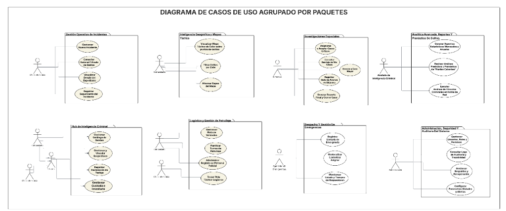

# Use Case Diagram Grouped by Packages

This document describes the functional use case packages designed for the SafeCity platform, detailing how different roles interact with the system modules.

---

## 📊 Use Case Diagram by Packages

---

## 📦 Functional Package Breakdown

### 1. Incident Operational Management (Gestión Operativa de Incidentes)
Manages the daily entry, review, and progress logging of criminal incidents.
* **Primary Actors:** Police Officer, Commander, Detective.
* **Key Use Cases:**
  * **Log New Incident:** Register a new incident report with precise geo-coordinates.
  * **Search & Filter Incidents:** Query historical crime records.
  * **View Case Details:** Access complete file reviews for specific incidents.
  * **Record Case Follow-ups:** Add timeline logs and status updates to ongoing cases.

### 2. Geographic Intelligence & Tactical Maps (Inteligencia Geográfica y Mapas Tácticos)
Provides spatial visualization of crime densities to aid in strategic patrolling.
* **Primary Actors:** Commander, Detective.
* **Key Use Cases:**
  * **Visualize Tactical Heatmap:** View high-density crime areas in Chicago.
  * **Filter Crimes by Street:** Target-search specific street addresses.
  * **Toggle Map Layers:** Switch between heatmaps, individual incident markers, and hotspots.

### 3. Special Investigations (Investigaciones Especiales)
Dedicated module for detectives handling complex or high-priority cases.
* **Primary Actors:** Detective.
* **Key Use Cases:**
  * **Assign/Accept Critical Cases:** Take ownership of major investigations.
  * **Consult "My Cases" Inbox:** Manage individual detective workloads.
  * **Log Progress Notes:** Add investigative updates to the case diary.
  * **Submit Final Report & Close Case:** Conclude investigations with official judicial reports.

### 4. Advanced Analytics & Crime Forecasting (Analítica Avanzada y Pronóstico de Delitos)
Leverages historical data for predictive police intelligence.
* **Primary Actors:** Criminal Intelligence Analyst.
* **Key Use Cases:**
  * **Generate Statistical Reports:** Produce monthly and annual crime summaries.
  * **Predictive Hotspot Analysis:** Forecast areas with high probabilities of crime occurrence.
  * **Criminal Link Analysis:** Map associations, networks, and relationships between criminals and gangs.

### 5. Criminal Intelligence Hub (Hub de Inteligencia Criminal)
Centralizes dossiers of known gang structures, suspects, and related testimonies.
* **Primary Actors:** Commander, Police Officer, Detective.
* **Key Use Cases:**
  * **Manage Gang Catalog:** Track organizations, operational zones, and threat levels.
  * **Manage & Link Suspects:** Associate suspects with specific case files and gangs.
  * **Record Witness Testimonies:** Archive statements and manage anonymity toggles.
  * **Manage Custody & Inventory:** Track seized items and evidence logs.

### 6. Logistics & Patrol Management (Logística y Gestión de Patrullaje)
Coordinates the fleet of vehicles, patrol shifts, and equipment assignments.
* **Primary Actors:** Commander, Police Officer.
* **Key Use Cases:**
  * **Manage Vehicle Routes:** Monitor patrol coverage.
  * **Schedule Patrol Shifts:** Plan assignments linking officers to vehicles.
  * **Administer Officer Directory:** Keep rosters and contact details updated.
  * **Tactical-Logistical Routing:** Optimize vehicle deployments based on active crime hotspots.

### 7. Emergency Dispatch Management (Despacho y Gestión de Emergencias)
Handles incoming emergency requests and routes response units.
* **Primary Actors:** Emergency Operator.
* **Key Use Cases:**
  * **Record Emergency Call:** File initial call reports with description and priority.
  * **Geolocalize & Dispatch:** Identify the caller's location and assign the nearest patrol unit.
  * **Monitor Response Times:** Evaluate response efficiency in real time.

### 8. System Security, Administration & Audit (Administración, Seguridad y Auditoría)
Ensures database integrity, access control, and complete traceability.
* **Primary Actors:** System Administrator.
* **Key Use Cases:**
  * **Manage Users, Roles & Permissions:** Oversee credentials and access levels.
  * **Audit System Logs:** Review audit trails of database mutations.
  * **Manage Backups & Recovery:** Secure historical records against data loss.
  * **Configure Global Settings:** Set alert triggers and system-wide thresholds.
