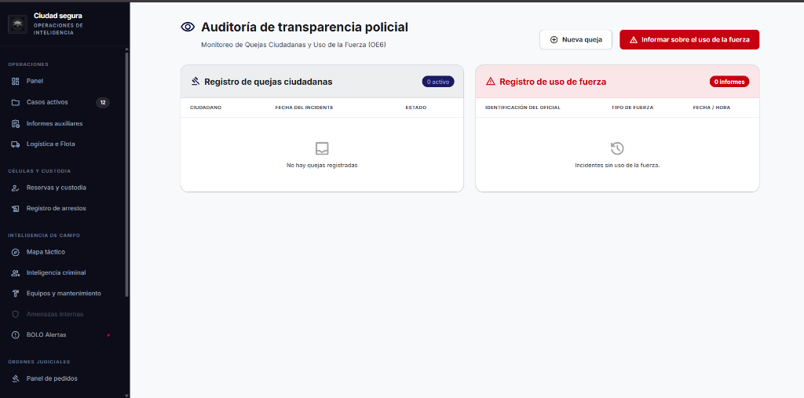

# Resumen de Objetivos: Informes Simples y Compuestos (Evaluación 01)

A continuación se detalla la justificación técnica y operativa de los paneles e informes seleccionados para la presentación, estructurados en formato de tabla para rápida lectura.

---

## 🖥️ WORKPANELS (Dashboards de Control)
*Paneles principales que centralizan la información táctica y operativa en tiempo real.*

| Nombre del Workpanel | Toma de Decisiones | Por qué es crucial para el Sistema |
| :--- | :--- | :--- |
| **1. Workpanel de Operaciones e Incidentes (DB1)** | Permite al comandante tomar decisiones instantáneas sobre el despliegue general de la fuerza policial basándose en KPIs críticos en vivo. | Centraliza el conteo de incidentes, tasa de arrestos y casos de alto riesgo, procesando volúmenes de datos transaccionales de forma instantánea. |
| **2. Workpanel de Despacho y Emergencias (DB2)** | El operador de despacho asigna eventos en milisegundos a patrullas libres, optimizando los tiempos de respuesta. | Permite visualizar la carga operativa de cada unidad para gestionar eventos concurrentes bajo extrema presión operativa en tiempo real. |
| **3. Workpanel de Administración y Seguridad (DB3)** | El administrador de TI decide bloqueos preventivos y detecta vulnerabilidades auditando actividades sospechosas de usuarios. | Mantiene la alta disponibilidad y ciberseguridad del sistema al monitorear la salud del clúster de bases de datos, y roles de acceso. |

 

## 🟢 INFORMES SIMPLES (Operativa Transaccional / OLTP)
*Estos informes demuestran el dominio de lecturas, escrituras y consultas directas en la base de datos relacional para la operativa del día a día.*

| Nombre del Informe | Objetivo Táctico Asociado (OT) | Toma de Decisiones | Cómo ayuda al Objetivo Táctico |
| :--- | :--- | :--- | :--- |
| **1. Listado de Incidentes en Curso por Patrulla** | **(OT12):** Consultar el listado de incidentes activos asignados a una patrulla específica. | Permite al comandante de campo redistribuir unidades dinámicamente si nota que una patrulla está saturada con múltiples incidentes críticos, evitando tiempos muertos. | Cumple con el OT12 al otorgar visibilidad 100% real sobre la carga operativa en el terreno mediante consultas (SELECTs) rápidas, garantizando que ninguna emergencia se pierda. |
| **2. Directorio de Órdenes Judiciales (Warrants)** | **(OT10):** Revisar listados y auditorías de Cadena de Custodia y órdenes judiciales activas. | Los comandantes priorizan la ejecución de redadas antes de que las órdenes expiren, verificando el estado procesal y la cadena de custodia de armas o evidencias. | Centraliza la operatividad policial de prófugos e incluye un mapa táctico interactivo que geolocaliza el objetivo, facilitando el despliegue rápido del equipo SWAT. |
| **3. Sistema de Ingreso y Control de Celdas (Booking)** | **(OT4):** Administración de ingresos a celdas, traslados y pertenencias. | El oficial de guardia necesita saber instantáneamente en qué bloque hay celdas de máxima seguridad disponibles para aislar a sospechosos peligrosos de la población general. | Conecta el perfil del criminal con la celda asignada ejecutando múltiples transacciones casi en paralelo (INSERT/UPDATE), asegurando la integridad referencial con llaves foráneas. |
| **4. Portal de Auditoría de Transparencia Policial** | **(OE6):** Documentar e investigar quejas ciudadanas y el registro auditable de uso de fuerza. | Asuntos Internos y la directiva policial pueden auditar y buscar instantáneamente el historial de quejas y la justificación legal de uso de fuerza de cualquier oficial. | Demuestra peticiones asíncronas independientes (RxJS), filtrado dinámico (Buscador) en tiempo real en frontend, interfaces ricas "Glassmorphism" y robustez en manejo de excepciones.     |

 

## 🔶 INFORMES COMPUESTOS / COMPLEJOS (Analítica, Big Data y Machine Learning)
*Estos informes garantizan la máxima calificación al demostrar arquitecturas avanzadas: Data Warehouses (ClickHouse), Pipelines (ETL Airflow), Triggers y Microservicios.*

| Nombre del Informe | Objetivo Táctico Asociado (OT) | Toma de Decisiones | Cómo ayuda al Objetivo Táctico |
| :--- | :--- | :--- | :--- |
| **1. Mapa de Calor de Criminalidad Geospacial** | **(OT1):** Analizar reportes mensuales de inteligencia y mapas de calor geoespaciales. | Sirve a los altos mandos y alcaldes para rediseñar estratégicamente los cuadrantes de patrullaje, moviendo presupuesto y policías de las zonas frías hacia las "calientes". | Resuelve el OT1 consolidando cientos de miles de coordenadas GPS usando un proceso ETL que extrae la historia y la aloja en ClickHouse (OLAP), evitando tumbar el servidor principal. |
| **2. Monitor Inmutable de Auditoría Forense** | **(OT15):** Auditar accesos al sistema y rastrear cualquier alteración de registros (Trazabilidad). | Permite a la división de Asuntos Internos identificar de inmediato si un oficial intentó alterar evidencia digital o el estado de un caso policial de manera indebida. | Proporciona un visor de logs alimentado por **Triggers (Disparadores)** en la Base de Datos que capturan cada modificación y la guardan inmutablemente en el motor analítico. |
| **3. Predictor de Tasa de Reincidencia por Sospechoso** | **(OT2):** Visualizar tableros de estadísticas de reincidencia y conexiones criminales. | Ayuda a los jueces y fiscales de turno a negar libertades bajo fianza y dictar prisión preventiva a individuos catalogados como "Alto Riesgo". | Materializa el OT2 conectando el historial de arrestos con modelos de Machine Learning ejecutados en una API externa (Microservicios), para no bloquear los hilos del servidor web. |
